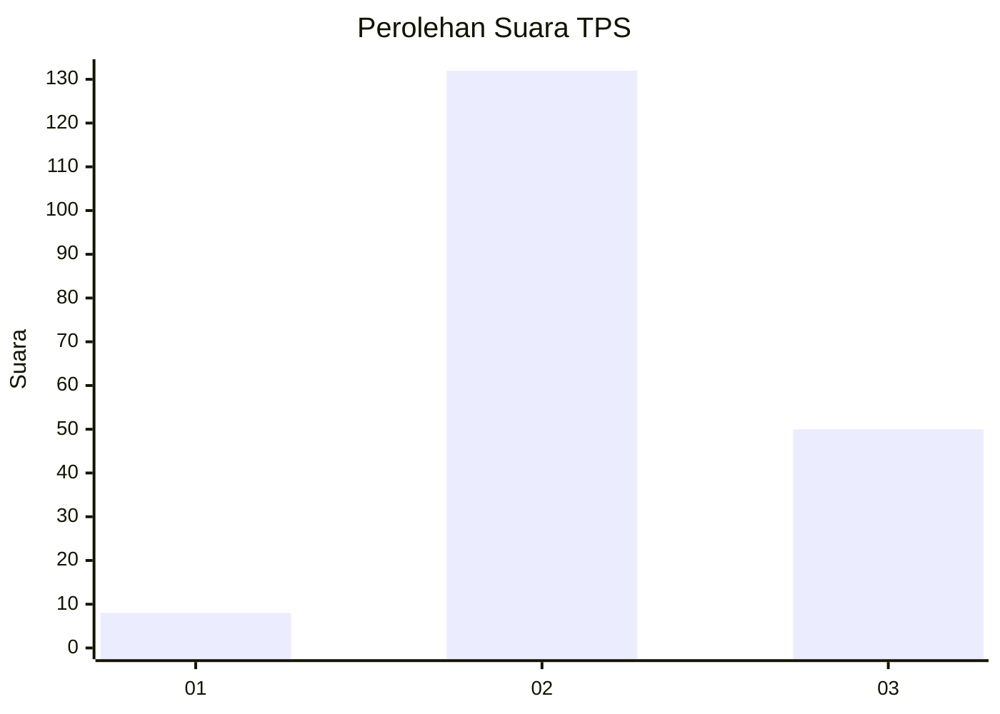

# Hasil

## Grafik

## Tabel

| No. | Nama Paslon    | Suara | Suara (raw) | Persentase |
|:--- |:-------------- | -----:| -----------:| ----------:|
| 1   | ANIES MUHAIMIN | 8     | [8][p-1]    | 4,21       |
| 2   | PRABOWO GIBRAN | 132   | [132][p-2]  | 69,47      |
| 3   | GANJAR MAHFUD  | 50    | [50][p-3]   | 26,32      |

[p-1]: https://github.com/gigit-pemilu/pemilu-2024-35-jawa-timur/blob/main/pilpres/hitung-suara/sub/35-jawa-timur/sub/04-tulungagung/sub/05-kauman/sub/2010-pucangan/sub/003-tps/sub/paslon-1.txt
[p-2]: https://github.com/gigit-pemilu/pemilu-2024-35-jawa-timur/blob/main/pilpres/hitung-suara/sub/35-jawa-timur/sub/04-tulungagung/sub/05-kauman/sub/2010-pucangan/sub/003-tps/sub/paslon-2.txt
[p-3]: https://github.com/gigit-pemilu/pemilu-2024-35-jawa-timur/blob/main/pilpres/hitung-suara/sub/35-jawa-timur/sub/04-tulungagung/sub/05-kauman/sub/2010-pucangan/sub/003-tps/sub/paslon-3.txt

## Foto C Plano

https://sirekap-obj-formc.kpu.go.id/a023/pemilu/ppwp/35/04/05/20/10/3504052010003-20240215-000620--ac72ee43-97d0-4d60-aade-d14230ee8fdd.jpg

https://sirekap-obj-formc.kpu.go.id/a023/pemilu/ppwp/35/04/05/20/10/3504052010003-20240215-001446--5acd8574-6350-443e-99ff-48169e0599ff.jpg

https://sirekap-obj-formc.kpu.go.id/a023/pemilu/ppwp/35/04/05/20/10/3504052010003-20240215-001623--eb4aa843-2d0a-4bee-95ef-de4d2bfacdea.jpg

## Metadata

| Key        | Value               |
| ---------- | ------------------- |
| Time Stamp | 2024-02-16 23:30:00 |

