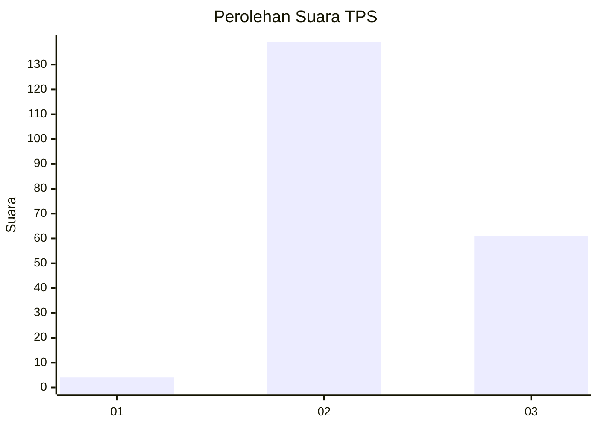

# Hasil

## Grafik

## Tabel

| No. | Nama Paslon    | Suara | Suara (raw) | Persentase |
|:--- |:-------------- | -----:| -----------:| ----------:|
| 1   | ANIES MUHAIMIN | 4     | [4][p-1]    | 1,96       |
| 2   | PRABOWO GIBRAN | 139   | [139][p-2]  | 68,14      |
| 3   | GANJAR MAHFUD  | 61    | [61][p-3]   | 29,90      |

[p-1]: https://github.com/gigit-pemilu/pemilu-2024/blob/main/pilpres/hitung-suara/sub/35-jawa-timur/sub/04-tulungagung/sub/06-pagerwojo/sub/2001-wonorejo/sub/001-tps/sub/paslon-1.txt
[p-2]: https://github.com/gigit-pemilu/pemilu-2024/blob/main/pilpres/hitung-suara/sub/35-jawa-timur/sub/04-tulungagung/sub/06-pagerwojo/sub/2001-wonorejo/sub/001-tps/sub/paslon-2.txt
[p-3]: https://github.com/gigit-pemilu/pemilu-2024/blob/main/pilpres/hitung-suara/sub/35-jawa-timur/sub/04-tulungagung/sub/06-pagerwojo/sub/2001-wonorejo/sub/001-tps/sub/paslon-3.txt

## Foto C Plano

https://sirekap-obj-formc.kpu.go.id/2a88/pemilu/ppwp/35/04/06/20/01/3504062001001-20240214-212413--08100496-be29-4db9-843f-1a9e3c7c5f8c.jpg

https://sirekap-obj-formc.kpu.go.id/2a88/pemilu/ppwp/35/04/06/20/01/3504062001001-20240214-225935--9ac2e938-4f28-49b2-aeb8-297248b444d6.jpg

https://sirekap-obj-formc.kpu.go.id/2a88/pemilu/ppwp/35/04/06/20/01/3504062001001-20240306-201045--f387626b-abf7-42d9-9e3f-e2530a9f6581.jpg

## Metadata

| Key        | Value               |
| ---------- | ------------------- |
| Time Stamp | 2024-03-06 21:00:00 |

