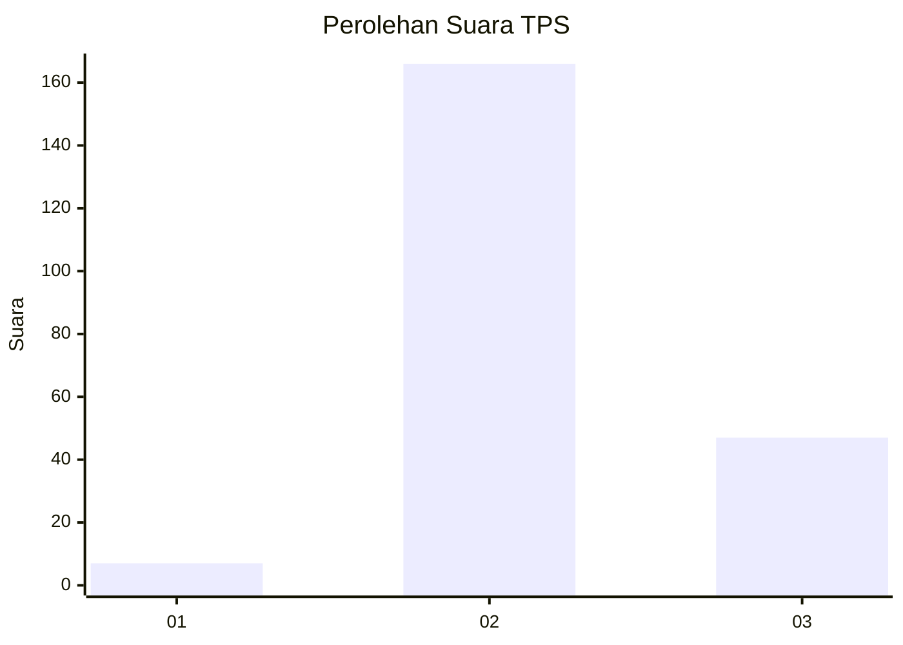

# Hasil

## Grafik

## Tabel

| No. | Nama Paslon    | Suara | Suara (raw) | Persentase |
|:--- |:-------------- | -----:| -----------:| ----------:|
| 1   | ANIES MUHAIMIN | 7     | [7][p-1]    | 3,18       |
| 2   | PRABOWO GIBRAN | 166   | [166][p-2]  | 75,45      |
| 3   | GANJAR MAHFUD  | 47    | [47][p-3]   | 21,36      |

[p-1]: https://github.com/gigit-pemilu/pemilu-2024/blob/main/pilpres/hitung-suara/sub/35-jawa-timur/sub/04-tulungagung/sub/06-pagerwojo/sub/2001-wonorejo/sub/003-tps/sub/paslon-1.txt
[p-2]: https://github.com/gigit-pemilu/pemilu-2024/blob/main/pilpres/hitung-suara/sub/35-jawa-timur/sub/04-tulungagung/sub/06-pagerwojo/sub/2001-wonorejo/sub/003-tps/sub/paslon-2.txt
[p-3]: https://github.com/gigit-pemilu/pemilu-2024/blob/main/pilpres/hitung-suara/sub/35-jawa-timur/sub/04-tulungagung/sub/06-pagerwojo/sub/2001-wonorejo/sub/003-tps/sub/paslon-3.txt

## Foto C Plano

https://sirekap-obj-formc.kpu.go.id/aee9/pemilu/ppwp/35/04/06/20/01/3504062001003-20240216-012242--0b24327d-8339-4e3e-8871-76149eb8053c.jpg

https://sirekap-obj-formc.kpu.go.id/aee9/pemilu/ppwp/35/04/06/20/01/3504062001003-20240216-012247--52e1357c-b376-4c6b-9c06-c2fb3128fcdf.jpg

https://sirekap-obj-formc.kpu.go.id/aee9/pemilu/ppwp/35/04/06/20/01/3504062001003-20240216-012244--e460f810-d5f1-4c57-a1ca-2ee6e2244717.jpg

## Metadata

| Key        | Value               |
| ---------- | ------------------- |
| Time Stamp | 2024-02-17 19:30:00 |

## DATA PEMILIH TETAP

Jumlah pemilih dalam DPT: **255**.
 * L: **125**.
 * P: **130**.

## DATA PENGGUNA HAK PILIH

Jumlah pengguna hak pilih dalam DPT: **221**.
 * L: **102**.
 * P: **119**.

Jumlah pengguna hak pilih dalam DPTb: **2**.
 * L: **1**.
 * P: **1**.

Jumlah pengguna hak pilih dalam DPK: **0**.
 * L: **0**.
 * P: **0**.

Jumlah pengguna hak pilih: **223**.
 * L: **103**.
 * P: **120**.

## JUMLAH SUARA SAH DAN TIDAK SAH

JUMLAH SELURUH SUARA SAH: **220**.

JUMLAH SUARA TIDAK SAH: **3**.

JUMLAH SELURUH SUARA SAH DAN SUARA TIDAK SAH: **223**.

