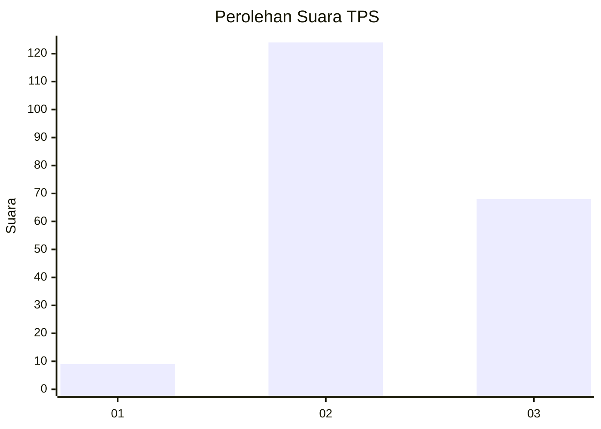
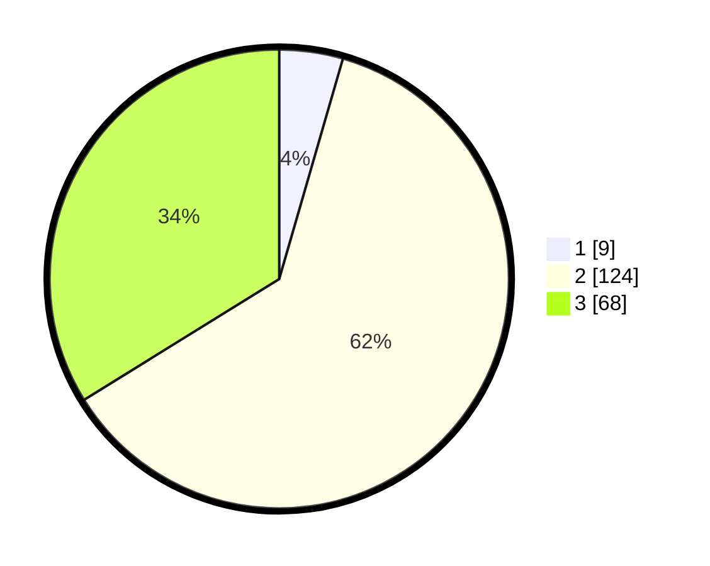

# Hasil

## Grafik

## Tabel

| No. | Nama Paslon    | Suara | Suara (raw) | Persentase |
|:--- |:-------------- | -----:| -----------:| ----------:|
| 1   | ANIES MUHAIMIN | 9     | [9][p-1]    | 4,48       |
| 2   | PRABOWO GIBRAN | 124   | [124][p-2]  | 61,69      |
| 3   | GANJAR MAHFUD  | 68    | [68][p-3]   | 33,83      |

[p-1]: https://github.com/gigit-pemilu/pemilu-2024/blob/main/pilpres/hitung-suara/sub/35-jawa-timur/sub/04-tulungagung/sub/06-pagerwojo/sub/2001-wonorejo/sub/004-tps/sub/paslon-1.txt
[p-2]: https://github.com/gigit-pemilu/pemilu-2024/blob/main/pilpres/hitung-suara/sub/35-jawa-timur/sub/04-tulungagung/sub/06-pagerwojo/sub/2001-wonorejo/sub/004-tps/sub/paslon-2.txt
[p-3]: https://github.com/gigit-pemilu/pemilu-2024/blob/main/pilpres/hitung-suara/sub/35-jawa-timur/sub/04-tulungagung/sub/06-pagerwojo/sub/2001-wonorejo/sub/004-tps/sub/paslon-3.txt

## Foto C Plano

https://sirekap-obj-formc.kpu.go.id/be20/pemilu/ppwp/35/04/06/20/01/3504062001004-20240306-194537--3faec2cc-bdfa-4b21-9848-64f3c1fb8c74.jpg

https://sirekap-obj-formc.kpu.go.id/be20/pemilu/ppwp/35/04/06/20/01/3504062001004-20240214-235846--e2affbef-f9ff-4412-86f2-a30aefb8748e.jpg

https://sirekap-obj-formc.kpu.go.id/be20/pemilu/ppwp/35/04/06/20/01/3504062001004-20240215-000033--a74dccce-cbb0-48a2-88f2-b126c55e8c9e.jpg

## Metadata

| Key        | Value               |
| ---------- | ------------------- |
| Time Stamp | 2024-03-06 20:00:00 |

