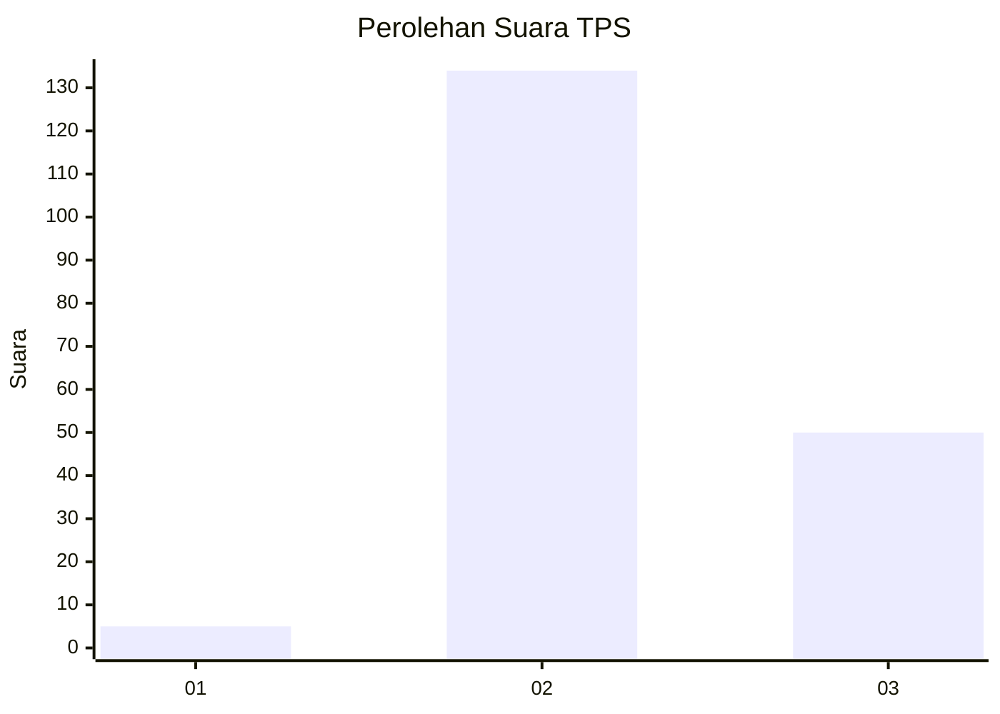
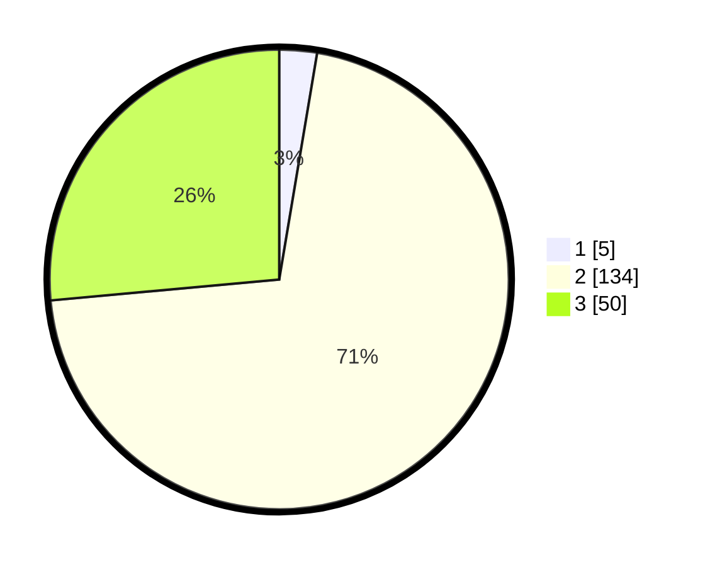

# Hasil

## Grafik

## Tabel

| No. | Nama Paslon    | Suara | Suara (raw) | Persentase |
|:--- |:-------------- | -----:| -----------:| ----------:|
| 1   | ANIES MUHAIMIN | 5     | [5][p-1]    | 2,65       |
| 2   | PRABOWO GIBRAN | 134   | [134][p-2]  | 70,90      |
| 3   | GANJAR MAHFUD  | 50    | [50][p-3]   | 26,46      |

[p-1]: https://github.com/gigit-pemilu/pemilu-2024/blob/main/pilpres/hitung-suara/sub/35-jawa-timur/sub/04-tulungagung/sub/06-pagerwojo/sub/2001-wonorejo/sub/009-tps/sub/paslon-1.txt
[p-2]: https://github.com/gigit-pemilu/pemilu-2024/blob/main/pilpres/hitung-suara/sub/35-jawa-timur/sub/04-tulungagung/sub/06-pagerwojo/sub/2001-wonorejo/sub/009-tps/sub/paslon-2.txt
[p-3]: https://github.com/gigit-pemilu/pemilu-2024/blob/main/pilpres/hitung-suara/sub/35-jawa-timur/sub/04-tulungagung/sub/06-pagerwojo/sub/2001-wonorejo/sub/009-tps/sub/paslon-3.txt

## Foto C Plano

https://sirekap-obj-formc.kpu.go.id/2070/pemilu/ppwp/35/04/06/20/01/3504062001009-20240214-141445--de8edb3a-1f45-438b-9061-3722c8b080b8.jpg

https://sirekap-obj-formc.kpu.go.id/2070/pemilu/ppwp/35/04/06/20/01/3504062001009-20240214-141534--74563dad-0873-4ef8-9312-163d805d5bf6.jpg

https://sirekap-obj-formc.kpu.go.id/2070/pemilu/ppwp/35/04/06/20/01/3504062001009-20240214-141617--2a40d7f2-5c45-42b8-8ffe-0df7d348aa95.jpg

## Metadata

| Key        | Value               |
| ---------- | ------------------- |
| Time Stamp | 2024-02-17 19:30:00 |

