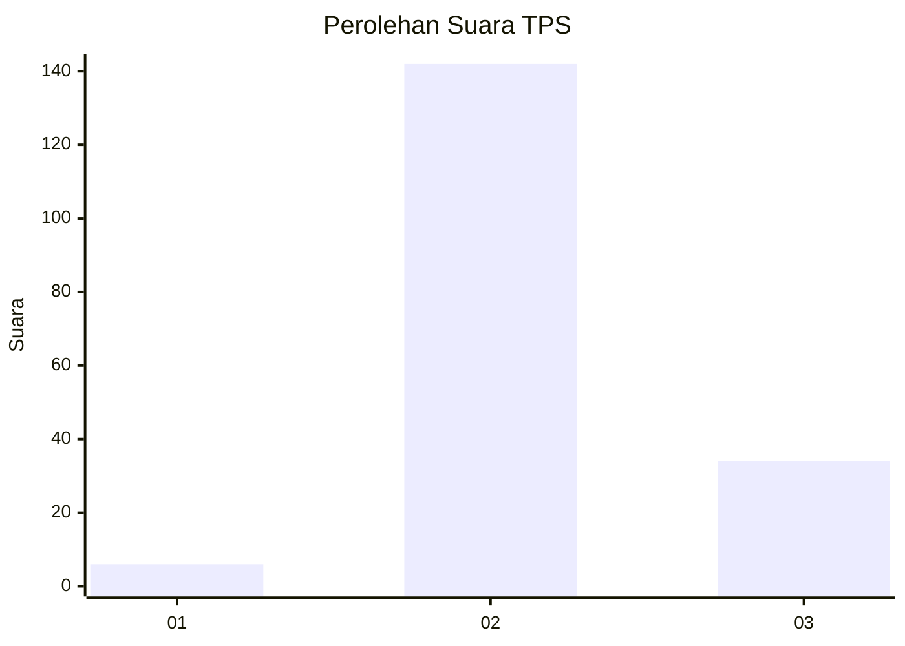
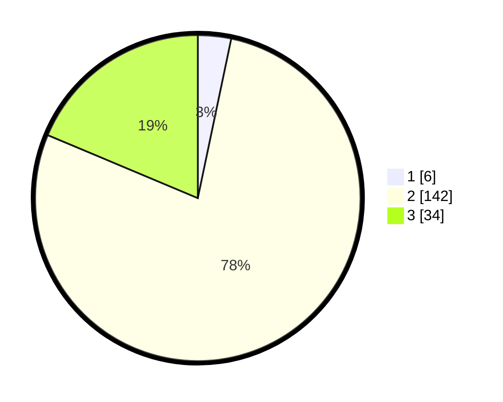

# Hasil

## Grafik

## Tabel

| No. | Nama Paslon    | Suara | Suara (raw) | Persentase |
|:--- |:-------------- | -----:| -----------:| ----------:|
| 1   | ANIES MUHAIMIN | 6     | [6][p-1]    | 3,30       |
| 2   | PRABOWO GIBRAN | 142   | [142][p-2]  | 78,02      |
| 3   | GANJAR MAHFUD  | 34    | [34][p-3]   | 18,68      |

[p-1]: https://github.com/gigit-pemilu/pemilu-2024-35-jawa-timur/blob/main/pilpres/hitung-suara/sub/35-jawa-timur/sub/04-tulungagung/sub/06-pagerwojo/sub/2002-kedungcangkring/sub/001-tps/sub/paslon-1.txt
[p-2]: https://github.com/gigit-pemilu/pemilu-2024-35-jawa-timur/blob/main/pilpres/hitung-suara/sub/35-jawa-timur/sub/04-tulungagung/sub/06-pagerwojo/sub/2002-kedungcangkring/sub/001-tps/sub/paslon-2.txt
[p-3]: https://github.com/gigit-pemilu/pemilu-2024-35-jawa-timur/blob/main/pilpres/hitung-suara/sub/35-jawa-timur/sub/04-tulungagung/sub/06-pagerwojo/sub/2002-kedungcangkring/sub/001-tps/sub/paslon-3.txt

## Foto C Plano

https://sirekap-obj-formc.kpu.go.id/4fff/pemilu/ppwp/35/04/06/20/02/3504062002001-20240303-075734--79a50303-b260-4baa-b38b-6e7326ead7e2.jpg

https://sirekap-obj-formc.kpu.go.id/4fff/pemilu/ppwp/35/04/06/20/02/3504062002001-20240214-233704--92803fda-5d9d-489a-a424-7c2114db1eed.jpg

https://sirekap-obj-formc.kpu.go.id/4fff/pemilu/ppwp/35/04/06/20/02/3504062002001-20240214-233801--6ff1ade5-5b63-45e0-8e36-a498d72d4863.jpg

## Metadata

| Key        | Value               |
| ---------- | ------------------- |
| Time Stamp | 2024-03-03 08:00:00 |

