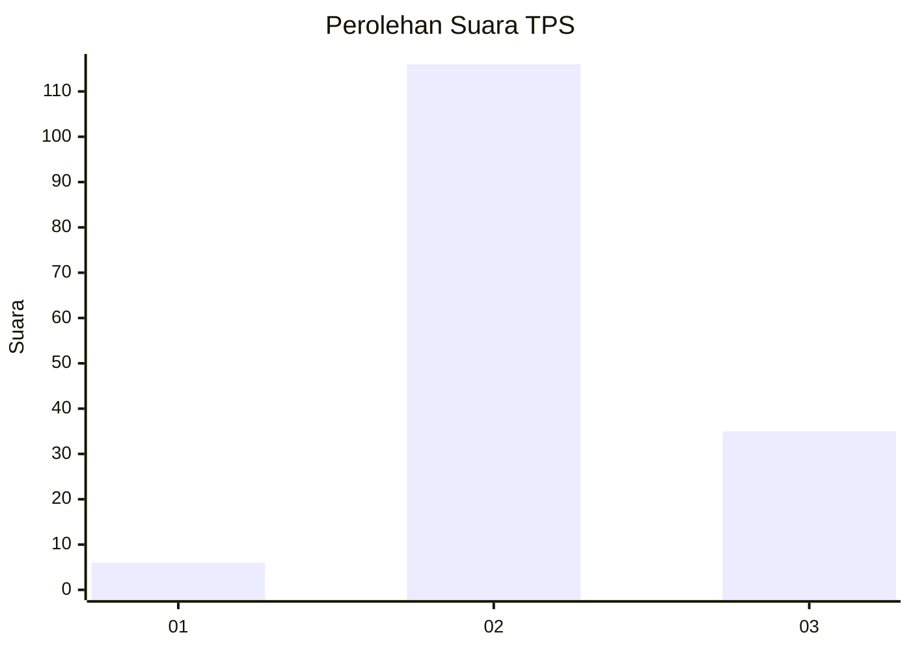
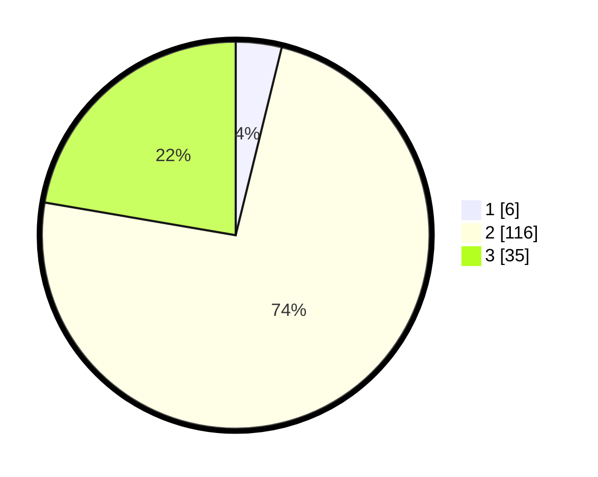

# Hasil

## Grafik

## Tabel

| No. | Nama Paslon    | Suara | Suara (raw) | Persentase |
|:--- |:-------------- | -----:| -----------:| ----------:|
| 1   | ANIES MUHAIMIN | 6     | [6][p-1]    | 3,82       |
| 2   | PRABOWO GIBRAN | 116   | [116][p-2]  | 73,89      |
| 3   | GANJAR MAHFUD  | 35    | [35][p-3]   | 22,29      |

[p-1]: https://github.com/gigit-pemilu/pemilu-2024-35-jawa-timur/blob/main/pilpres/hitung-suara/sub/35-jawa-timur/sub/04-tulungagung/sub/06-pagerwojo/sub/2002-kedungcangkring/sub/003-tps/sub/paslon-1.txt
[p-2]: https://github.com/gigit-pemilu/pemilu-2024-35-jawa-timur/blob/main/pilpres/hitung-suara/sub/35-jawa-timur/sub/04-tulungagung/sub/06-pagerwojo/sub/2002-kedungcangkring/sub/003-tps/sub/paslon-2.txt
[p-3]: https://github.com/gigit-pemilu/pemilu-2024-35-jawa-timur/blob/main/pilpres/hitung-suara/sub/35-jawa-timur/sub/04-tulungagung/sub/06-pagerwojo/sub/2002-kedungcangkring/sub/003-tps/sub/paslon-3.txt

## Foto C Plano

https://sirekap-obj-formc.kpu.go.id/b227/pemilu/ppwp/35/04/06/20/02/3504062002003-20240214-211920--247a9205-3cac-4a1a-94eb-5e487f931f70.jpg

https://sirekap-obj-formc.kpu.go.id/b227/pemilu/ppwp/35/04/06/20/02/3504062002003-20240214-211734--71622e82-23e0-433d-b841-14d8b415edc1.jpg

https://sirekap-obj-formc.kpu.go.id/b227/pemilu/ppwp/35/04/06/20/02/3504062002003-20240214-212044--0fb94bd6-e51a-4be4-a44e-5c6d3be28cc0.jpg

## Metadata

| Key        | Value               |
| ---------- | ------------------- |
| Time Stamp | 2024-02-17 19:30:00 |

