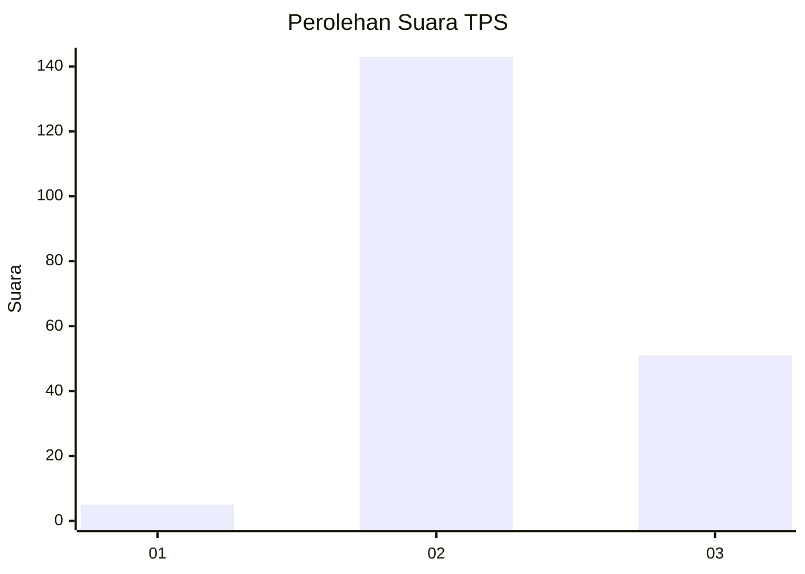
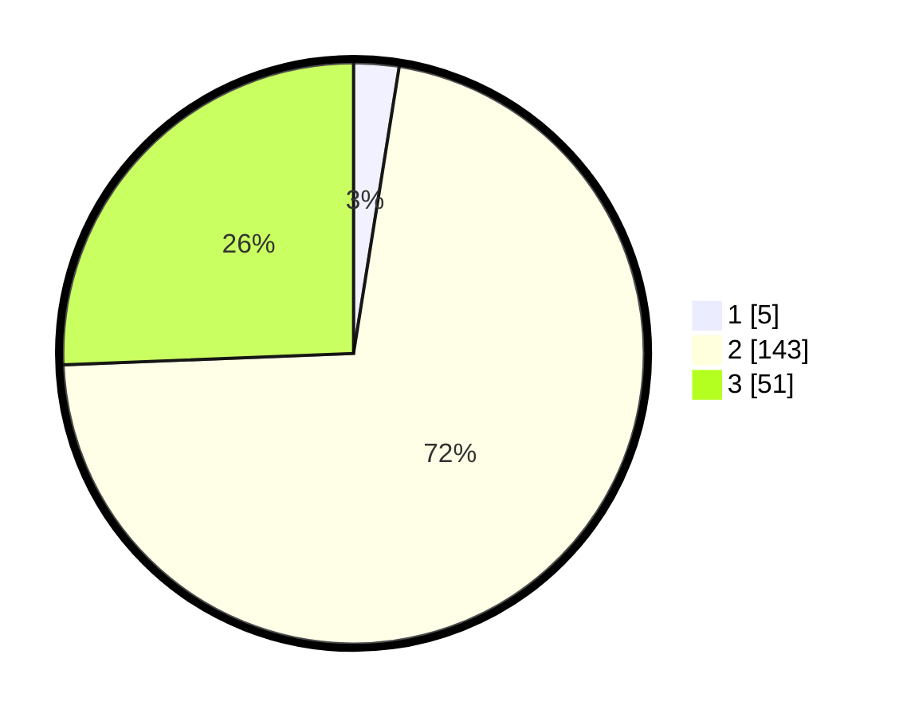

# Hasil

## Grafik

## Tabel

| No. | Nama Paslon    | Suara | Suara (raw) | Persentase |
|:--- |:-------------- | -----:| -----------:| ----------:|
| 1   | ANIES MUHAIMIN | 5     | [5][p-1]    | 2,51       |
| 2   | PRABOWO GIBRAN | 143   | [143][p-2]  | 71,86      |
| 3   | GANJAR MAHFUD  | 51    | [51][p-3]   | 25,63      |

[p-1]: https://github.com/gigit-pemilu/pemilu-2024-35-jawa-timur/blob/main/pilpres/hitung-suara/sub/35-jawa-timur/sub/04-tulungagung/sub/06-pagerwojo/sub/2002-kedungcangkring/sub/011-tps/sub/paslon-1.txt
[p-2]: https://github.com/gigit-pemilu/pemilu-2024-35-jawa-timur/blob/main/pilpres/hitung-suara/sub/35-jawa-timur/sub/04-tulungagung/sub/06-pagerwojo/sub/2002-kedungcangkring/sub/011-tps/sub/paslon-2.txt
[p-3]: https://github.com/gigit-pemilu/pemilu-2024-35-jawa-timur/blob/main/pilpres/hitung-suara/sub/35-jawa-timur/sub/04-tulungagung/sub/06-pagerwojo/sub/2002-kedungcangkring/sub/011-tps/sub/paslon-3.txt

## Foto C Plano

https://sirekap-obj-formc.kpu.go.id/6586/pemilu/ppwp/35/04/06/20/02/3504062002011-20240218-135706--1effa429-4c42-4956-a5cc-826a09126e9c.jpg

https://sirekap-obj-formc.kpu.go.id/6586/pemilu/ppwp/35/04/06/20/02/3504062002011-20240217-081744--523977cb-cd71-498e-a776-a3b7fae0b166.jpg

https://sirekap-obj-formc.kpu.go.id/6586/pemilu/ppwp/35/04/06/20/02/3504062002011-20240217-082016--04e79bfb-10a6-467a-8f0f-9914f7b6280a.jpg

## Metadata

| Key        | Value               |
| ---------- | ------------------- |
| Time Stamp | 2024-02-19 06:16:00 |

