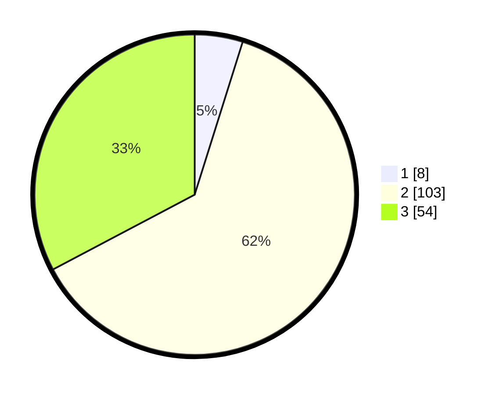

# Hasil

## Grafik

## Tabel

| No. | Nama Paslon    | Suara | Suara (raw) | Persentase |
|:--- |:-------------- | -----:| -----------:| ----------:|
| 1   | ANIES MUHAIMIN | 8     | [8][p-1]    | 4,85       |
| 2   | PRABOWO GIBRAN | 103   | [103][p-2]  | 62,42      |
| 3   | GANJAR MAHFUD  | 54    | [54][p-3]   | 32,73      |

[p-1]: https://github.com/gigit-pemilu/pemilu-2024-35-jawa-timur/blob/main/pilpres/hitung-suara/sub/35-jawa-timur/sub/04-tulungagung/sub/07-sendang/sub/2001-kedoyo/sub/009-tps/sub/paslon-1.txt
[p-2]: https://github.com/gigit-pemilu/pemilu-2024-35-jawa-timur/blob/main/pilpres/hitung-suara/sub/35-jawa-timur/sub/04-tulungagung/sub/07-sendang/sub/2001-kedoyo/sub/009-tps/sub/paslon-2.txt
[p-3]: https://github.com/gigit-pemilu/pemilu-2024-35-jawa-timur/blob/main/pilpres/hitung-suara/sub/35-jawa-timur/sub/04-tulungagung/sub/07-sendang/sub/2001-kedoyo/sub/009-tps/sub/paslon-3.txt

## Foto C Plano

https://sirekap-obj-formc.kpu.go.id/fef0/pemilu/ppwp/35/04/07/20/01/3504072001009-20240216-092508--50943451-86fe-462b-92f7-279d28d65f81.jpg

https://sirekap-obj-formc.kpu.go.id/fef0/pemilu/ppwp/35/04/07/20/01/3504072001009-20240216-092614--6fa7e50f-5a8a-4f65-87ef-f462fe49caf7.jpg

https://sirekap-obj-formc.kpu.go.id/fef0/pemilu/ppwp/35/04/07/20/01/3504072001009-20240216-092724--740eef13-c11f-4626-a04f-330c0faa2fce.jpg

## Metadata

| Key        | Value               |
| ---------- | ------------------- |
| Time Stamp | 2024-02-19 06:16:00 |

