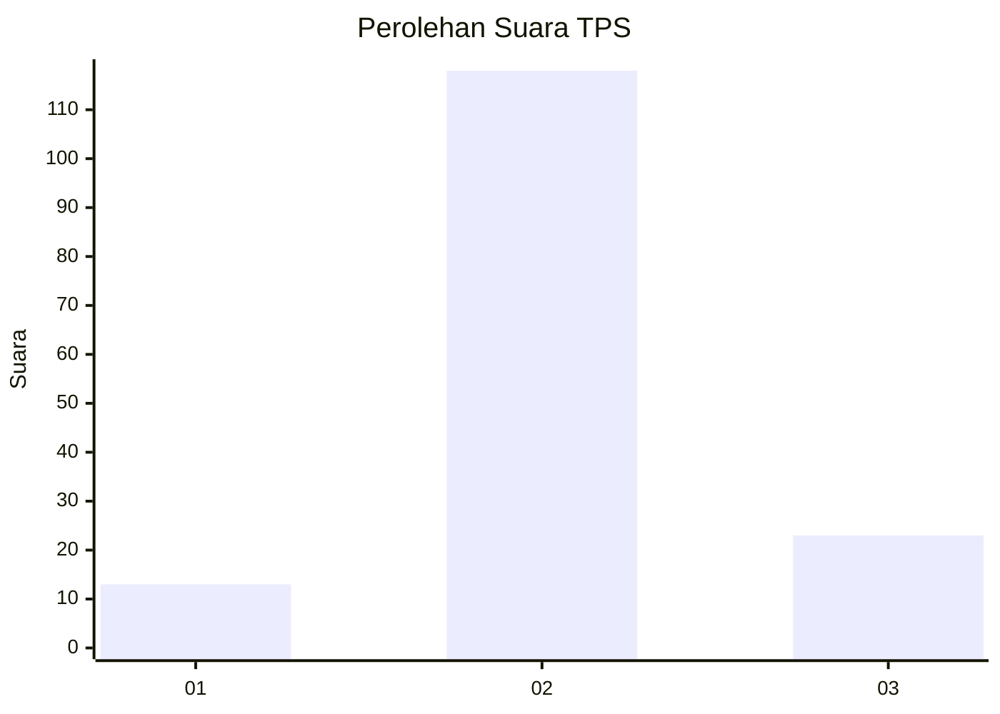

# Hasil

## Grafik

## Tabel

| No. | Nama Paslon    | Suara | Suara (raw) | Persentase |
|:--- |:-------------- | -----:| -----------:| ----------:|
| 1   | ANIES MUHAIMIN | 13    | [13][p-1]   | 8,44       |
| 2   | PRABOWO GIBRAN | 118   | [118][p-2]  | 76,62      |
| 3   | GANJAR MAHFUD  | 23    | [23][p-3]   | 14,94      |

[p-1]: https://github.com/gigit-pemilu/pemilu-2024-35-jawa-timur/blob/main/pilpres/hitung-suara/sub/35-jawa-timur/sub/04-tulungagung/sub/07-sendang/sub/2003-talang/sub/001-tps/sub/paslon-1.txt
[p-2]: https://github.com/gigit-pemilu/pemilu-2024-35-jawa-timur/blob/main/pilpres/hitung-suara/sub/35-jawa-timur/sub/04-tulungagung/sub/07-sendang/sub/2003-talang/sub/001-tps/sub/paslon-2.txt
[p-3]: https://github.com/gigit-pemilu/pemilu-2024-35-jawa-timur/blob/main/pilpres/hitung-suara/sub/35-jawa-timur/sub/04-tulungagung/sub/07-sendang/sub/2003-talang/sub/001-tps/sub/paslon-3.txt

## Foto C Plano

https://sirekap-obj-formc.kpu.go.id/b597/pemilu/ppwp/35/04/07/20/03/3504072003001-20240214-230145--e1289b0e-9298-4880-9eb4-d834abf2b882.jpg

https://sirekap-obj-formc.kpu.go.id/b597/pemilu/ppwp/35/04/07/20/03/3504072003001-20240214-230409--a93ef1df-cc70-4322-8a5d-556ffd95b606.jpg

https://sirekap-obj-formc.kpu.go.id/b597/pemilu/ppwp/35/04/07/20/03/3504072003001-20240214-230608--3484ecd3-351e-41fd-8065-f469c0172692.jpg

## Metadata

| Key        | Value               |
| ---------- | ------------------- |
| Time Stamp | 2024-02-19 06:16:00 |

