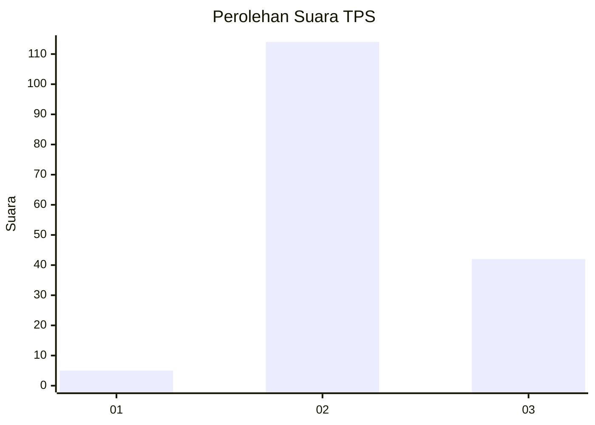
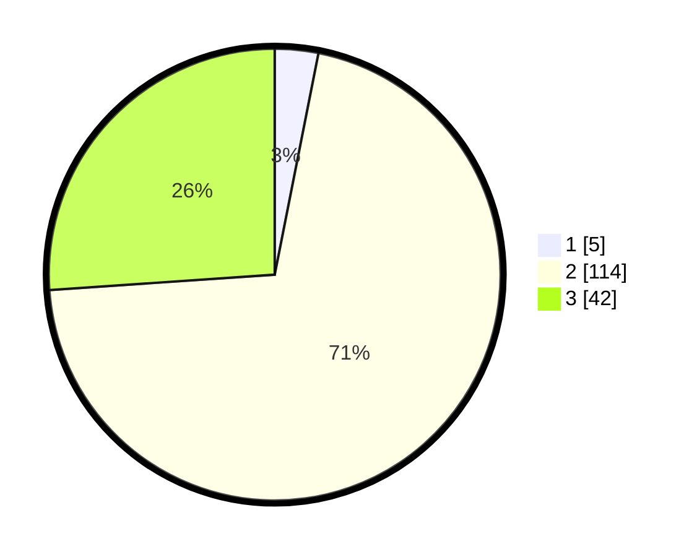

# Hasil

## Grafik

## Tabel

| No. | Nama Paslon    | Suara | Suara (raw) | Persentase |
|:--- |:-------------- | -----:| -----------:| ----------:|
| 1   | ANIES MUHAIMIN | 5     | [5][p-1]    | 3,11       |
| 2   | PRABOWO GIBRAN | 114   | [114][p-2]  | 70,81      |
| 3   | GANJAR MAHFUD  | 42    | [42][p-3]   | 26,09      |

[p-1]: https://github.com/gigit-pemilu/pemilu-2024/blob/main/pilpres/hitung-suara/sub/35-jawa-timur/sub/04-tulungagung/sub/07-sendang/sub/2003-talang/sub/002-tps/sub/paslon-1.txt
[p-2]: https://github.com/gigit-pemilu/pemilu-2024/blob/main/pilpres/hitung-suara/sub/35-jawa-timur/sub/04-tulungagung/sub/07-sendang/sub/2003-talang/sub/002-tps/sub/paslon-2.txt
[p-3]: https://github.com/gigit-pemilu/pemilu-2024/blob/main/pilpres/hitung-suara/sub/35-jawa-timur/sub/04-tulungagung/sub/07-sendang/sub/2003-talang/sub/002-tps/sub/paslon-3.txt

## Foto C Plano

https://sirekap-obj-formc.kpu.go.id/5697/pemilu/ppwp/35/04/07/20/03/3504072003002-20240214-233007--93c142aa-c68b-4af6-8b3b-3049de8b4f03.jpg

https://sirekap-obj-formc.kpu.go.id/5697/pemilu/ppwp/35/04/07/20/03/3504072003002-20240214-233418--55610ceb-fb7d-4d0e-a11b-25a0408fafec.jpg

https://sirekap-obj-formc.kpu.go.id/5697/pemilu/ppwp/35/04/07/20/03/3504072003002-20240214-234347--24e43fa6-1225-43e7-a91c-0e921b10ba87.jpg

## Metadata

| Key        | Value               |
| ---------- | ------------------- |
| Time Stamp | 2024-02-19 06:16:00 |

