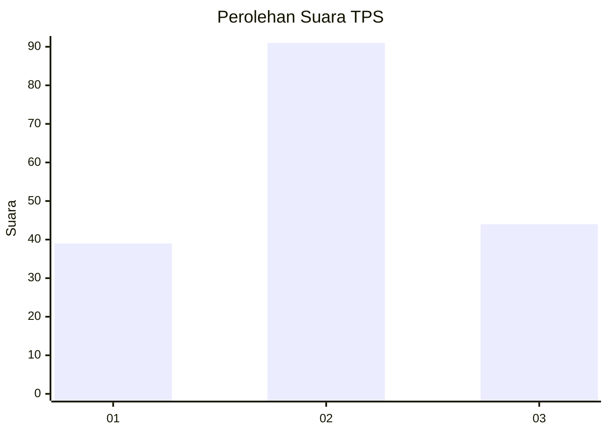
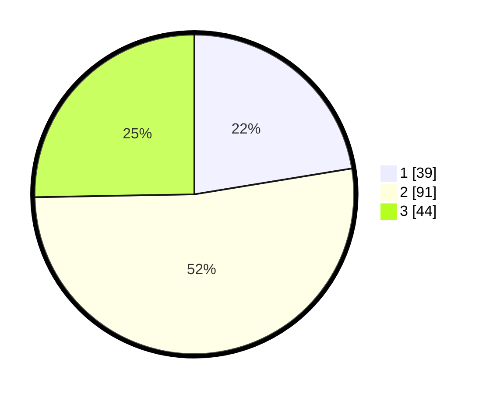

# Hasil

## Grafik

## Tabel

| No. | Nama Paslon    | Suara | Suara (raw) | Persentase |
|:--- |:-------------- | -----:| -----------:| ----------:|
| 1   | ANIES MUHAIMIN | 39    | [39][p-1]   | 22,41      |
| 2   | PRABOWO GIBRAN | 91    | [91][p-2]   | 52,30      |
| 3   | GANJAR MAHFUD  | 44    | [44][p-3]   | 25,29      |

[p-1]: https://github.com/gigit-pemilu/pemilu-2024/blob/main/pilpres/hitung-suara/sub/35-jawa-timur/sub/04-tulungagung/sub/07-sendang/sub/2006-tugu/sub/007-tps/sub/paslon-1.txt
[p-2]: https://github.com/gigit-pemilu/pemilu-2024/blob/main/pilpres/hitung-suara/sub/35-jawa-timur/sub/04-tulungagung/sub/07-sendang/sub/2006-tugu/sub/007-tps/sub/paslon-2.txt
[p-3]: https://github.com/gigit-pemilu/pemilu-2024/blob/main/pilpres/hitung-suara/sub/35-jawa-timur/sub/04-tulungagung/sub/07-sendang/sub/2006-tugu/sub/007-tps/sub/paslon-3.txt

## Foto C Plano

https://sirekap-obj-formc.kpu.go.id/f3ae/pemilu/ppwp/35/04/07/20/06/3504072006007-20240216-190151--812b3a31-b3af-4a77-98f9-7cbda8946eb9.jpg

https://sirekap-obj-formc.kpu.go.id/f3ae/pemilu/ppwp/35/04/07/20/06/3504072006007-20240216-190301--e558d9b7-7c17-45a5-9065-3cf6226bb8b6.jpg

## Metadata

| Key        | Value               |
| ---------- | ------------------- |
| Time Stamp | 2024-02-24 22:31:28 |

