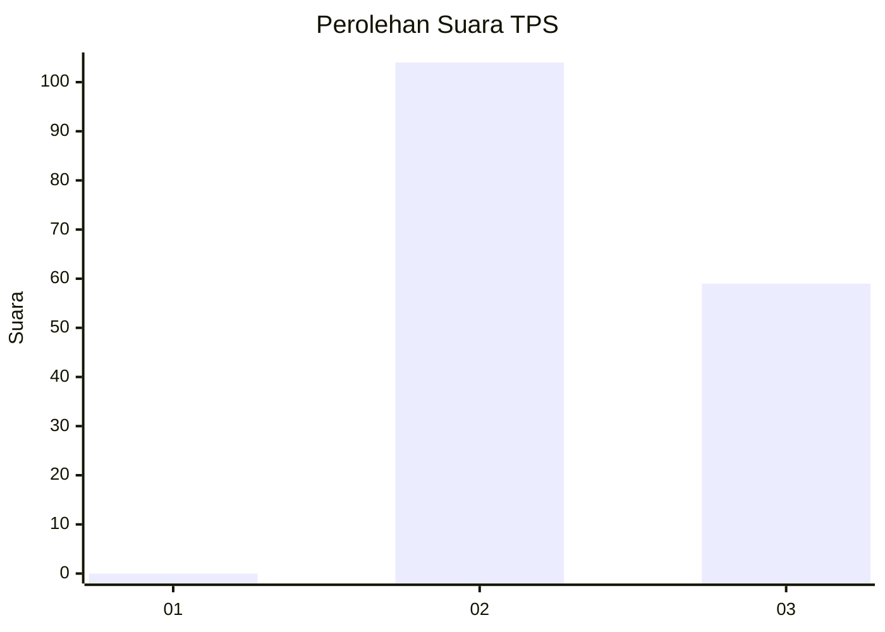
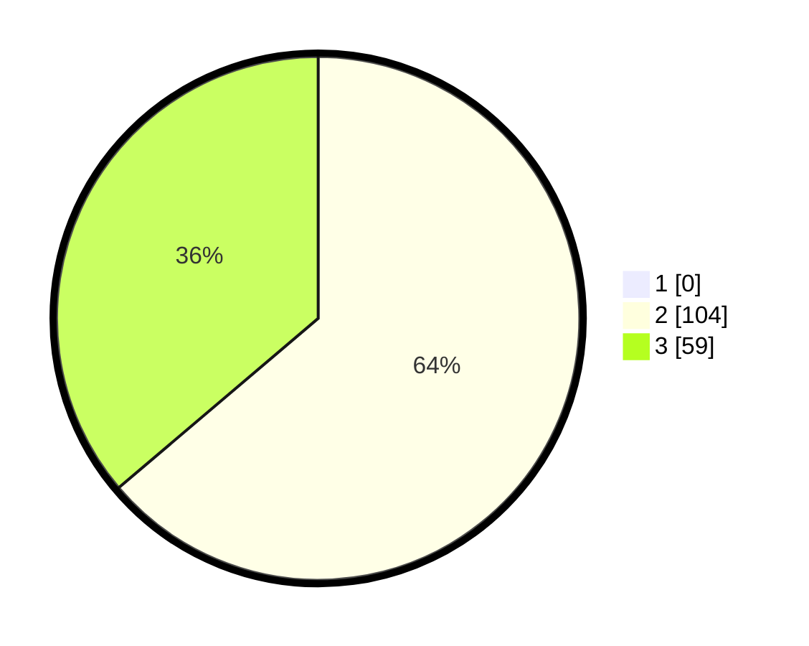

# Hasil

## Grafik

## Tabel

| No. | Nama Paslon    | Suara | Suara (raw) | Persentase |
|:--- |:-------------- | -----:| -----------:| ----------:|
| 1   | ANIES MUHAIMIN | 0     | [0][p-1]    | 0,00       |
| 2   | PRABOWO GIBRAN | 104   | [104][p-2]  | 63,80      |
| 3   | GANJAR MAHFUD  | 59    | [59][p-3]   | 36,20      |

[p-1]: https://github.com/gigit-pemilu/pemilu-2024/blob/main/pilpres/hitung-suara/sub/35-jawa-timur/sub/04-tulungagung/sub/07-sendang/sub/2008-nyawangan/sub/016-tps/sub/paslon-1.txt
[p-2]: https://github.com/gigit-pemilu/pemilu-2024/blob/main/pilpres/hitung-suara/sub/35-jawa-timur/sub/04-tulungagung/sub/07-sendang/sub/2008-nyawangan/sub/016-tps/sub/paslon-2.txt
[p-3]: https://github.com/gigit-pemilu/pemilu-2024/blob/main/pilpres/hitung-suara/sub/35-jawa-timur/sub/04-tulungagung/sub/07-sendang/sub/2008-nyawangan/sub/016-tps/sub/paslon-3.txt

## Foto C Plano

https://sirekap-obj-formc.kpu.go.id/d41b/pemilu/ppwp/35/04/07/20/08/3504072008016-20240216-195809--99d28556-db7f-40c0-a015-a7b87ce0d4ef.jpg

https://sirekap-obj-formc.kpu.go.id/d41b/pemilu/ppwp/35/04/07/20/08/3504072008016-20240214-141426--7304370d-7f05-406a-8bd8-e9b99cfb7e0f.jpg

https://sirekap-obj-formc.kpu.go.id/d41b/pemilu/ppwp/35/04/07/20/08/3504072008016-20240214-141524--fbe48ab0-b8fa-45f4-80c3-ce723a88c2f1.jpg

## Metadata

| Key        | Value               |
| ---------- | ------------------- |
| Time Stamp | 2024-02-19 06:16:00 |

