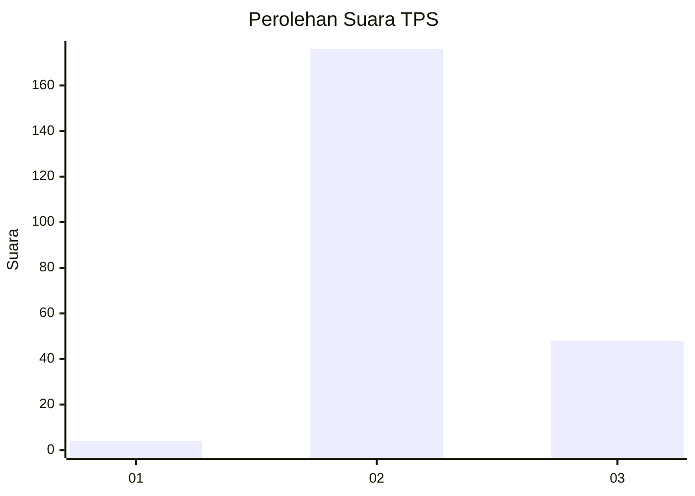

# Hasil

## Grafik

## Tabel

| No. | Nama Paslon    | Suara | Suara (raw) | Persentase |
|:--- |:-------------- | -----:| -----------:| ----------:|
| 1   | ANIES MUHAIMIN | 4     | [4][p-1]    | 1,75       |
| 2   | PRABOWO GIBRAN | 176   | [176][p-2]  | 77,19      |
| 3   | GANJAR MAHFUD  | 48    | [48][p-3]   | 21,05      |

[p-1]: https://github.com/gigit-pemilu/pemilu-2024-35-jawa-timur/blob/main/pilpres/hitung-suara/sub/35-jawa-timur/sub/04-tulungagung/sub/07-sendang/sub/2010-nglurup/sub/009-tps/sub/paslon-1.txt
[p-2]: https://github.com/gigit-pemilu/pemilu-2024-35-jawa-timur/blob/main/pilpres/hitung-suara/sub/35-jawa-timur/sub/04-tulungagung/sub/07-sendang/sub/2010-nglurup/sub/009-tps/sub/paslon-2.txt
[p-3]: https://github.com/gigit-pemilu/pemilu-2024-35-jawa-timur/blob/main/pilpres/hitung-suara/sub/35-jawa-timur/sub/04-tulungagung/sub/07-sendang/sub/2010-nglurup/sub/009-tps/sub/paslon-3.txt

## Foto C Plano

https://sirekap-obj-formc.kpu.go.id/7e26/pemilu/ppwp/35/04/07/20/10/3504072010009-20240217-105242--ace3c160-7f40-46d4-b85a-a2750d5fe74e.jpg

https://sirekap-obj-formc.kpu.go.id/7e26/pemilu/ppwp/35/04/07/20/10/3504072010009-20240218-114511--5328679b-9958-4853-8b92-12d6f918d5f4.jpg

https://sirekap-obj-formc.kpu.go.id/7e26/pemilu/ppwp/35/04/07/20/10/3504072010009-20240218-114510--8e4df323-6db7-463c-a077-78b34cec3b64.jpg

## Metadata

| Key        | Value               |
| ---------- | ------------------- |
| Time Stamp | 2024-02-24 22:31:28 |

