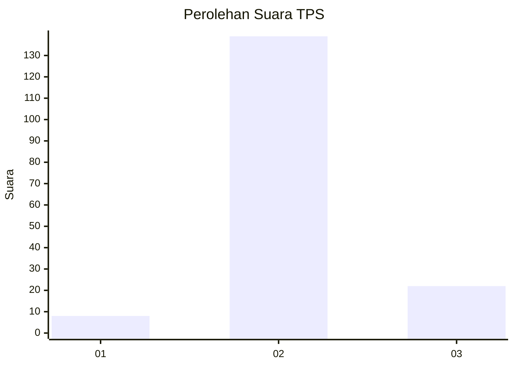
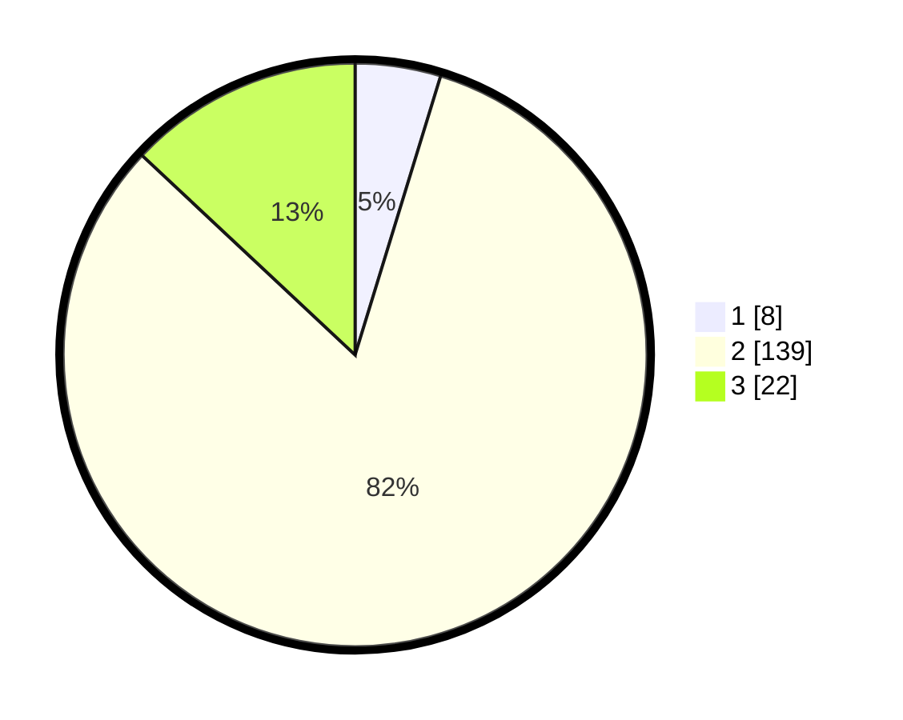

# Hasil

## Grafik

## Tabel

| No. | Nama Paslon    | Suara | Suara (raw) | Persentase |
|:--- |:-------------- | -----:| -----------:| ----------:|
| 1   | ANIES MUHAIMIN | 8     | [8][p-1]    | 4,73       |
| 2   | PRABOWO GIBRAN | 139   | [139][p-2]  | 82,25      |
| 3   | GANJAR MAHFUD  | 22    | [22][p-3]   | 13,02      |

[p-1]: https://github.com/gigit-pemilu/pemilu-2024/blob/main/pilpres/hitung-suara/sub/35-jawa-timur/sub/04-tulungagung/sub/07-sendang/sub/2010-nglurup/sub/011-tps/sub/paslon-1.txt
[p-2]: https://github.com/gigit-pemilu/pemilu-2024/blob/main/pilpres/hitung-suara/sub/35-jawa-timur/sub/04-tulungagung/sub/07-sendang/sub/2010-nglurup/sub/011-tps/sub/paslon-2.txt
[p-3]: https://github.com/gigit-pemilu/pemilu-2024/blob/main/pilpres/hitung-suara/sub/35-jawa-timur/sub/04-tulungagung/sub/07-sendang/sub/2010-nglurup/sub/011-tps/sub/paslon-3.txt

## Foto C Plano

https://sirekap-obj-formc.kpu.go.id/5799/pemilu/ppwp/35/04/07/20/10/3504072010011-20240216-214537--eb234de5-8ea5-4ed4-ba49-6c085acfb01b.jpg

https://sirekap-obj-formc.kpu.go.id/5799/pemilu/ppwp/35/04/07/20/10/3504072010011-20240216-214903--474f88dc-9c11-4e33-b6bf-a17279f22cb0.jpg

https://sirekap-obj-formc.kpu.go.id/5799/pemilu/ppwp/35/04/07/20/10/3504072010011-20240216-215201--55ab6e6d-bd28-4710-b016-18ea1428d5ea.jpg

## Metadata

| Key        | Value               |
| ---------- | ------------------- |
| Time Stamp | 2024-02-19 06:16:00 |

