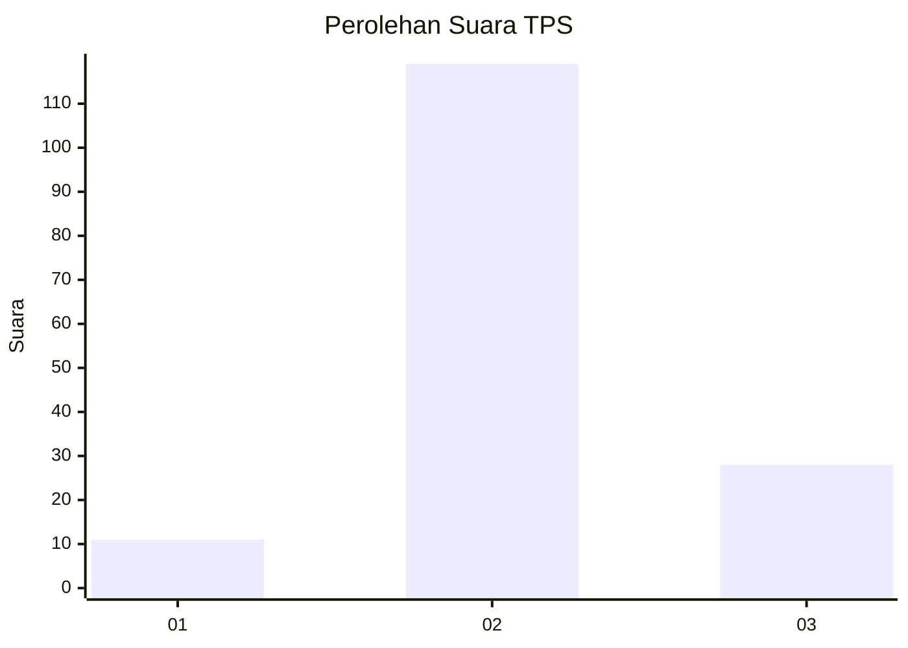

# Hasil

## Grafik

## Tabel

| No. | Nama Paslon    | Suara | Suara (raw) | Persentase |
|:--- |:-------------- | -----:| -----------:| ----------:|
| 1   | ANIES MUHAIMIN | 11    | [11][p-1]   | 6,96       |
| 2   | PRABOWO GIBRAN | 119   | [119][p-2]  | 75,32      |
| 3   | GANJAR MAHFUD  | 28    | [28][p-3]   | 17,72      |

[p-1]: https://github.com/gigit-pemilu/pemilu-2024/blob/main/pilpres/hitung-suara/sub/35-jawa-timur/sub/04-tulungagung/sub/07-sendang/sub/2011-geger/sub/006-tps/sub/paslon-1.txt
[p-2]: https://github.com/gigit-pemilu/pemilu-2024/blob/main/pilpres/hitung-suara/sub/35-jawa-timur/sub/04-tulungagung/sub/07-sendang/sub/2011-geger/sub/006-tps/sub/paslon-2.txt
[p-3]: https://github.com/gigit-pemilu/pemilu-2024/blob/main/pilpres/hitung-suara/sub/35-jawa-timur/sub/04-tulungagung/sub/07-sendang/sub/2011-geger/sub/006-tps/sub/paslon-3.txt

## Foto C Plano

https://sirekap-obj-formc.kpu.go.id/6060/pemilu/ppwp/35/04/07/20/11/3504072011006-20240216-083158--61fde28c-49da-427f-90a1-46ee951b24fe.jpg

https://sirekap-obj-formc.kpu.go.id/6060/pemilu/ppwp/35/04/07/20/11/3504072011006-20240214-201903--81af35d5-30be-486b-be96-a55eb88263e8.jpg

https://sirekap-obj-formc.kpu.go.id/6060/pemilu/ppwp/35/04/07/20/11/3504072011006-20240214-202052--30ab7e40-b35b-40df-bbde-a5c603f88b0e.jpg

## Metadata

| Key        | Value               |
| ---------- | ------------------- |
| Time Stamp | 2024-02-19 06:16:00 |

