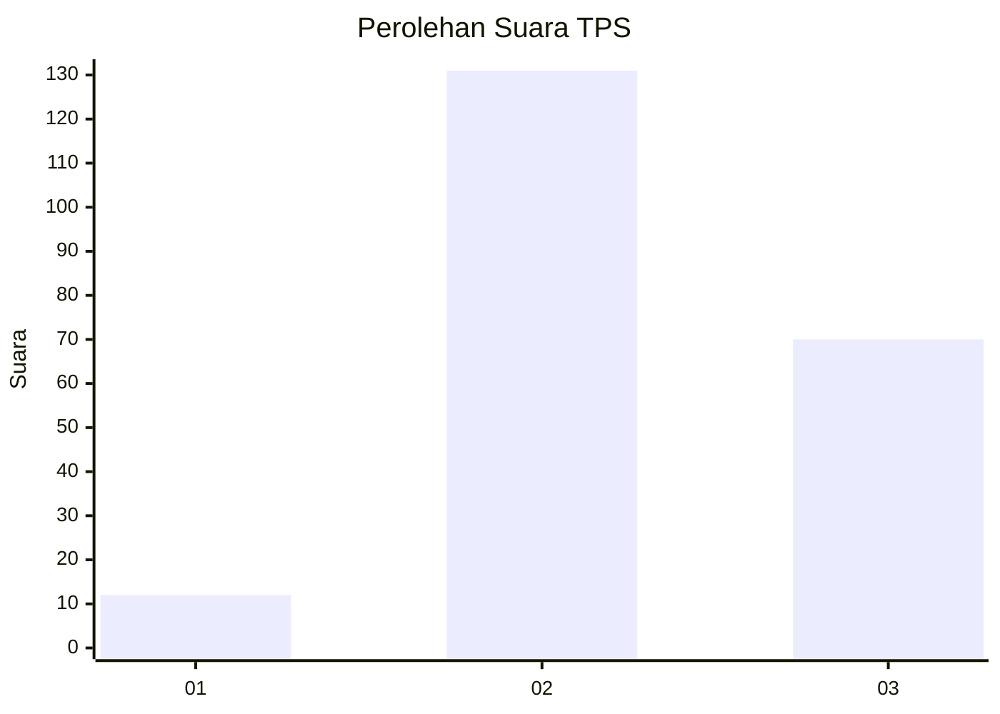
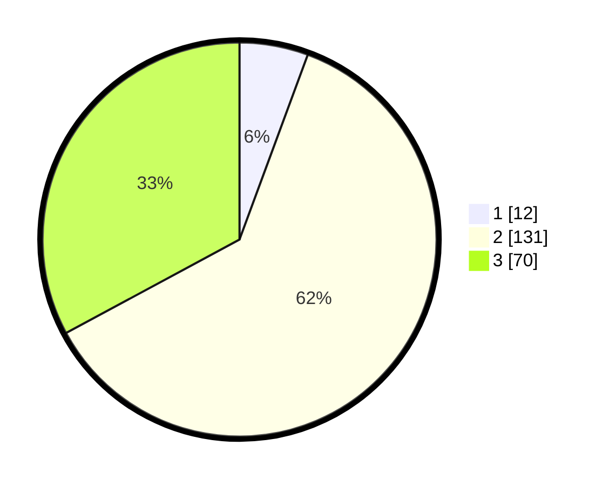

# Hasil

## Grafik

## Tabel

| No. | Nama Paslon    | Suara | Suara (raw) | Persentase |
|:--- |:-------------- | -----:| -----------:| ----------:|
| 1   | ANIES MUHAIMIN | 12    | [12][p-1]   | 5,63       |
| 2   | PRABOWO GIBRAN | 131   | [131][p-2]  | 61,50      |
| 3   | GANJAR MAHFUD  | 70    | [70][p-3]   | 32,86      |

[p-1]: https://github.com/gigit-pemilu/pemilu-2024/blob/main/pilpres/hitung-suara/sub/35-jawa-timur/sub/04-tulungagung/sub/08-karangrejo/sub/2001-bungur/sub/004-tps/sub/paslon-1.txt
[p-2]: https://github.com/gigit-pemilu/pemilu-2024/blob/main/pilpres/hitung-suara/sub/35-jawa-timur/sub/04-tulungagung/sub/08-karangrejo/sub/2001-bungur/sub/004-tps/sub/paslon-2.txt
[p-3]: https://github.com/gigit-pemilu/pemilu-2024/blob/main/pilpres/hitung-suara/sub/35-jawa-timur/sub/04-tulungagung/sub/08-karangrejo/sub/2001-bungur/sub/004-tps/sub/paslon-3.txt

## Foto C Plano

https://sirekap-obj-formc.kpu.go.id/03d6/pemilu/ppwp/35/04/08/20/01/3504082001004-20240214-223019--3f4eac65-62a4-4b20-beb8-78e4f7937da1.jpg

https://sirekap-obj-formc.kpu.go.id/03d6/pemilu/ppwp/35/04/08/20/01/3504082001004-20240214-223220--445d04ed-9374-46be-83d3-8af2507cf0f9.jpg

https://sirekap-obj-formc.kpu.go.id/03d6/pemilu/ppwp/35/04/08/20/01/3504082001004-20240214-223507--75d19e30-df43-4ff4-816d-61fa97624362.jpg

## Metadata

| Key        | Value               |
| ---------- | ------------------- |
| Time Stamp | 2024-02-15 22:00:27 |

