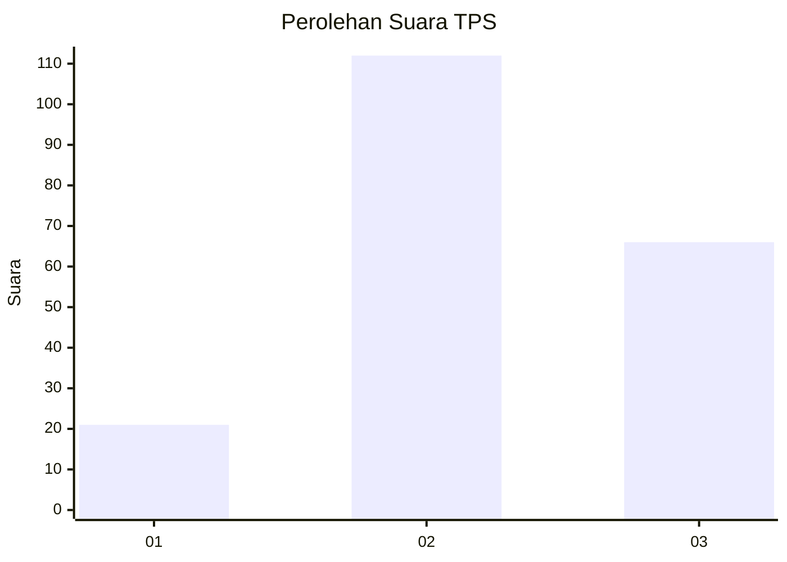
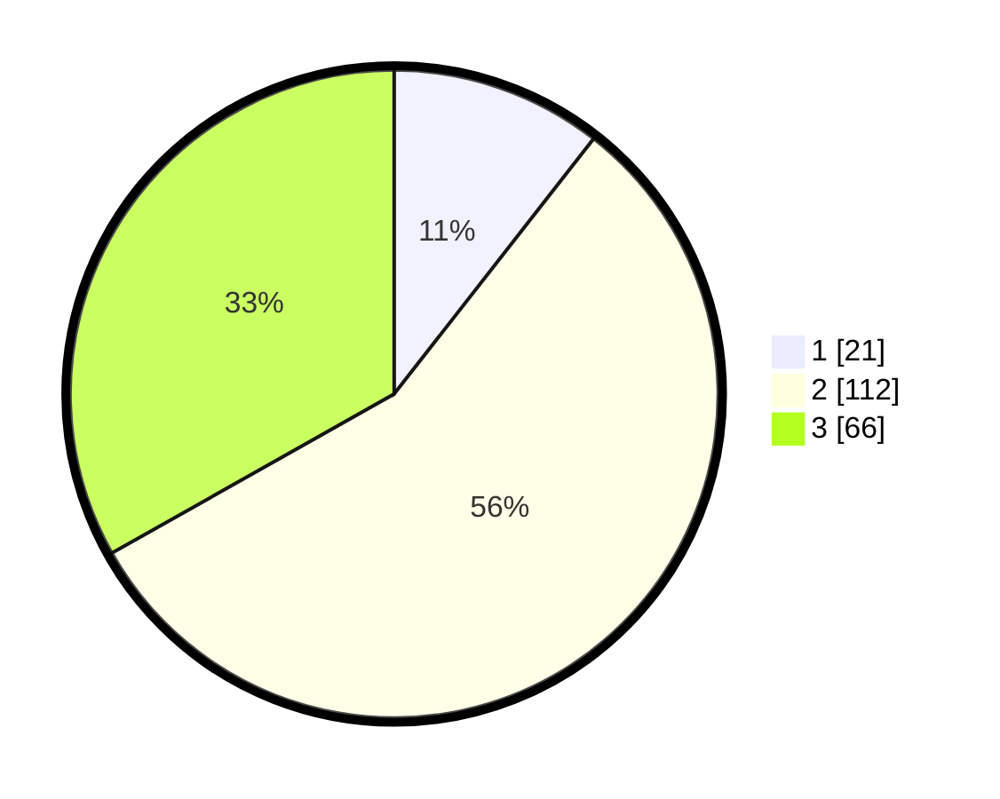

# Hasil

## Grafik

## Tabel

| No. | Nama Paslon    | Suara | Suara (raw) | Persentase |
|:--- |:-------------- | -----:| -----------:| ----------:|
| 1   | ANIES MUHAIMIN | 21    | [21][p-1]   | 10,55      |
| 2   | PRABOWO GIBRAN | 112   | [112][p-2]  | 56,28      |
| 3   | GANJAR MAHFUD  | 66    | [66][p-3]   | 33,17      |

[p-1]: https://github.com/gigit-pemilu/pemilu-2024/blob/main/pilpres/hitung-suara/sub/35-jawa-timur/sub/04-tulungagung/sub/08-karangrejo/sub/2001-bungur/sub/018-tps/sub/paslon-1.txt
[p-2]: https://github.com/gigit-pemilu/pemilu-2024/blob/main/pilpres/hitung-suara/sub/35-jawa-timur/sub/04-tulungagung/sub/08-karangrejo/sub/2001-bungur/sub/018-tps/sub/paslon-2.txt
[p-3]: https://github.com/gigit-pemilu/pemilu-2024/blob/main/pilpres/hitung-suara/sub/35-jawa-timur/sub/04-tulungagung/sub/08-karangrejo/sub/2001-bungur/sub/018-tps/sub/paslon-3.txt

## Foto C Plano

https://sirekap-obj-formc.kpu.go.id/a26d/pemilu/ppwp/35/04/08/20/01/3504082001018-20240214-204832--4dff41ea-809b-42e9-a380-73d5e46d15f5.jpg

https://sirekap-obj-formc.kpu.go.id/a26d/pemilu/ppwp/35/04/08/20/01/3504082001018-20240214-204940--d139204b-51c0-448b-9d04-a3d50019f111.jpg

https://sirekap-obj-formc.kpu.go.id/a26d/pemilu/ppwp/35/04/08/20/01/3504082001018-20240214-205024--103e55e3-9f9f-4317-830f-bd1d4358a21a.jpg

## Metadata

| Key        | Value               |
| ---------- | ------------------- |
| Time Stamp | 2024-02-15 22:00:27 |

