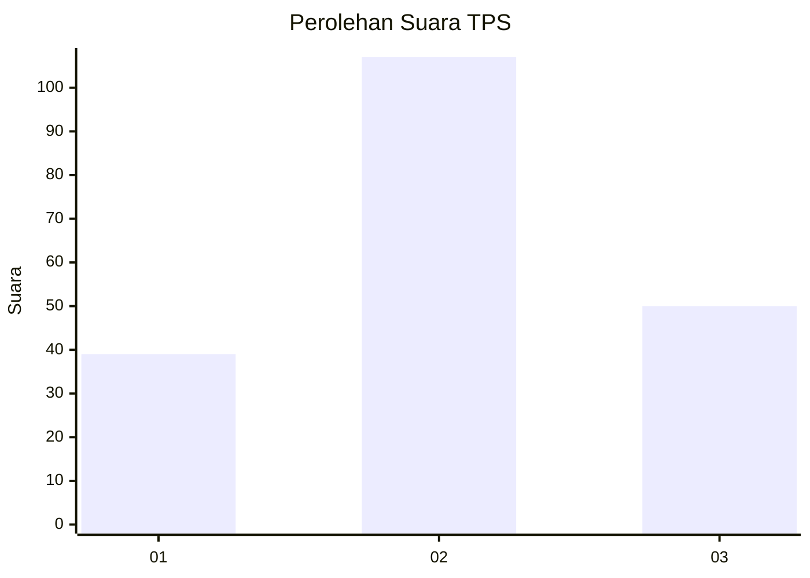
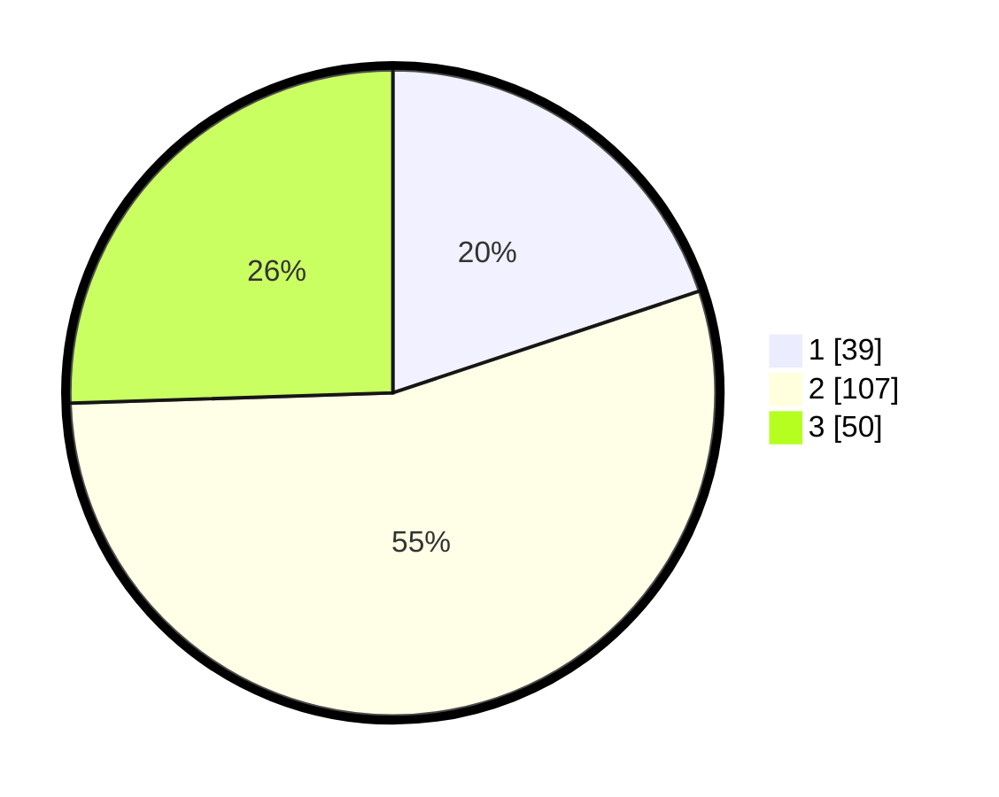

# Hasil

## Grafik

## Tabel

| No. | Nama Paslon    | Suara | Suara (raw) | Persentase |
|:--- |:-------------- | -----:| -----------:| ----------:|
| 1   | ANIES MUHAIMIN | 39    | [39][p-1]   | 19,90      |
| 2   | PRABOWO GIBRAN | 107   | [107][p-2]  | 54,59      |
| 3   | GANJAR MAHFUD  | 50    | [50][p-3]   | 25,51      |

[p-1]: https://github.com/gigit-pemilu/pemilu-2024/blob/main/pilpres/hitung-suara/sub/35-jawa-timur/sub/04-tulungagung/sub/08-karangrejo/sub/2008-sukodono/sub/003-tps/sub/paslon-1.txt
[p-2]: https://github.com/gigit-pemilu/pemilu-2024/blob/main/pilpres/hitung-suara/sub/35-jawa-timur/sub/04-tulungagung/sub/08-karangrejo/sub/2008-sukodono/sub/003-tps/sub/paslon-2.txt
[p-3]: https://github.com/gigit-pemilu/pemilu-2024/blob/main/pilpres/hitung-suara/sub/35-jawa-timur/sub/04-tulungagung/sub/08-karangrejo/sub/2008-sukodono/sub/003-tps/sub/paslon-3.txt

## Foto C Plano

https://sirekap-obj-formc.kpu.go.id/7085/pemilu/ppwp/35/04/08/20/08/3504082008003-20240215-002837--ba514a1b-4344-4f3a-bca4-d2b1e54db5b1.jpg

https://sirekap-obj-formc.kpu.go.id/7085/pemilu/ppwp/35/04/08/20/08/3504082008003-20240215-003252--ca2c871a-f9d5-40b4-b7e4-d8e41e3f3754.jpg

https://sirekap-obj-formc.kpu.go.id/7085/pemilu/ppwp/35/04/08/20/08/3504082008003-20240215-003438--8c0b97e1-027b-4b7b-a274-a86540bdfb91.jpg

## Metadata

| Key        | Value               |
| ---------- | ------------------- |
| Time Stamp | 2024-02-24 22:31:28 |

