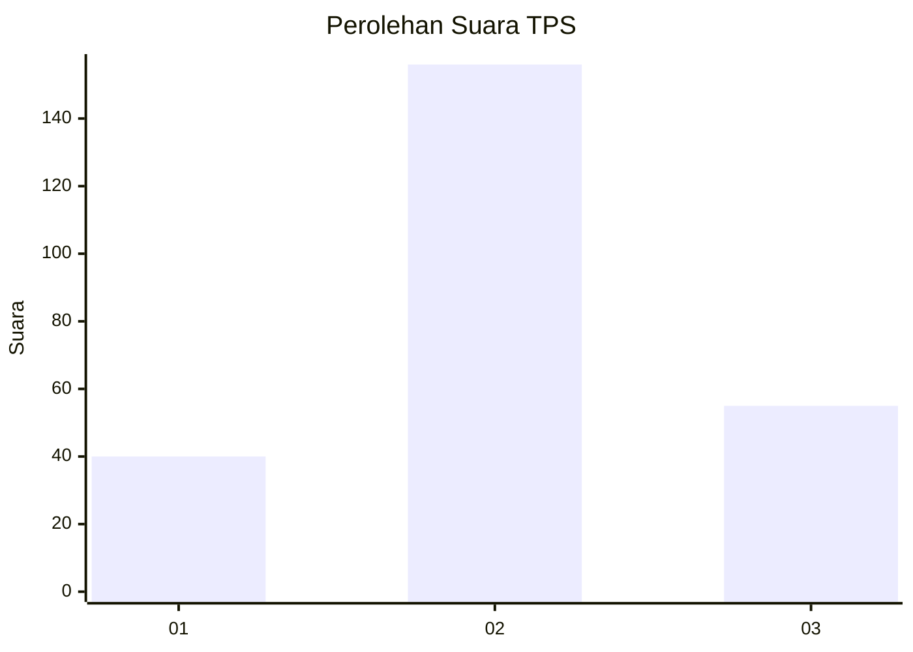
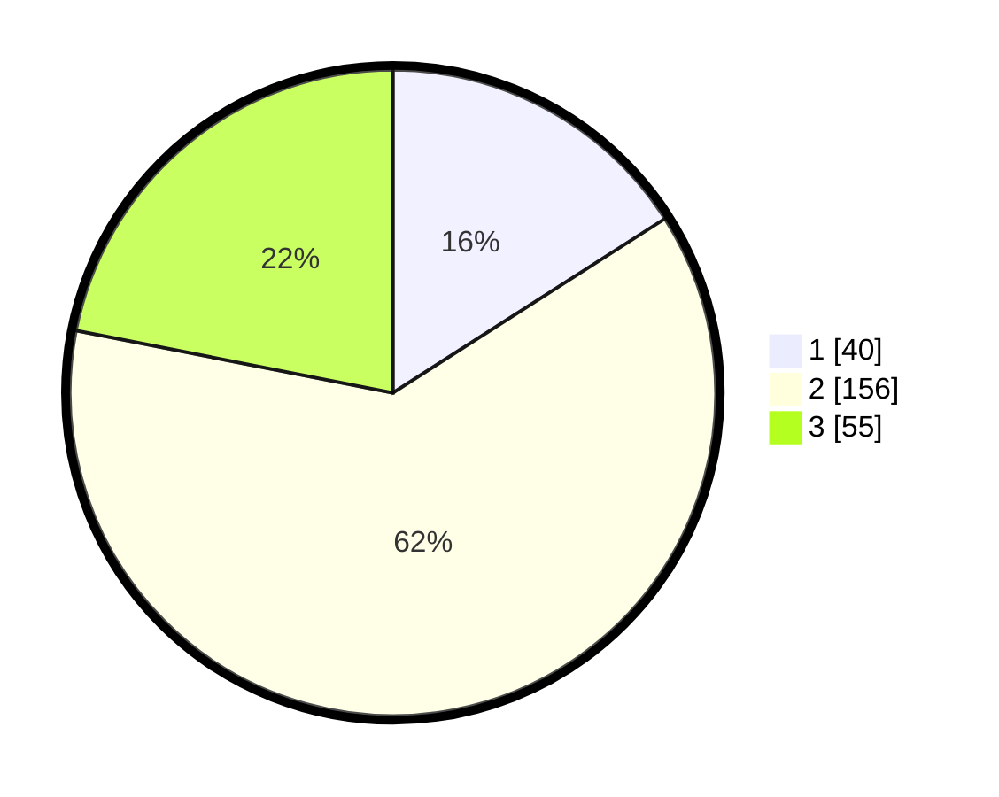

# Hasil

## Grafik

## Tabel

| No. | Nama Paslon    | Suara | Suara (raw) | Persentase |
|:--- |:-------------- | -----:| -----------:| ----------:|
| 1   | ANIES MUHAIMIN | 40    | [40][p-1]   | 15,94      |
| 2   | PRABOWO GIBRAN | 156   | [156][p-2]  | 62,15      |
| 3   | GANJAR MAHFUD  | 55    | [55][p-3]   | 21,91      |

[p-1]: https://github.com/gigit-pemilu/pemilu-2024-35-jawa-timur/blob/main/pilpres/hitung-suara/sub/35-jawa-timur/sub/04-tulungagung/sub/08-karangrejo/sub/2009-karangrejo/sub/002-tps/sub/paslon-1.txt
[p-2]: https://github.com/gigit-pemilu/pemilu-2024-35-jawa-timur/blob/main/pilpres/hitung-suara/sub/35-jawa-timur/sub/04-tulungagung/sub/08-karangrejo/sub/2009-karangrejo/sub/002-tps/sub/paslon-2.txt
[p-3]: https://github.com/gigit-pemilu/pemilu-2024-35-jawa-timur/blob/main/pilpres/hitung-suara/sub/35-jawa-timur/sub/04-tulungagung/sub/08-karangrejo/sub/2009-karangrejo/sub/002-tps/sub/paslon-3.txt

## Foto C Plano

https://sirekap-obj-formc.kpu.go.id/683a/pemilu/ppwp/35/04/08/20/09/3504082009002-20240214-211300--5e2f6053-4f6f-419f-8285-39cd1bda8002.jpg

https://sirekap-obj-formc.kpu.go.id/683a/pemilu/ppwp/35/04/08/20/09/3504082009002-20240214-212209--f03aeebe-9bc2-4176-99e5-f78df5754f65.jpg

https://sirekap-obj-formc.kpu.go.id/683a/pemilu/ppwp/35/04/08/20/09/3504082009002-20240214-212612--265c986c-0e36-4269-843d-92a2d6d011f4.jpg

## Metadata

| Key        | Value               |
| ---------- | ------------------- |
| Time Stamp | 2024-02-25 22:00:00 |

