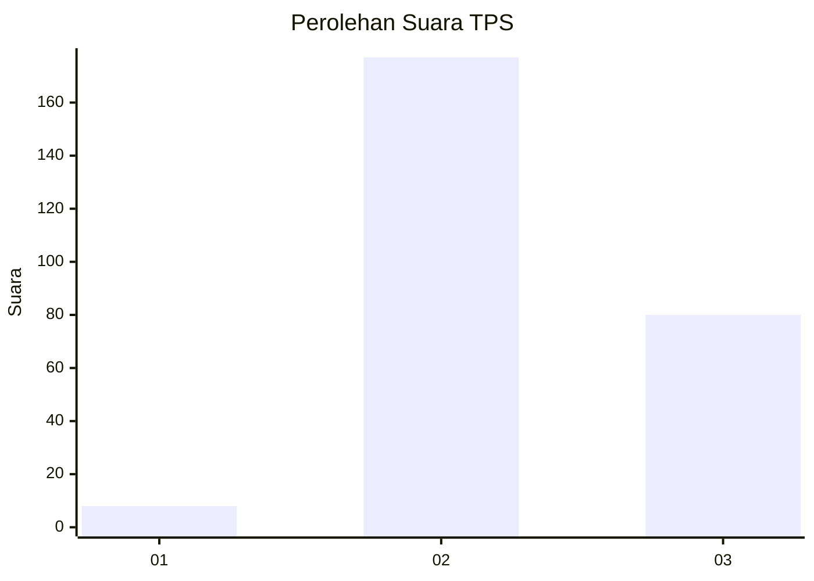

# Hasil

## Grafik

## Tabel

| No. | Nama Paslon    | Suara | Suara (raw) | Persentase |
|:--- |:-------------- | -----:| -----------:| ----------:|
| 1   | ANIES MUHAIMIN | 8     | [8][p-1]    | 3,02       |
| 2   | PRABOWO GIBRAN | 177   | [177][p-2]  | 66,79      |
| 3   | GANJAR MAHFUD  | 80    | [80][p-3]   | 30,19      |

[p-1]: https://github.com/gigit-pemilu/pemilu-2024/blob/main/pilpres/hitung-suara/sub/35-jawa-timur/sub/04-tulungagung/sub/09-gondang/sub/2004-dukuh/sub/002-tps/sub/paslon-1.txt
[p-2]: https://github.com/gigit-pemilu/pemilu-2024/blob/main/pilpres/hitung-suara/sub/35-jawa-timur/sub/04-tulungagung/sub/09-gondang/sub/2004-dukuh/sub/002-tps/sub/paslon-2.txt
[p-3]: https://github.com/gigit-pemilu/pemilu-2024/blob/main/pilpres/hitung-suara/sub/35-jawa-timur/sub/04-tulungagung/sub/09-gondang/sub/2004-dukuh/sub/002-tps/sub/paslon-3.txt

## Foto C Plano

https://sirekap-obj-formc.kpu.go.id/98d5/pemilu/ppwp/35/04/09/20/04/3504092004002-20240214-223214--58066371-a624-4c2a-82a5-8c6bc68bae2d.jpg

https://sirekap-obj-formc.kpu.go.id/98d5/pemilu/ppwp/35/04/09/20/04/3504092004002-20240214-224901--d08e3100-4796-4550-8b06-eb68170cd91e.jpg

https://sirekap-obj-formc.kpu.go.id/98d5/pemilu/ppwp/35/04/09/20/04/3504092004002-20240214-225149--921c6bb6-7621-414b-8469-40c7a3e3d199.jpg

## Metadata

| Key        | Value               |
| ---------- | ------------------- |
| Time Stamp | 2024-02-16 21:01:00 |

