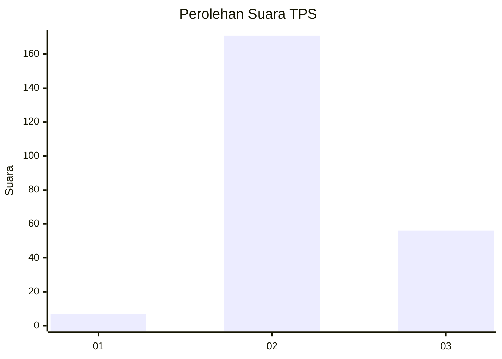
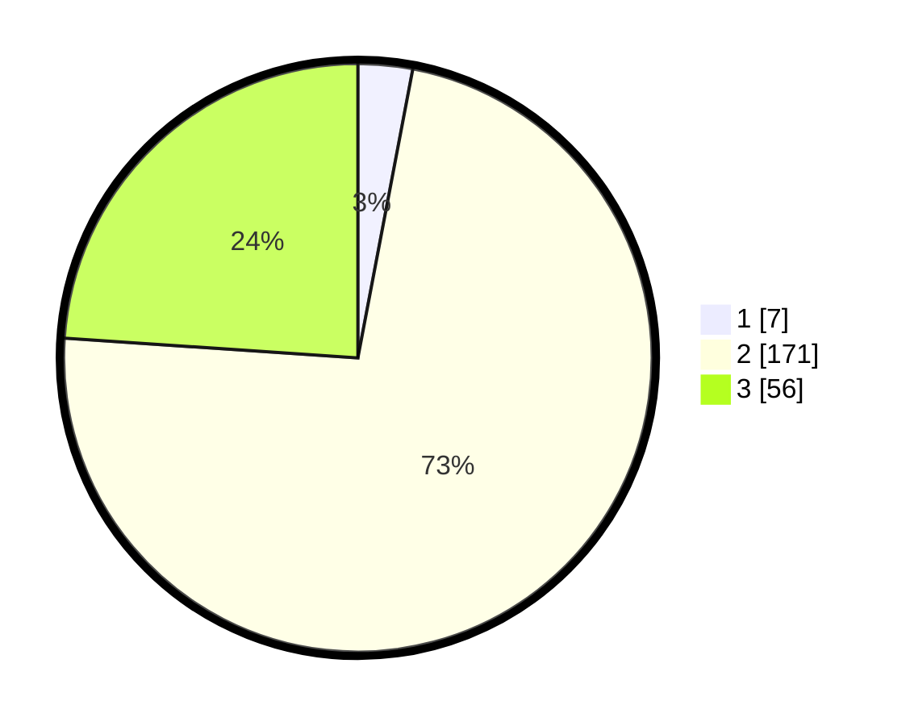

# Hasil

## Grafik

## Tabel

| No. | Nama Paslon    | Suara | Suara (raw) | Persentase |
|:--- |:-------------- | -----:| -----------:| ----------:|
| 1   | ANIES MUHAIMIN | 7     | [7][p-1]    | 2,99       |
| 2   | PRABOWO GIBRAN | 171   | [171][p-2]  | 73,08      |
| 3   | GANJAR MAHFUD  | 56    | [56][p-3]   | 23,93      |

[p-1]: https://github.com/gigit-pemilu/pemilu-2024/blob/main/pilpres/hitung-suara/sub/35-jawa-timur/sub/04-tulungagung/sub/09-gondang/sub/2006-macanbang/sub/006-tps/sub/paslon-1.txt
[p-2]: https://github.com/gigit-pemilu/pemilu-2024/blob/main/pilpres/hitung-suara/sub/35-jawa-timur/sub/04-tulungagung/sub/09-gondang/sub/2006-macanbang/sub/006-tps/sub/paslon-2.txt
[p-3]: https://github.com/gigit-pemilu/pemilu-2024/blob/main/pilpres/hitung-suara/sub/35-jawa-timur/sub/04-tulungagung/sub/09-gondang/sub/2006-macanbang/sub/006-tps/sub/paslon-3.txt

## Foto C Plano

https://sirekap-obj-formc.kpu.go.id/6b8f/pemilu/ppwp/35/04/09/20/06/3504092006006-20240214-225549--bc46ae4c-7a78-40f5-900e-12b5870811a8.jpg

https://sirekap-obj-formc.kpu.go.id/6b8f/pemilu/ppwp/35/04/09/20/06/3504092006006-20240214-225702--2a55f4db-5cfa-430e-ad94-b8e4ade75296.jpg

https://sirekap-obj-formc.kpu.go.id/6b8f/pemilu/ppwp/35/04/09/20/06/3504092006006-20240214-225952--d0fd195f-540c-4800-92dd-9bbb25478dc2.jpg

## Metadata

| Key        | Value               |
| ---------- | ------------------- |
| Time Stamp | 2024-02-16 21:01:00 |

