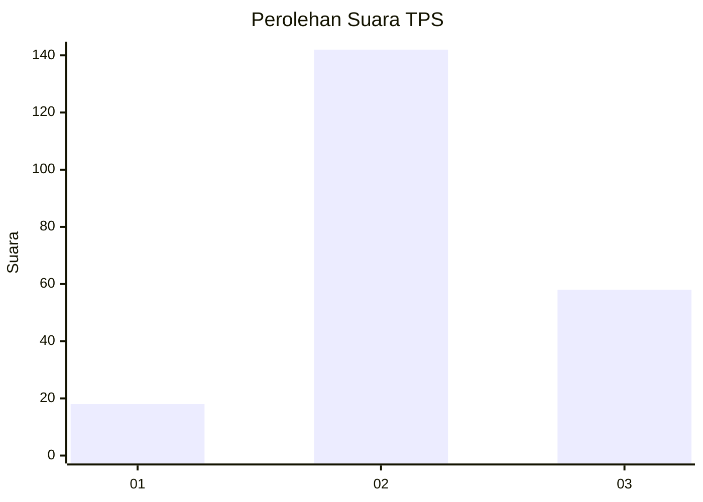

# Hasil

## Grafik

## Tabel

| No. | Nama Paslon    | Suara | Suara (raw) | Persentase |
|:--- |:-------------- | -----:| -----------:| ----------:|
| 1   | ANIES MUHAIMIN | 18    | [18][p-1]   | 8,26       |
| 2   | PRABOWO GIBRAN | 142   | [142][p-2]  | 65,14      |
| 3   | GANJAR MAHFUD  | 58    | [58][p-3]   | 26,61      |

[p-1]: https://github.com/gigit-pemilu/pemilu-2024/blob/main/pilpres/hitung-suara/sub/35-jawa-timur/sub/04-tulungagung/sub/09-gondang/sub/2009-bendo/sub/005-tps/sub/paslon-1.txt
[p-2]: https://github.com/gigit-pemilu/pemilu-2024/blob/main/pilpres/hitung-suara/sub/35-jawa-timur/sub/04-tulungagung/sub/09-gondang/sub/2009-bendo/sub/005-tps/sub/paslon-2.txt
[p-3]: https://github.com/gigit-pemilu/pemilu-2024/blob/main/pilpres/hitung-suara/sub/35-jawa-timur/sub/04-tulungagung/sub/09-gondang/sub/2009-bendo/sub/005-tps/sub/paslon-3.txt

## Foto C Plano

https://sirekap-obj-formc.kpu.go.id/0968/pemilu/ppwp/35/04/09/20/09/3504092009005-20240214-213047--747c5568-1d83-4472-9359-cfef07a4d40c.jpg

https://sirekap-obj-formc.kpu.go.id/0968/pemilu/ppwp/35/04/09/20/09/3504092009005-20240214-213212--8d0b666c-8d36-485e-9c88-b8328560e8b7.jpg

https://sirekap-obj-formc.kpu.go.id/0968/pemilu/ppwp/35/04/09/20/09/3504092009005-20240215-010725--c82df7ba-fd0b-40b2-b966-1769284f3105.jpg

## Metadata

| Key        | Value               |
| ---------- | ------------------- |
| Time Stamp | 2024-02-16 21:01:00 |

