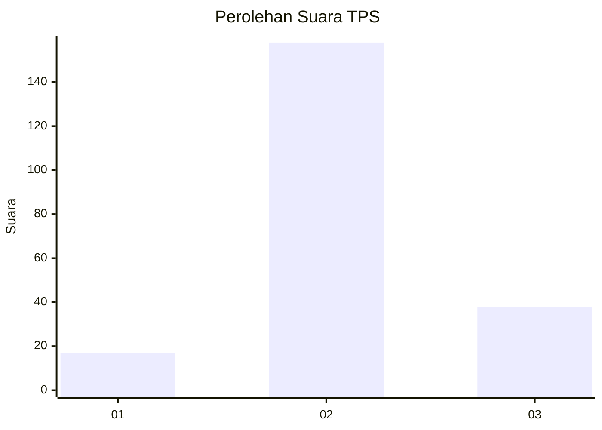

# Hasil

## Grafik

## Tabel

| No. | Nama Paslon    | Suara | Suara (raw) | Persentase |
|:--- |:-------------- | -----:| -----------:| ----------:|
| 1   | ANIES MUHAIMIN | 17    | [17][p-1]   | 7,98       |
| 2   | PRABOWO GIBRAN | 158   | [158][p-2]  | 74,18      |
| 3   | GANJAR MAHFUD  | 38    | [38][p-3]   | 17,84      |

[p-1]: https://github.com/gigit-pemilu/pemilu-2024-35-jawa-timur/blob/main/pilpres/hitung-suara/sub/35-jawa-timur/sub/04-tulungagung/sub/09-gondang/sub/2009-bendo/sub/008-tps/sub/paslon-1.txt
[p-2]: https://github.com/gigit-pemilu/pemilu-2024-35-jawa-timur/blob/main/pilpres/hitung-suara/sub/35-jawa-timur/sub/04-tulungagung/sub/09-gondang/sub/2009-bendo/sub/008-tps/sub/paslon-2.txt
[p-3]: https://github.com/gigit-pemilu/pemilu-2024-35-jawa-timur/blob/main/pilpres/hitung-suara/sub/35-jawa-timur/sub/04-tulungagung/sub/09-gondang/sub/2009-bendo/sub/008-tps/sub/paslon-3.txt

## Foto C Plano

https://sirekap-obj-formc.kpu.go.id/e4c7/pemilu/ppwp/35/04/09/20/09/3504092009008-20240215-000618--c9c1bfb4-04f0-45b3-9fa8-5dea8506bffd.jpg

https://sirekap-obj-formc.kpu.go.id/e4c7/pemilu/ppwp/35/04/09/20/09/3504092009008-20240215-000436--049d45d8-2e49-4b11-af79-d5792fb70db0.jpg

https://sirekap-obj-formc.kpu.go.id/e4c7/pemilu/ppwp/35/04/09/20/09/3504092009008-20240214-213311--dddbe66a-031b-43bb-bac2-56ee2bc540e0.jpg

## Metadata

| Key        | Value               |
| ---------- | ------------------- |
| Time Stamp | 2024-02-16 21:01:00 |

