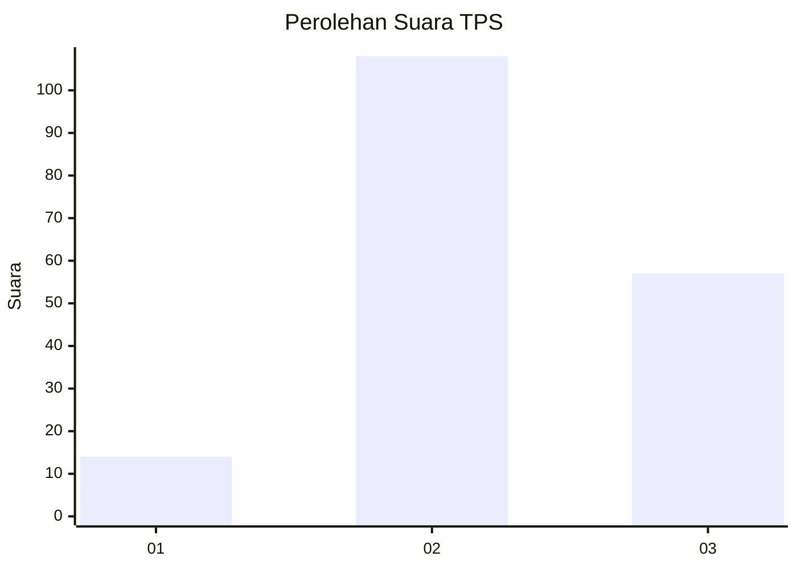
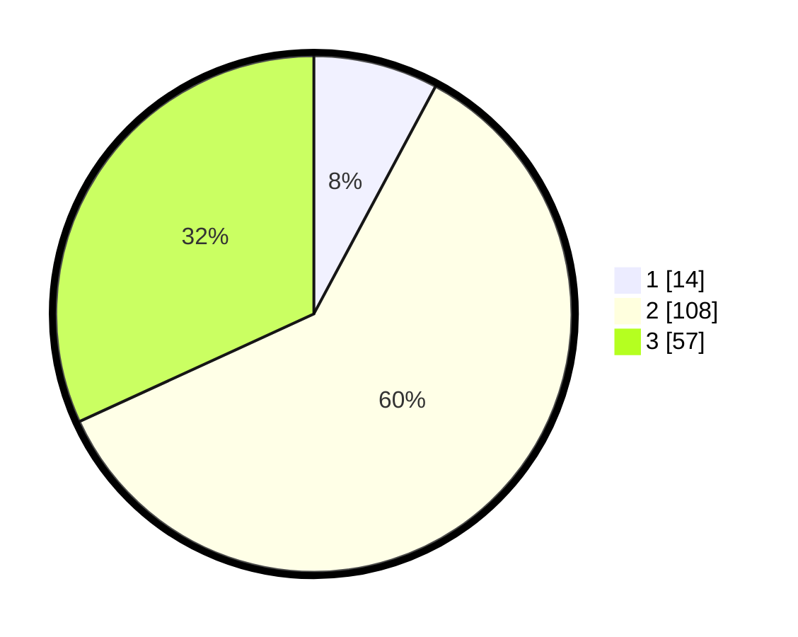

# Hasil

## Grafik

## Tabel

| No. | Nama Paslon    | Suara | Suara (raw) | Persentase |
|:--- |:-------------- | -----:| -----------:| ----------:|
| 1   | ANIES MUHAIMIN | 14    | [14][p-1]   | 7,82       |
| 2   | PRABOWO GIBRAN | 108   | [108][p-2]  | 60,34      |
| 3   | GANJAR MAHFUD  | 57    | [57][p-3]   | 31,84      |

[p-1]: https://github.com/gigit-pemilu/pemilu-2024-35-jawa-timur/blob/main/pilpres/hitung-suara/sub/35-jawa-timur/sub/04-tulungagung/sub/09-gondang/sub/2012-bendungan/sub/007-tps/sub/paslon-1.txt
[p-2]: https://github.com/gigit-pemilu/pemilu-2024-35-jawa-timur/blob/main/pilpres/hitung-suara/sub/35-jawa-timur/sub/04-tulungagung/sub/09-gondang/sub/2012-bendungan/sub/007-tps/sub/paslon-2.txt
[p-3]: https://github.com/gigit-pemilu/pemilu-2024-35-jawa-timur/blob/main/pilpres/hitung-suara/sub/35-jawa-timur/sub/04-tulungagung/sub/09-gondang/sub/2012-bendungan/sub/007-tps/sub/paslon-3.txt

## Foto C Plano

https://sirekap-obj-formc.kpu.go.id/ab43/pemilu/ppwp/35/04/09/20/12/3504092012007-20240216-224240--662fb9b1-a0a1-47ed-8f1b-35ac9715499d.jpg

https://sirekap-obj-formc.kpu.go.id/ab43/pemilu/ppwp/35/04/09/20/12/3504092012007-20240216-215746--4191d170-a48b-4f83-a2a7-2e3b16871123.jpg

https://sirekap-obj-formc.kpu.go.id/ab43/pemilu/ppwp/35/04/09/20/12/3504092012007-20240216-215757--3cc65c11-e35d-4ab6-90da-65555e041328.jpg

## Metadata

| Key        | Value               |
| ---------- | ------------------- |
| Time Stamp | 2024-02-17 18:00:00 |

