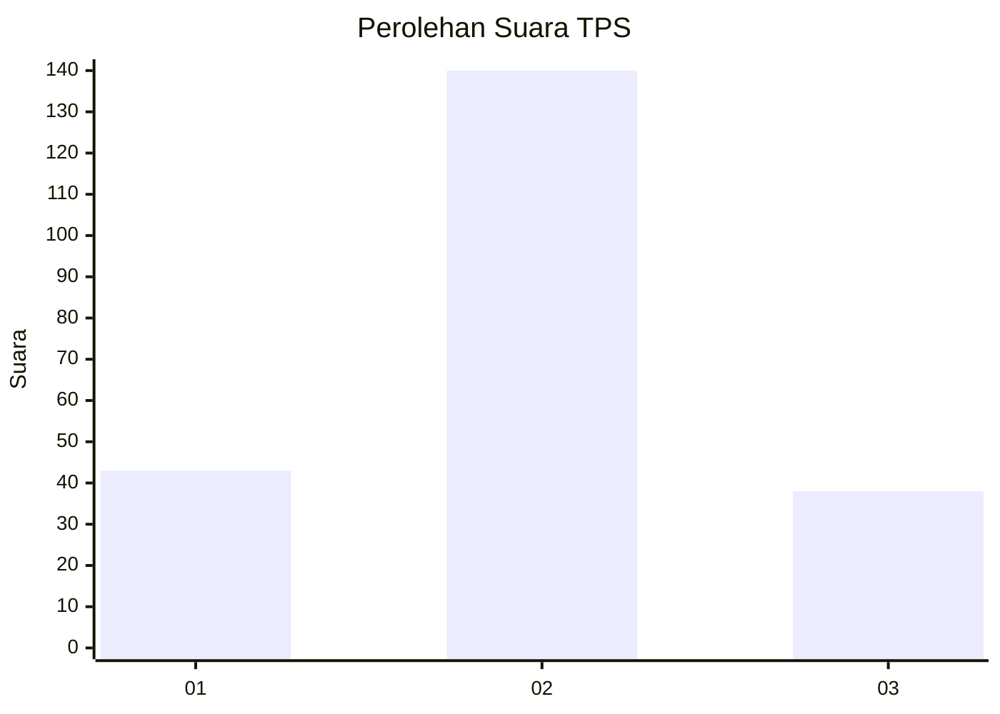
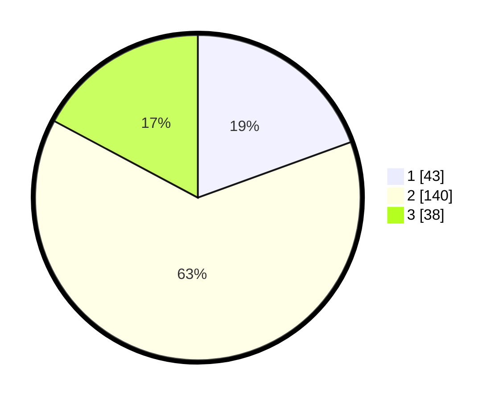

# Hasil

## Grafik

## Tabel

| No. | Nama Paslon    | Suara | Suara (raw) | Persentase |
|:--- |:-------------- | -----:| -----------:| ----------:|
| 1   | ANIES MUHAIMIN | 43    | [43][p-1]   | 19,46      |
| 2   | PRABOWO GIBRAN | 140   | [140][p-2]  | 63,35      |
| 3   | GANJAR MAHFUD  | 38    | [38][p-3]   | 17,19      |

[p-1]: https://github.com/gigit-pemilu/pemilu-2024-35-jawa-timur/blob/main/pilpres/hitung-suara/sub/35-jawa-timur/sub/04-tulungagung/sub/09-gondang/sub/2013-notorejo/sub/007-tps/sub/paslon-1.txt
[p-2]: https://github.com/gigit-pemilu/pemilu-2024-35-jawa-timur/blob/main/pilpres/hitung-suara/sub/35-jawa-timur/sub/04-tulungagung/sub/09-gondang/sub/2013-notorejo/sub/007-tps/sub/paslon-2.txt
[p-3]: https://github.com/gigit-pemilu/pemilu-2024-35-jawa-timur/blob/main/pilpres/hitung-suara/sub/35-jawa-timur/sub/04-tulungagung/sub/09-gondang/sub/2013-notorejo/sub/007-tps/sub/paslon-3.txt

## Foto C Plano

https://sirekap-obj-formc.kpu.go.id/bfa8/pemilu/ppwp/35/04/09/20/13/3504092013007-20240214-230141--cf96e9d6-cf24-4809-9c51-0fd850b42430.jpg

https://sirekap-obj-formc.kpu.go.id/bfa8/pemilu/ppwp/35/04/09/20/13/3504092013007-20240214-230259--7ef07494-1c96-43aa-a601-ef84d097ebdb.jpg

https://sirekap-obj-formc.kpu.go.id/bfa8/pemilu/ppwp/35/04/09/20/13/3504092013007-20240214-230428--e3aabe84-6a63-4992-9826-0395043ab011.jpg

## Metadata

| Key        | Value               |
| ---------- | ------------------- |
| Time Stamp | 2024-02-16 21:01:00 |

