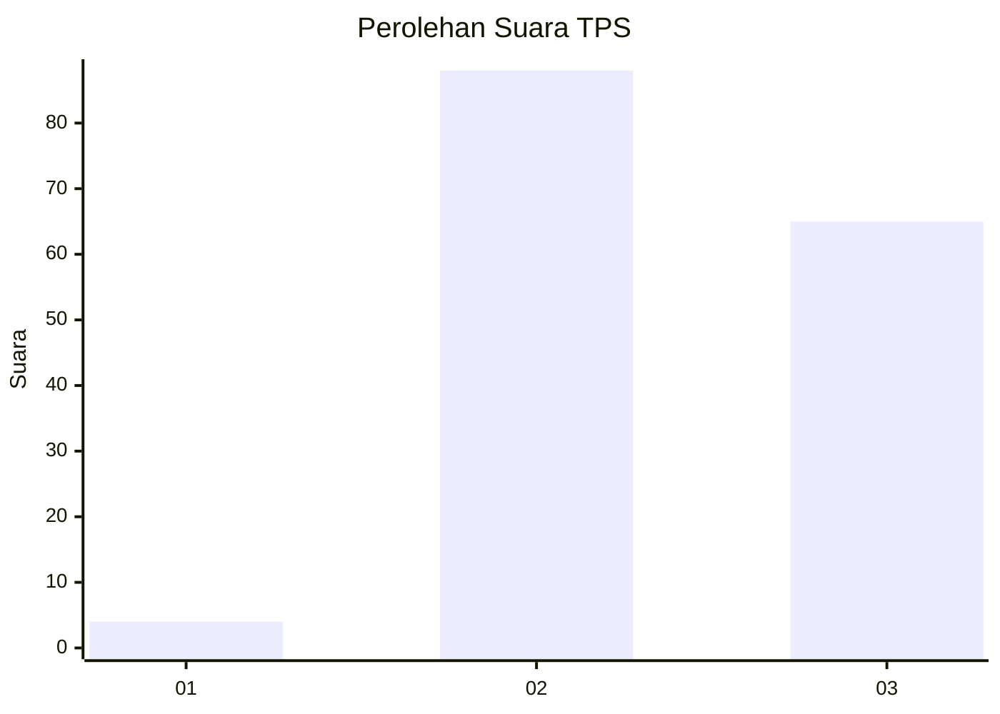
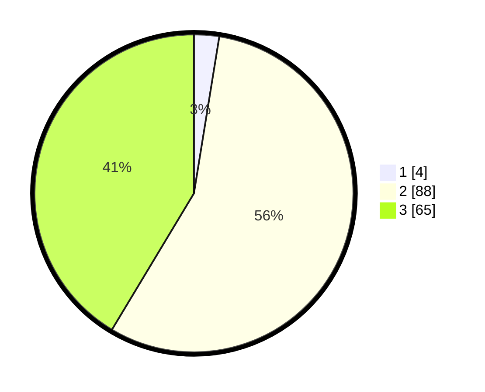

# Hasil

## Grafik

## Tabel

| No. | Nama Paslon    | Suara | Suara (raw) | Persentase |
|:--- |:-------------- | -----:| -----------:| ----------:|
| 1   | ANIES MUHAIMIN | 4     | [4][p-1]    | 2,55       |
| 2   | PRABOWO GIBRAN | 88    | [88][p-2]   | 56,05      |
| 3   | GANJAR MAHFUD  | 65    | [65][p-3]   | 41,40      |

[p-1]: https://github.com/gigit-pemilu/pemilu-2024/blob/main/pilpres/hitung-suara/sub/35-jawa-timur/sub/04-tulungagung/sub/09-gondang/sub/2014-sidem/sub/003-tps/sub/paslon-1.txt
[p-2]: https://github.com/gigit-pemilu/pemilu-2024/blob/main/pilpres/hitung-suara/sub/35-jawa-timur/sub/04-tulungagung/sub/09-gondang/sub/2014-sidem/sub/003-tps/sub/paslon-2.txt
[p-3]: https://github.com/gigit-pemilu/pemilu-2024/blob/main/pilpres/hitung-suara/sub/35-jawa-timur/sub/04-tulungagung/sub/09-gondang/sub/2014-sidem/sub/003-tps/sub/paslon-3.txt

## Foto C Plano

https://sirekap-obj-formc.kpu.go.id/627d/pemilu/ppwp/35/04/09/20/14/3504092014003-20240214-223830--da1289e5-f846-48fb-bdc0-fc04ba8a71fc.jpg

https://sirekap-obj-formc.kpu.go.id/627d/pemilu/ppwp/35/04/09/20/14/3504092014003-20240214-224107--ac458526-b6a5-4edd-ad47-b9ed8789aa4a.jpg

https://sirekap-obj-formc.kpu.go.id/627d/pemilu/ppwp/35/04/09/20/14/3504092014003-20240214-224228--6790edc0-c41d-45c1-8b79-9fa494a7a48f.jpg

## Metadata

| Key        | Value               |
| ---------- | ------------------- |
| Time Stamp | 2024-02-15 12:00:28 |

