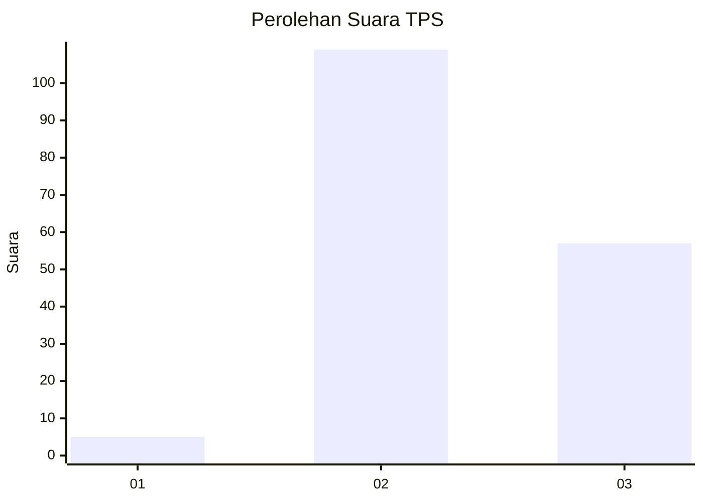
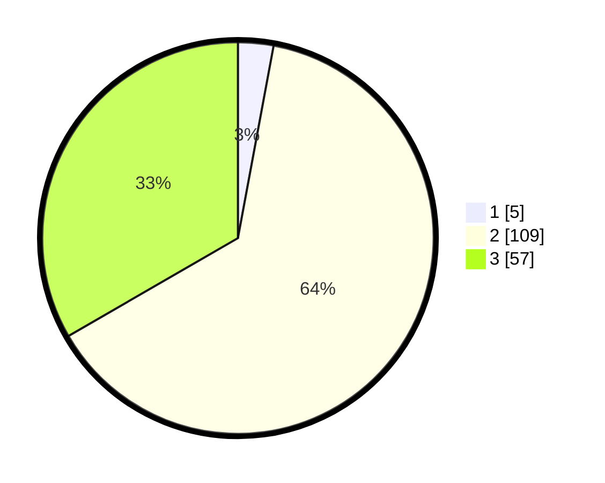

# Hasil

## Grafik

## Tabel

| No. | Nama Paslon    | Suara | Suara (raw) | Persentase |
|:--- |:-------------- | -----:| -----------:| ----------:|
| 1   | ANIES MUHAIMIN | 5     | [5][p-1]    | 2,92       |
| 2   | PRABOWO GIBRAN | 109   | [109][p-2]  | 63,74      |
| 3   | GANJAR MAHFUD  | 57    | [57][p-3]   | 33,33      |

[p-1]: https://github.com/gigit-pemilu/pemilu-2024/blob/main/pilpres/hitung-suara/sub/35-jawa-timur/sub/04-tulungagung/sub/09-gondang/sub/2014-sidem/sub/007-tps/sub/paslon-1.txt
[p-2]: https://github.com/gigit-pemilu/pemilu-2024/blob/main/pilpres/hitung-suara/sub/35-jawa-timur/sub/04-tulungagung/sub/09-gondang/sub/2014-sidem/sub/007-tps/sub/paslon-2.txt
[p-3]: https://github.com/gigit-pemilu/pemilu-2024/blob/main/pilpres/hitung-suara/sub/35-jawa-timur/sub/04-tulungagung/sub/09-gondang/sub/2014-sidem/sub/007-tps/sub/paslon-3.txt

## Foto C Plano

https://sirekap-obj-formc.kpu.go.id/b103/pemilu/ppwp/35/04/09/20/14/3504092014007-20240214-231841--0326de8a-270d-4f79-9b2c-6ff6821270b2.jpg

https://sirekap-obj-formc.kpu.go.id/b103/pemilu/ppwp/35/04/09/20/14/3504092014007-20240214-195002--f9339056-3f4f-4fb0-a92e-56bd50633460.jpg

https://sirekap-obj-formc.kpu.go.id/b103/pemilu/ppwp/35/04/09/20/14/3504092014007-20240214-195104--5fce4fea-86c9-4979-9d88-8dee405d8920.jpg

## Metadata

| Key        | Value               |
| ---------- | ------------------- |
| Time Stamp | 2024-02-15 09:00:24 |

