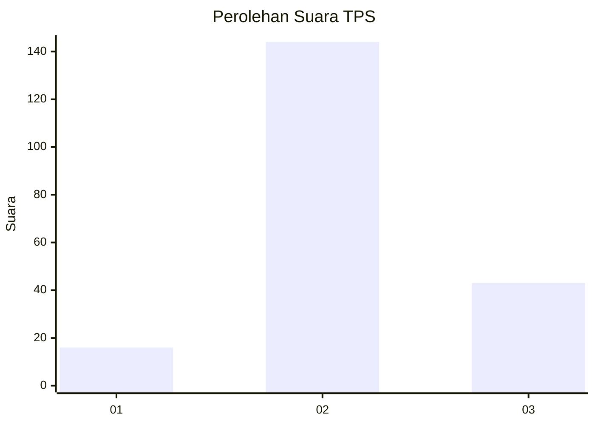
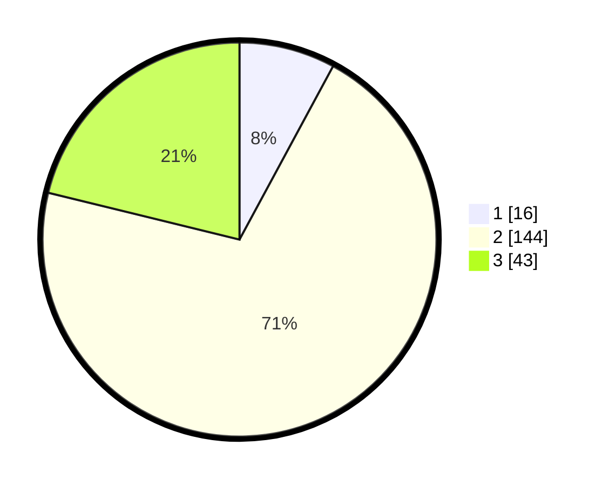

# Hasil

## Grafik

## Tabel

| No. | Nama Paslon    | Suara | Suara (raw) | Persentase |
|:--- |:-------------- | -----:| -----------:| ----------:|
| 1   | ANIES MUHAIMIN | 16    | [16][p-1]   | 7,88       |
| 2   | PRABOWO GIBRAN | 144   | [144][p-2]  | 70,94      |
| 3   | GANJAR MAHFUD  | 43    | [43][p-3]   | 21,18      |

[p-1]: https://github.com/gigit-pemilu/pemilu-2024-35-jawa-timur/blob/main/pilpres/hitung-suara/sub/35-jawa-timur/sub/04-tulungagung/sub/09-gondang/sub/2017-mojoarum/sub/003-tps/sub/paslon-1.txt
[p-2]: https://github.com/gigit-pemilu/pemilu-2024-35-jawa-timur/blob/main/pilpres/hitung-suara/sub/35-jawa-timur/sub/04-tulungagung/sub/09-gondang/sub/2017-mojoarum/sub/003-tps/sub/paslon-2.txt
[p-3]: https://github.com/gigit-pemilu/pemilu-2024-35-jawa-timur/blob/main/pilpres/hitung-suara/sub/35-jawa-timur/sub/04-tulungagung/sub/09-gondang/sub/2017-mojoarum/sub/003-tps/sub/paslon-3.txt

## Foto C Plano

https://sirekap-obj-formc.kpu.go.id/c240/pemilu/ppwp/35/04/09/20/17/3504092017003-20240214-220542--d9390de8-d7de-4a11-a048-bba7306df911.jpg

https://sirekap-obj-formc.kpu.go.id/c240/pemilu/ppwp/35/04/09/20/17/3504092017003-20240217-053426--c1a082ad-68df-4f3e-9a83-2726c82a6f37.jpg

https://sirekap-obj-formc.kpu.go.id/c240/pemilu/ppwp/35/04/09/20/17/3504092017003-20240217-053425--85fdb0f5-0b6e-4f39-ab2d-5dc44480c460.jpg

## Metadata

| Key        | Value               |
| ---------- | ------------------- |
| Time Stamp | 2024-02-21 18:00:00 |

