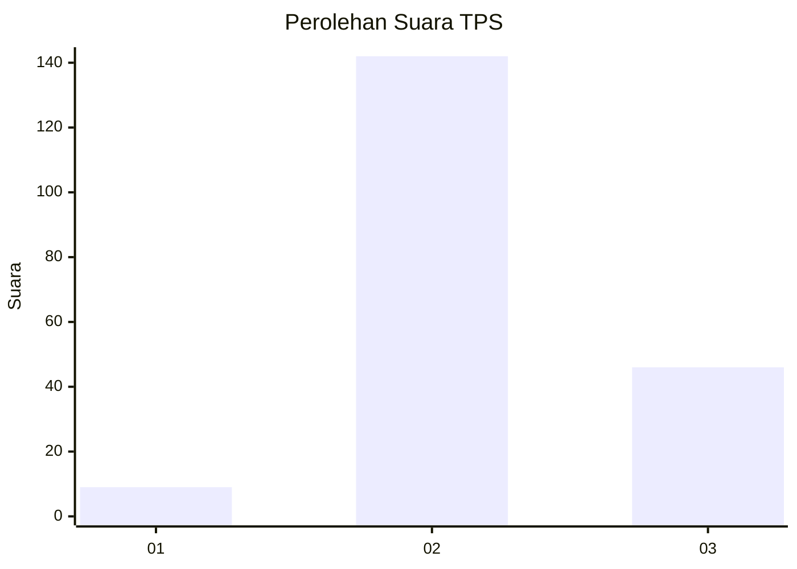
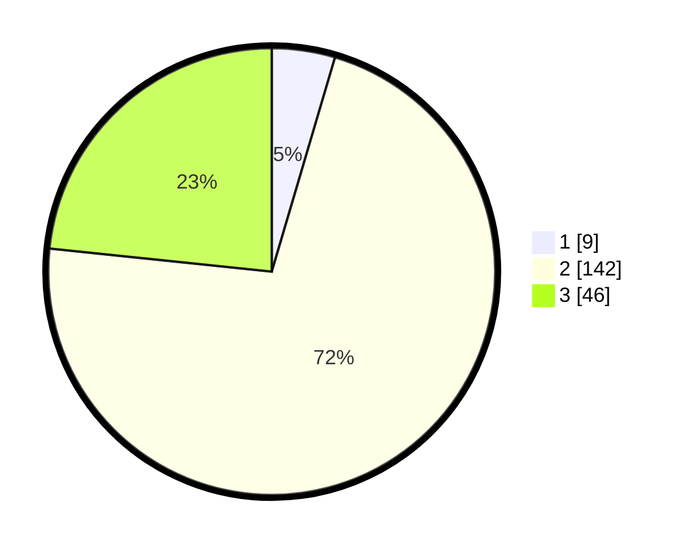

# Hasil

## Grafik

## Tabel

| No. | Nama Paslon    | Suara | Suara (raw) | Persentase |
|:--- |:-------------- | -----:| -----------:| ----------:|
| 1   | ANIES MUHAIMIN | 9     | [9][p-1]    | 4,57       |
| 2   | PRABOWO GIBRAN | 142   | [142][p-2]  | 72,08      |
| 3   | GANJAR MAHFUD  | 46    | [46][p-3]   | 23,35      |

[p-1]: https://github.com/gigit-pemilu/pemilu-2024-35-jawa-timur/blob/main/pilpres/hitung-suara/sub/35-jawa-timur/sub/04-tulungagung/sub/09-gondang/sub/2019-jarakan/sub/003-tps/sub/paslon-1.txt
[p-2]: https://github.com/gigit-pemilu/pemilu-2024-35-jawa-timur/blob/main/pilpres/hitung-suara/sub/35-jawa-timur/sub/04-tulungagung/sub/09-gondang/sub/2019-jarakan/sub/003-tps/sub/paslon-2.txt
[p-3]: https://github.com/gigit-pemilu/pemilu-2024-35-jawa-timur/blob/main/pilpres/hitung-suara/sub/35-jawa-timur/sub/04-tulungagung/sub/09-gondang/sub/2019-jarakan/sub/003-tps/sub/paslon-3.txt

## Foto C Plano

https://sirekap-obj-formc.kpu.go.id/5b0a/pemilu/ppwp/35/04/09/20/19/3504092019003-20240214-195904--65a71408-a4e7-4452-9f20-abede65896a4.jpg

https://sirekap-obj-formc.kpu.go.id/5b0a/pemilu/ppwp/35/04/09/20/19/3504092019003-20240214-200312--685ce9a5-1f92-43c6-931c-288151637446.jpg

https://sirekap-obj-formc.kpu.go.id/5b0a/pemilu/ppwp/35/04/09/20/19/3504092019003-20240214-200505--52f109f9-f485-42cd-bd54-610f11d32c3b.jpg

## Metadata

| Key        | Value               |
| ---------- | ------------------- |
| Time Stamp | 2024-02-15 00:41:44 |

