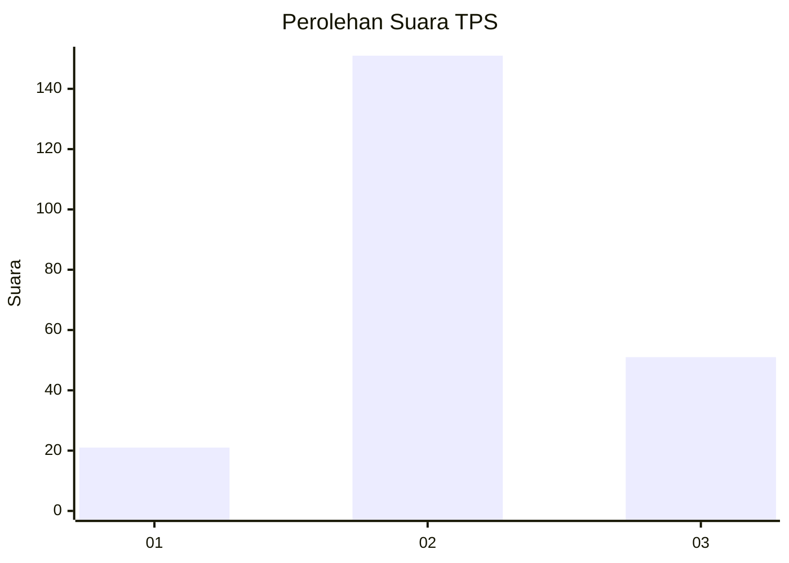
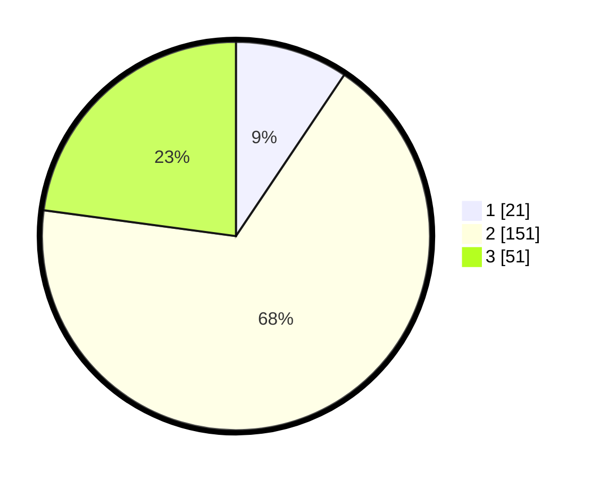

# Hasil

## Grafik

## Tabel

| No. | Nama Paslon    | Suara | Suara (raw) | Persentase |
|:--- |:-------------- | -----:| -----------:| ----------:|
| 1   | ANIES MUHAIMIN | 21    | [21][p-1]   | 9,42       |
| 2   | PRABOWO GIBRAN | 151   | [151][p-2]  | 67,71      |
| 3   | GANJAR MAHFUD  | 51    | [51][p-3]   | 22,87      |

[p-1]: https://github.com/gigit-pemilu/pemilu-2024/blob/main/pilpres/hitung-suara/sub/35-jawa-timur/sub/04-tulungagung/sub/10-sumbergempol/sub/2002-wates/sub/002-tps/sub/paslon-1.txt
[p-2]: https://github.com/gigit-pemilu/pemilu-2024/blob/main/pilpres/hitung-suara/sub/35-jawa-timur/sub/04-tulungagung/sub/10-sumbergempol/sub/2002-wates/sub/002-tps/sub/paslon-2.txt
[p-3]: https://github.com/gigit-pemilu/pemilu-2024/blob/main/pilpres/hitung-suara/sub/35-jawa-timur/sub/04-tulungagung/sub/10-sumbergempol/sub/2002-wates/sub/002-tps/sub/paslon-3.txt

## Foto C Plano

https://sirekap-obj-formc.kpu.go.id/4029/pemilu/ppwp/35/04/10/20/02/3504102002002-20240214-220417--cf5df99e-6d51-4218-a2ce-08cc7e406004.jpg

https://sirekap-obj-formc.kpu.go.id/4029/pemilu/ppwp/35/04/10/20/02/3504102002002-20240214-220607--3932b888-1f98-4ca6-bd12-93091b58dbd6.jpg

https://sirekap-obj-formc.kpu.go.id/4029/pemilu/ppwp/35/04/10/20/02/3504102002002-20240214-220710--fe7b12c6-029a-4125-97bc-f0f26c6b02c6.jpg

## Metadata

| Key        | Value               |
| ---------- | ------------------- |
| Time Stamp | 2024-02-15 23:29:50 |

