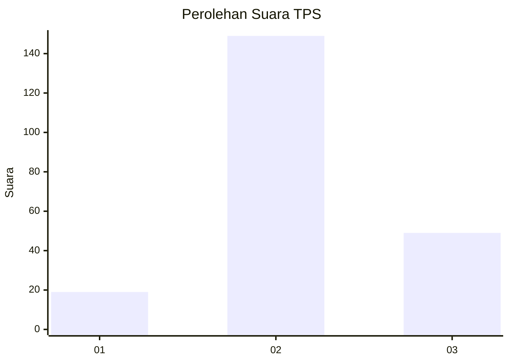
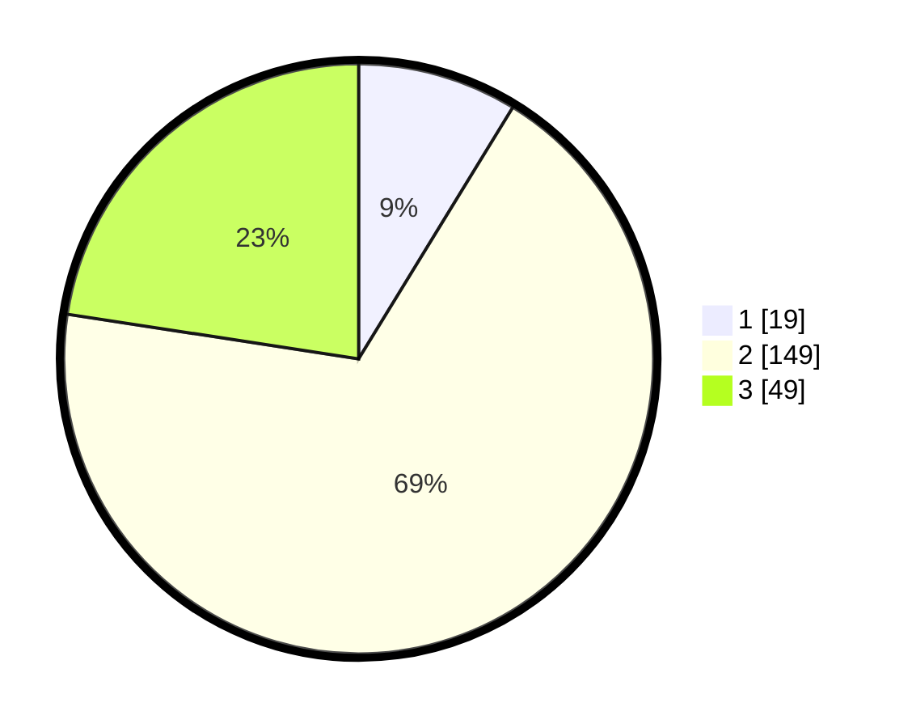

# Hasil

## Grafik

## Tabel

| No. | Nama Paslon    | Suara | Suara (raw) | Persentase |
|:--- |:-------------- | -----:| -----------:| ----------:|
| 1   | ANIES MUHAIMIN | 19    | [19][p-1]   | 8,76       |
| 2   | PRABOWO GIBRAN | 149   | [149][p-2]  | 68,66      |
| 3   | GANJAR MAHFUD  | 49    | [49][p-3]   | 22,58      |

[p-1]: https://github.com/gigit-pemilu/pemilu-2024-35-jawa-timur/blob/main/pilpres/hitung-suara/sub/35-jawa-timur/sub/04-tulungagung/sub/10-sumbergempol/sub/2003-mirigambar/sub/001-tps/sub/paslon-1.txt
[p-2]: https://github.com/gigit-pemilu/pemilu-2024-35-jawa-timur/blob/main/pilpres/hitung-suara/sub/35-jawa-timur/sub/04-tulungagung/sub/10-sumbergempol/sub/2003-mirigambar/sub/001-tps/sub/paslon-2.txt
[p-3]: https://github.com/gigit-pemilu/pemilu-2024-35-jawa-timur/blob/main/pilpres/hitung-suara/sub/35-jawa-timur/sub/04-tulungagung/sub/10-sumbergempol/sub/2003-mirigambar/sub/001-tps/sub/paslon-3.txt

## Foto C Plano

https://sirekap-obj-formc.kpu.go.id/b1b1/pemilu/ppwp/35/04/10/20/03/3504102003001-20240217-113544--ceb43ee4-e753-4a25-b65c-a5599eb574b7.jpg

https://sirekap-obj-formc.kpu.go.id/b1b1/pemilu/ppwp/35/04/10/20/03/3504102003001-20240217-113648--9b8cb45e-cc84-453a-bcf5-5d8de9431026.jpg

https://sirekap-obj-formc.kpu.go.id/b1b1/pemilu/ppwp/35/04/10/20/03/3504102003001-20240217-113820--d61571dc-74cd-4b3f-a39f-e2c2808d4186.jpg

## Metadata

| Key        | Value               |
| ---------- | ------------------- |
| Time Stamp | 2024-02-24 22:31:28 |

