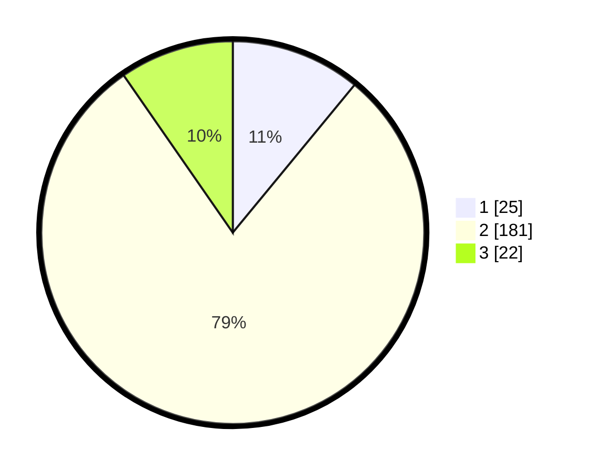

# Hasil

## Grafik

## Tabel

| No. | Nama Paslon    | Suara | Suara (raw) | Persentase |
|:--- |:-------------- | -----:| -----------:| ----------:|
| 1   | ANIES MUHAIMIN | 25    | [25][p-1]   | 10,96      |
| 2   | PRABOWO GIBRAN | 181   | [181][p-2]  | 79,39      |
| 3   | GANJAR MAHFUD  | 22    | [22][p-3]   | 9,65       |

[p-1]: https://github.com/gigit-pemilu/pemilu-2024/blob/main/pilpres/hitung-suara/sub/35-jawa-timur/sub/04-tulungagung/sub/10-sumbergempol/sub/2003-mirigambar/sub/002-tps/sub/paslon-1.txt
[p-2]: https://github.com/gigit-pemilu/pemilu-2024/blob/main/pilpres/hitung-suara/sub/35-jawa-timur/sub/04-tulungagung/sub/10-sumbergempol/sub/2003-mirigambar/sub/002-tps/sub/paslon-2.txt
[p-3]: https://github.com/gigit-pemilu/pemilu-2024/blob/main/pilpres/hitung-suara/sub/35-jawa-timur/sub/04-tulungagung/sub/10-sumbergempol/sub/2003-mirigambar/sub/002-tps/sub/paslon-3.txt

## Foto C Plano

https://sirekap-obj-formc.kpu.go.id/a5e2/pemilu/ppwp/35/04/10/20/03/3504102003002-20240214-230746--1001d4d6-53c9-4207-826e-fc2f08f894cc.jpg

https://sirekap-obj-formc.kpu.go.id/a5e2/pemilu/ppwp/35/04/10/20/03/3504102003002-20240214-231025--2c9c8e43-149e-43fb-810b-d4f7cb76fd1f.jpg

https://sirekap-obj-formc.kpu.go.id/a5e2/pemilu/ppwp/35/04/10/20/03/3504102003002-20240214-231230--0bc6e6e7-ed97-4f5e-ae2a-ff2c2c69f0e3.jpg

## Metadata

| Key        | Value               |
| ---------- | ------------------- |
| Time Stamp | 2024-02-15 23:29:50 |

