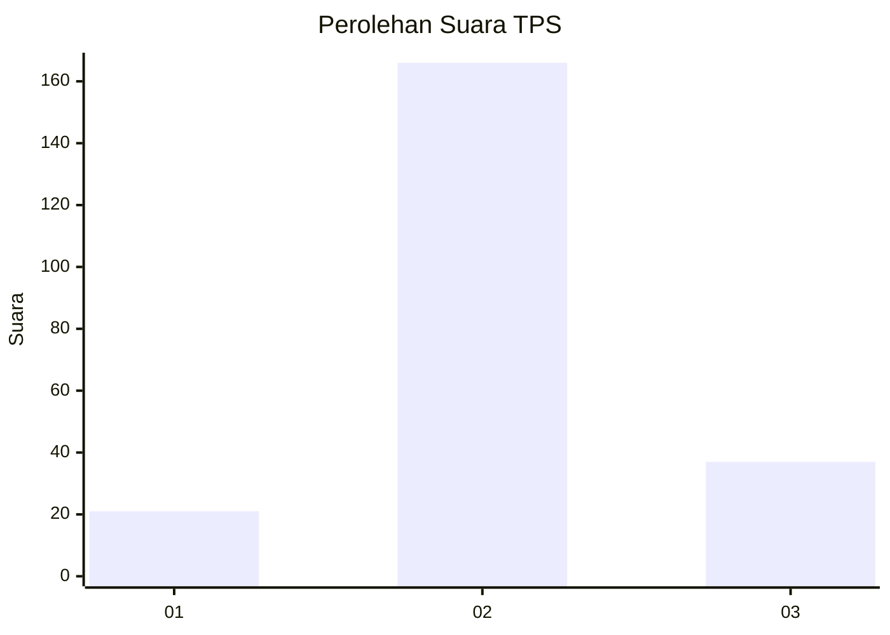
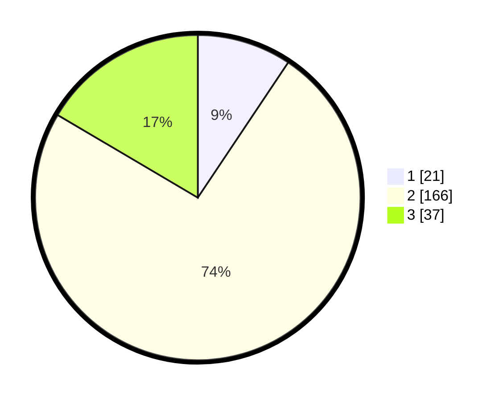

# Hasil

## Grafik

## Tabel

| No. | Nama Paslon    | Suara | Suara (raw) | Persentase |
|:--- |:-------------- | -----:| -----------:| ----------:|
| 1   | ANIES MUHAIMIN | 21    | [21][p-1]   | 9,38       |
| 2   | PRABOWO GIBRAN | 166   | [166][p-2]  | 74,11      |
| 3   | GANJAR MAHFUD  | 37    | [37][p-3]   | 16,52      |

[p-1]: https://github.com/gigit-pemilu/pemilu-2024/blob/main/pilpres/hitung-suara/sub/35-jawa-timur/sub/04-tulungagung/sub/10-sumbergempol/sub/2003-mirigambar/sub/004-tps/sub/paslon-1.txt
[p-2]: https://github.com/gigit-pemilu/pemilu-2024/blob/main/pilpres/hitung-suara/sub/35-jawa-timur/sub/04-tulungagung/sub/10-sumbergempol/sub/2003-mirigambar/sub/004-tps/sub/paslon-2.txt
[p-3]: https://github.com/gigit-pemilu/pemilu-2024/blob/main/pilpres/hitung-suara/sub/35-jawa-timur/sub/04-tulungagung/sub/10-sumbergempol/sub/2003-mirigambar/sub/004-tps/sub/paslon-3.txt

## Foto C Plano

https://sirekap-obj-formc.kpu.go.id/95ae/pemilu/ppwp/35/04/10/20/03/3504102003004-20240215-000358--1bc3d643-2bad-45eb-a9bf-45a83ba3d10a.jpg

https://sirekap-obj-formc.kpu.go.id/95ae/pemilu/ppwp/35/04/10/20/03/3504102003004-20240215-002602--b241f459-b893-43fb-a98b-a6f6a8142f20.jpg

https://sirekap-obj-formc.kpu.go.id/95ae/pemilu/ppwp/35/04/10/20/03/3504102003004-20240215-002712--4d062450-8521-4c28-a9e7-5f301b1c3b37.jpg

## Metadata

| Key        | Value               |
| ---------- | ------------------- |
| Time Stamp | 2024-02-15 23:29:50 |

