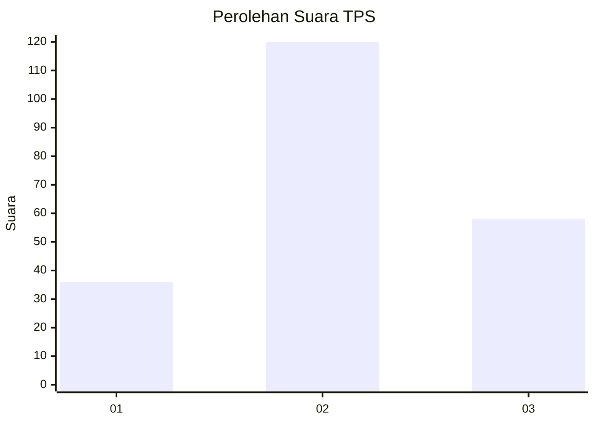
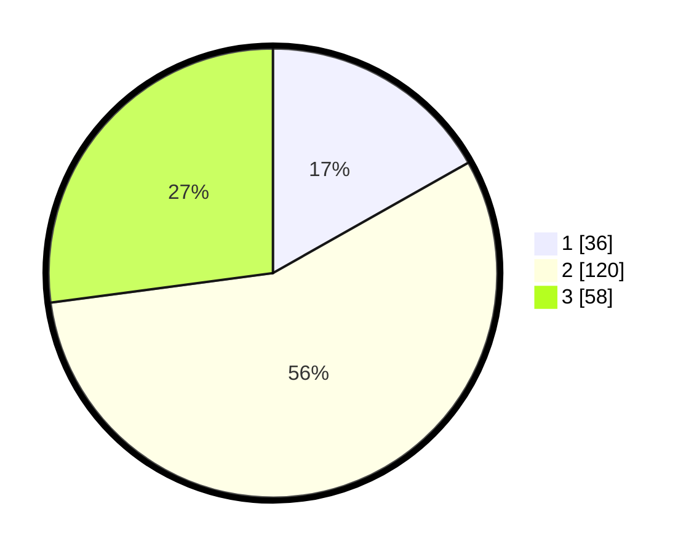

# Hasil

## Grafik

## Tabel

| No. | Nama Paslon    | Suara | Suara (raw) | Persentase |
|:--- |:-------------- | -----:| -----------:| ----------:|
| 1   | ANIES MUHAIMIN | 36    | [36][p-1]   | 16,82      |
| 2   | PRABOWO GIBRAN | 120   | [120][p-2]  | 56,07      |
| 3   | GANJAR MAHFUD  | 58    | [58][p-3]   | 27,10      |

[p-1]: https://github.com/gigit-pemilu/pemilu-2024-35-jawa-timur/blob/main/pilpres/hitung-suara/sub/35-jawa-timur/sub/04-tulungagung/sub/10-sumbergempol/sub/2003-mirigambar/sub/007-tps/sub/paslon-1.txt
[p-2]: https://github.com/gigit-pemilu/pemilu-2024-35-jawa-timur/blob/main/pilpres/hitung-suara/sub/35-jawa-timur/sub/04-tulungagung/sub/10-sumbergempol/sub/2003-mirigambar/sub/007-tps/sub/paslon-2.txt
[p-3]: https://github.com/gigit-pemilu/pemilu-2024-35-jawa-timur/blob/main/pilpres/hitung-suara/sub/35-jawa-timur/sub/04-tulungagung/sub/10-sumbergempol/sub/2003-mirigambar/sub/007-tps/sub/paslon-3.txt

## Foto C Plano

https://sirekap-obj-formc.kpu.go.id/1e82/pemilu/ppwp/35/04/10/20/03/3504102003007-20240214-193733--36ce9827-1374-4dc2-a77c-057bf0517731.jpg

https://sirekap-obj-formc.kpu.go.id/1e82/pemilu/ppwp/35/04/10/20/03/3504102003007-20240214-194924--88270d66-0d89-46f4-a634-e50204bb2432.jpg

https://sirekap-obj-formc.kpu.go.id/1e82/pemilu/ppwp/35/04/10/20/03/3504102003007-20240214-194515--7ea96c2d-7e2f-4cb9-9566-1d8b4594aecc.jpg

## Metadata

| Key        | Value               |
| ---------- | ------------------- |
| Time Stamp | 2024-02-15 23:29:50 |

