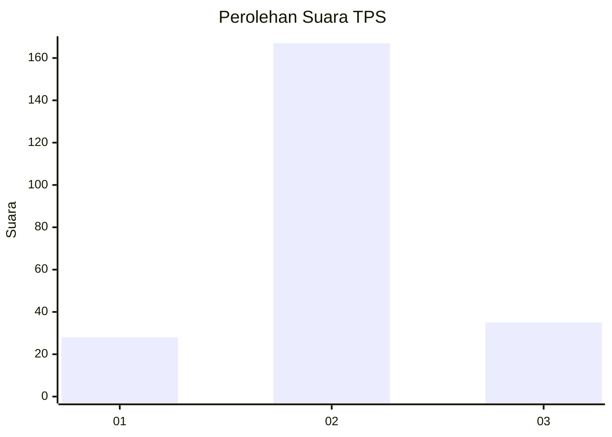
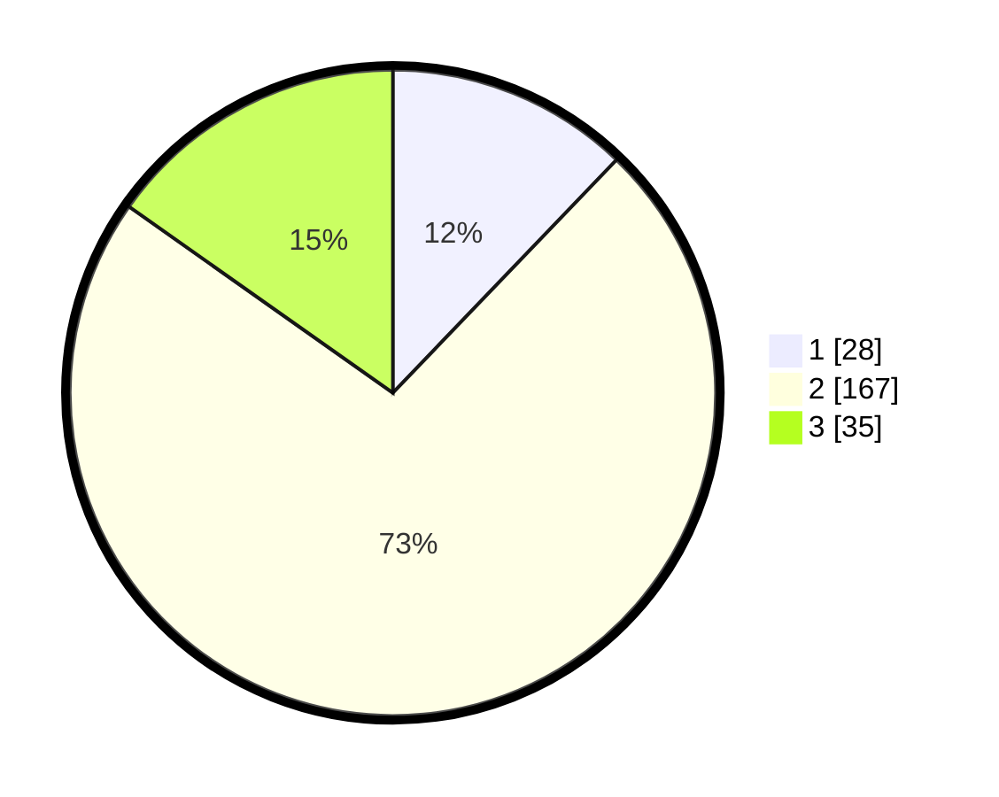

# Hasil

## Grafik

## Tabel

| No. | Nama Paslon    | Suara | Suara (raw) | Persentase |
|:--- |:-------------- | -----:| -----------:| ----------:|
| 1   | ANIES MUHAIMIN | 28    | [28][p-1]   | 12,17      |
| 2   | PRABOWO GIBRAN | 167   | [167][p-2]  | 72,61      |
| 3   | GANJAR MAHFUD  | 35    | [35][p-3]   | 15,22      |

[p-1]: https://github.com/gigit-pemilu/pemilu-2024-35-jawa-timur/blob/main/pilpres/hitung-suara/sub/35-jawa-timur/sub/04-tulungagung/sub/10-sumbergempol/sub/2003-mirigambar/sub/013-tps/sub/paslon-1.txt
[p-2]: https://github.com/gigit-pemilu/pemilu-2024-35-jawa-timur/blob/main/pilpres/hitung-suara/sub/35-jawa-timur/sub/04-tulungagung/sub/10-sumbergempol/sub/2003-mirigambar/sub/013-tps/sub/paslon-2.txt
[p-3]: https://github.com/gigit-pemilu/pemilu-2024-35-jawa-timur/blob/main/pilpres/hitung-suara/sub/35-jawa-timur/sub/04-tulungagung/sub/10-sumbergempol/sub/2003-mirigambar/sub/013-tps/sub/paslon-3.txt

## Foto C Plano

https://sirekap-obj-formc.kpu.go.id/28e6/pemilu/ppwp/35/04/10/20/03/3504102003013-20240214-224648--97748e2f-8d52-4543-8f8b-9ebe73e40517.jpg

https://sirekap-obj-formc.kpu.go.id/28e6/pemilu/ppwp/35/04/10/20/03/3504102003013-20240215-001107--23639840-8199-4608-aa5c-c101a4409bde.jpg

https://sirekap-obj-formc.kpu.go.id/28e6/pemilu/ppwp/35/04/10/20/03/3504102003013-20240214-225005--ea8e1129-bb46-4260-b506-a80b5524a02e.jpg

## Metadata

| Key        | Value               |
| ---------- | ------------------- |
| Time Stamp | 2024-02-15 23:29:50 |

