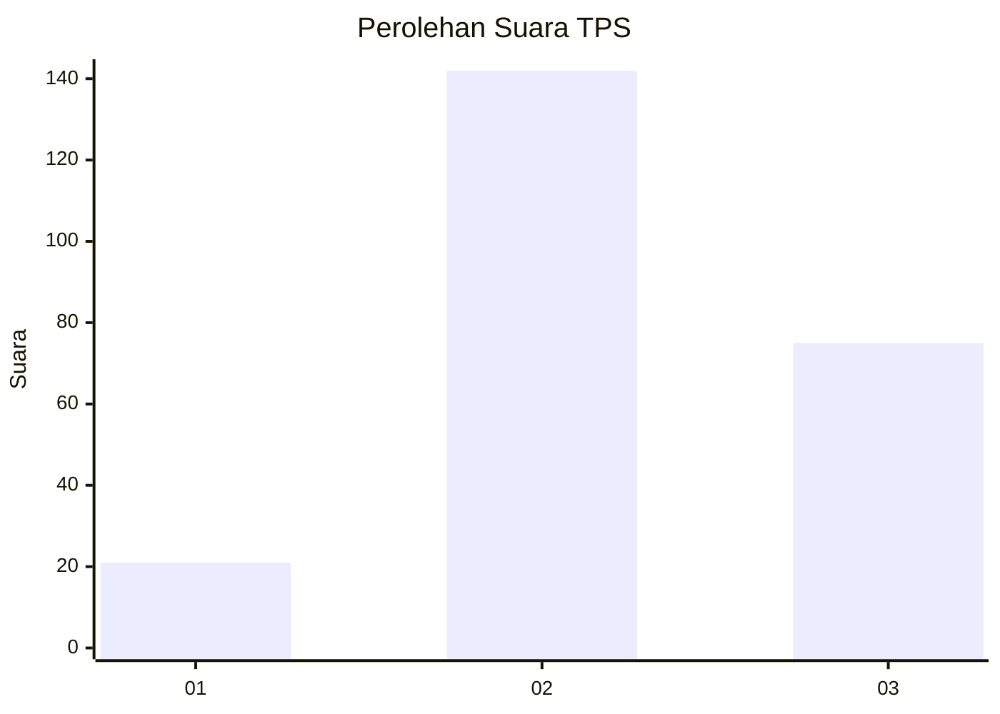
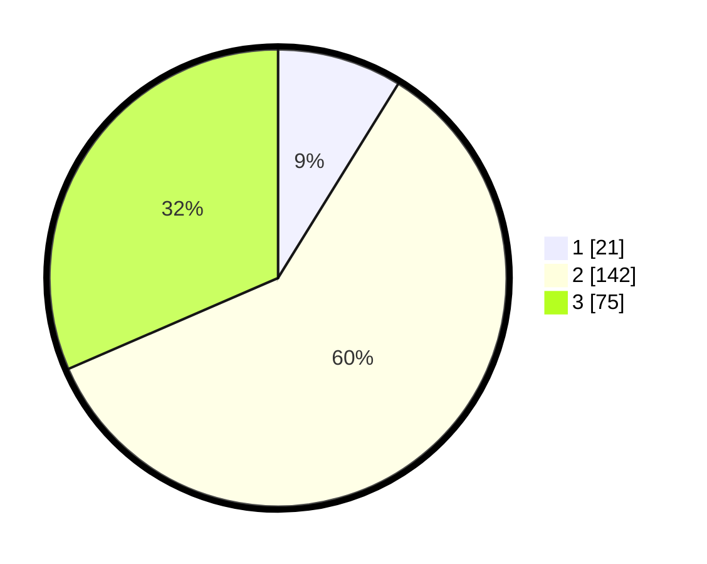

# Hasil

## Grafik

## Tabel

| No. | Nama Paslon    | Suara | Suara (raw) | Persentase |
|:--- |:-------------- | -----:| -----------:| ----------:|
| 1   | ANIES MUHAIMIN | 21    | [21][p-1]   | 8,82       |
| 2   | PRABOWO GIBRAN | 142   | [142][p-2]  | 59,66      |
| 3   | GANJAR MAHFUD  | 75    | [75][p-3]   | 31,51      |

[p-1]: https://github.com/gigit-pemilu/pemilu-2024-35-jawa-timur/blob/main/pilpres/hitung-suara/sub/35-jawa-timur/sub/04-tulungagung/sub/10-sumbergempol/sub/2004-trenceng/sub/001-tps/sub/paslon-1.txt
[p-2]: https://github.com/gigit-pemilu/pemilu-2024-35-jawa-timur/blob/main/pilpres/hitung-suara/sub/35-jawa-timur/sub/04-tulungagung/sub/10-sumbergempol/sub/2004-trenceng/sub/001-tps/sub/paslon-2.txt
[p-3]: https://github.com/gigit-pemilu/pemilu-2024-35-jawa-timur/blob/main/pilpres/hitung-suara/sub/35-jawa-timur/sub/04-tulungagung/sub/10-sumbergempol/sub/2004-trenceng/sub/001-tps/sub/paslon-3.txt

## Foto C Plano

https://sirekap-obj-formc.kpu.go.id/b22d/pemilu/ppwp/35/04/10/20/04/3504102004001-20240218-133342--1f19849a-c576-431d-b720-2eab0062d0b4.jpg

https://sirekap-obj-formc.kpu.go.id/b22d/pemilu/ppwp/35/04/10/20/04/3504102004001-20240218-134014--95cde092-44ef-4d55-b583-407d87bd678a.jpg

https://sirekap-obj-formc.kpu.go.id/b22d/pemilu/ppwp/35/04/10/20/04/3504102004001-20240214-234730--73f005e5-8116-429c-9704-aa280f08dd56.jpg

## Metadata

| Key        | Value               |
| ---------- | ------------------- |
| Time Stamp | 2024-02-25 15:00:00 |

