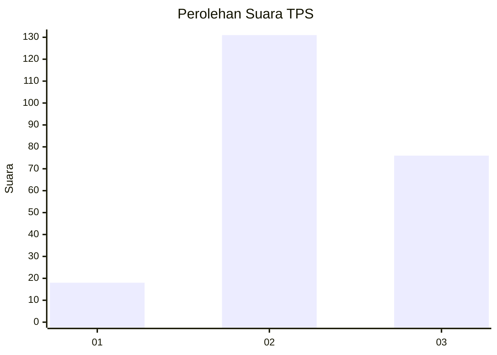
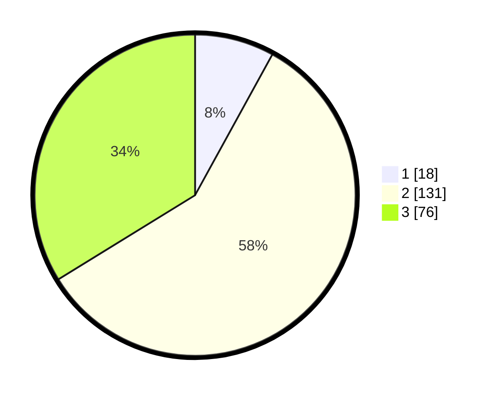

# Hasil

## Grafik

## Tabel

| No. | Nama Paslon    | Suara | Suara (raw) | Persentase |
|:--- |:-------------- | -----:| -----------:| ----------:|
| 1   | ANIES MUHAIMIN | 18    | [18][p-1]   | 8,00       |
| 2   | PRABOWO GIBRAN | 131   | [131][p-2]  | 58,22      |
| 3   | GANJAR MAHFUD  | 76    | [76][p-3]   | 33,78      |

[p-1]: https://github.com/gigit-pemilu/pemilu-2024/blob/main/pilpres/hitung-suara/sub/35-jawa-timur/sub/04-tulungagung/sub/10-sumbergempol/sub/2004-trenceng/sub/006-tps/sub/paslon-1.txt
[p-2]: https://github.com/gigit-pemilu/pemilu-2024/blob/main/pilpres/hitung-suara/sub/35-jawa-timur/sub/04-tulungagung/sub/10-sumbergempol/sub/2004-trenceng/sub/006-tps/sub/paslon-2.txt
[p-3]: https://github.com/gigit-pemilu/pemilu-2024/blob/main/pilpres/hitung-suara/sub/35-jawa-timur/sub/04-tulungagung/sub/10-sumbergempol/sub/2004-trenceng/sub/006-tps/sub/paslon-3.txt

## Foto C Plano

https://sirekap-obj-formc.kpu.go.id/18ac/pemilu/ppwp/35/04/10/20/04/3504102004006-20240218-134825--d4140518-4112-49b4-9292-0249b74871b7.jpg

https://sirekap-obj-formc.kpu.go.id/18ac/pemilu/ppwp/35/04/10/20/04/3504102004006-20240218-134532--6b849931-cb6b-4712-b773-97a9ff3550fc.jpg

https://sirekap-obj-formc.kpu.go.id/18ac/pemilu/ppwp/35/04/10/20/04/3504102004006-20240218-133647--14a49066-8d6e-4c75-9087-c17f62345898.jpg

## Metadata

| Key        | Value               |
| ---------- | ------------------- |
| Time Stamp | 2024-02-24 22:31:28 |

