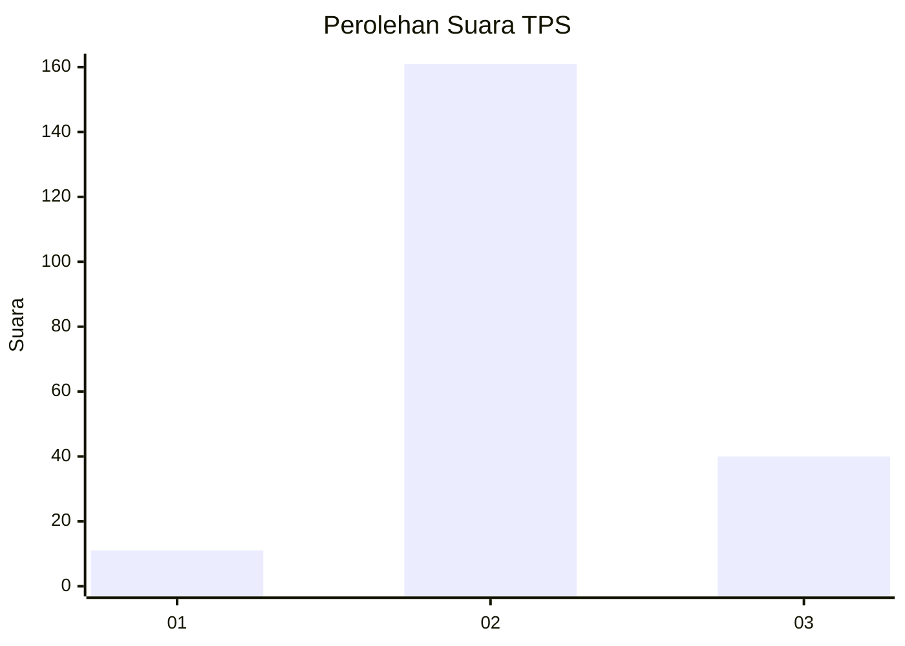
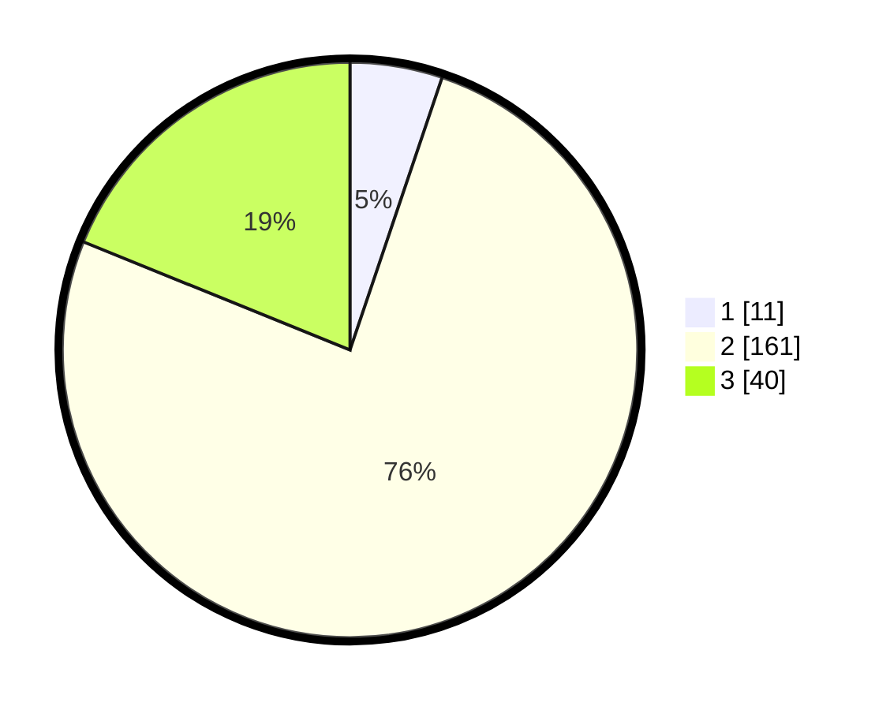

# Hasil

## Grafik

## Tabel

| No. | Nama Paslon    | Suara | Suara (raw) | Persentase |
|:--- |:-------------- | -----:| -----------:| ----------:|
| 1   | ANIES MUHAIMIN | 11    | [11][p-1]   | 5,19       |
| 2   | PRABOWO GIBRAN | 161   | [161][p-2]  | 75,94      |
| 3   | GANJAR MAHFUD  | 40    | [40][p-3]   | 18,87      |

[p-1]: https://github.com/gigit-pemilu/pemilu-2024-35-jawa-timur/blob/main/pilpres/hitung-suara/sub/35-jawa-timur/sub/04-tulungagung/sub/10-sumbergempol/sub/2005-bendilwungu/sub/006-tps/sub/paslon-1.txt
[p-2]: https://github.com/gigit-pemilu/pemilu-2024-35-jawa-timur/blob/main/pilpres/hitung-suara/sub/35-jawa-timur/sub/04-tulungagung/sub/10-sumbergempol/sub/2005-bendilwungu/sub/006-tps/sub/paslon-2.txt
[p-3]: https://github.com/gigit-pemilu/pemilu-2024-35-jawa-timur/blob/main/pilpres/hitung-suara/sub/35-jawa-timur/sub/04-tulungagung/sub/10-sumbergempol/sub/2005-bendilwungu/sub/006-tps/sub/paslon-3.txt

## Foto C Plano

https://sirekap-obj-formc.kpu.go.id/8715/pemilu/ppwp/35/04/10/20/05/3504102005006-20240214-205126--6eaf8c22-9305-4623-b671-688b58d6dc8b.jpg

https://sirekap-obj-formc.kpu.go.id/8715/pemilu/ppwp/35/04/10/20/05/3504102005006-20240214-205344--98b515d1-d3d8-4f7d-94d9-6075b7427d95.jpg

https://sirekap-obj-formc.kpu.go.id/8715/pemilu/ppwp/35/04/10/20/05/3504102005006-20240214-205516--a94e8b1e-14fc-49da-8fcd-604538abcd92.jpg

## Metadata

| Key        | Value               |
| ---------- | ------------------- |
| Time Stamp | 2024-02-15 23:29:50 |

