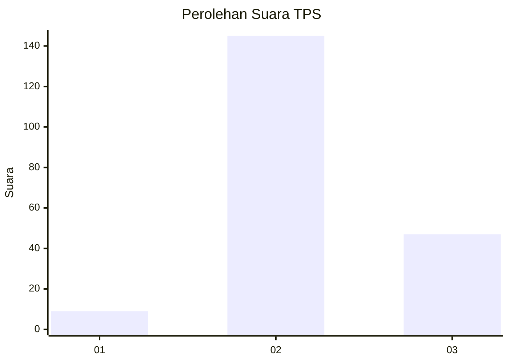
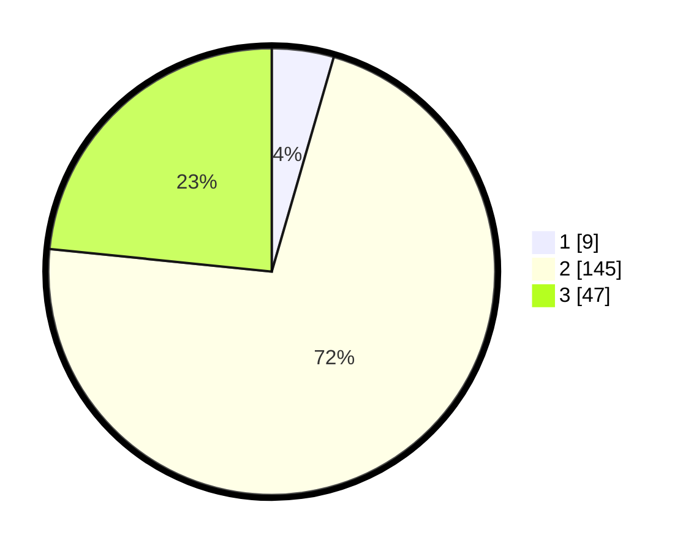

# Hasil

## Grafik

## Tabel

| No. | Nama Paslon    | Suara | Suara (raw) | Persentase |
|:--- |:-------------- | -----:| -----------:| ----------:|
| 1   | ANIES MUHAIMIN | 9     | [9][p-1]    | 4,48       |
| 2   | PRABOWO GIBRAN | 145   | [145][p-2]  | 72,14      |
| 3   | GANJAR MAHFUD  | 47    | [47][p-3]   | 23,38      |

[p-1]: https://github.com/gigit-pemilu/pemilu-2024/blob/main/pilpres/hitung-suara/sub/35-jawa-timur/sub/04-tulungagung/sub/10-sumbergempol/sub/2006-sambijajar/sub/004-tps/sub/paslon-1.txt
[p-2]: https://github.com/gigit-pemilu/pemilu-2024/blob/main/pilpres/hitung-suara/sub/35-jawa-timur/sub/04-tulungagung/sub/10-sumbergempol/sub/2006-sambijajar/sub/004-tps/sub/paslon-2.txt
[p-3]: https://github.com/gigit-pemilu/pemilu-2024/blob/main/pilpres/hitung-suara/sub/35-jawa-timur/sub/04-tulungagung/sub/10-sumbergempol/sub/2006-sambijajar/sub/004-tps/sub/paslon-3.txt

## Foto C Plano

https://sirekap-obj-formc.kpu.go.id/a51d/pemilu/ppwp/35/04/10/20/06/3504102006004-20240215-052313--ab3f2f91-4418-4c6f-91ce-520ed94b1b70.jpg

https://sirekap-obj-formc.kpu.go.id/a51d/pemilu/ppwp/35/04/10/20/06/3504102006004-20240215-052608--9874f6a8-202a-4cff-bfec-705fc21b2789.jpg

https://sirekap-obj-formc.kpu.go.id/a51d/pemilu/ppwp/35/04/10/20/06/3504102006004-20240215-052831--4209fef9-384c-4487-85a0-b66fbe45f17b.jpg

## Metadata

| Key        | Value               |
| ---------- | ------------------- |
| Time Stamp | 2024-02-15 23:29:50 |

