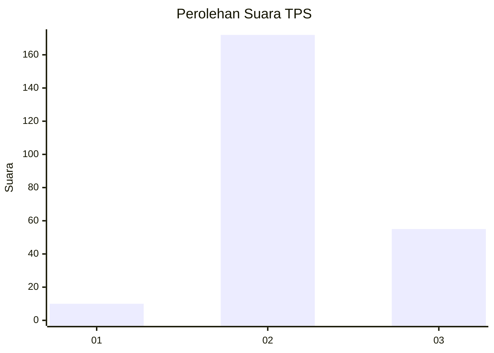
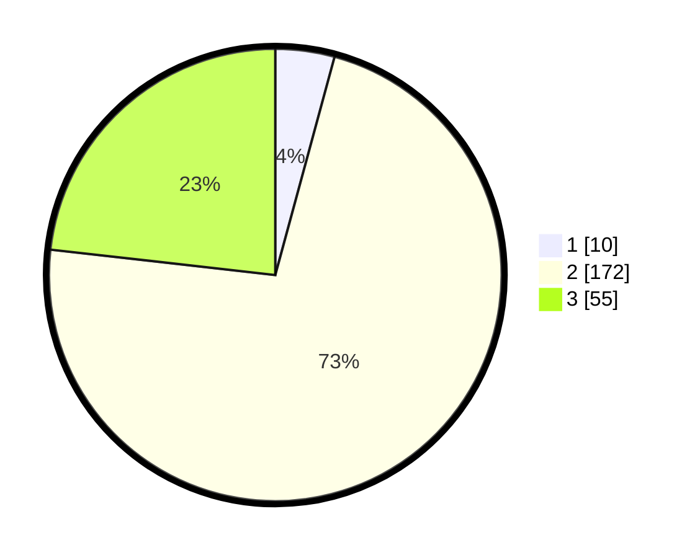

# Hasil

## Grafik

## Tabel

| No. | Nama Paslon    | Suara | Suara (raw) | Persentase |
|:--- |:-------------- | -----:| -----------:| ----------:|
| 1   | ANIES MUHAIMIN | 10    | [10][p-1]   | 4,22       |
| 2   | PRABOWO GIBRAN | 172   | [172][p-2]  | 72,57      |
| 3   | GANJAR MAHFUD  | 55    | [55][p-3]   | 23,21      |

[p-1]: https://github.com/gigit-pemilu/pemilu-2024/blob/main/pilpres/hitung-suara/sub/35-jawa-timur/sub/04-tulungagung/sub/10-sumbergempol/sub/2008-doroampel/sub/010-tps/sub/paslon-1.txt
[p-2]: https://github.com/gigit-pemilu/pemilu-2024/blob/main/pilpres/hitung-suara/sub/35-jawa-timur/sub/04-tulungagung/sub/10-sumbergempol/sub/2008-doroampel/sub/010-tps/sub/paslon-2.txt
[p-3]: https://github.com/gigit-pemilu/pemilu-2024/blob/main/pilpres/hitung-suara/sub/35-jawa-timur/sub/04-tulungagung/sub/10-sumbergempol/sub/2008-doroampel/sub/010-tps/sub/paslon-3.txt

## Foto C Plano

https://sirekap-obj-formc.kpu.go.id/c6f1/pemilu/ppwp/35/04/10/20/08/3504102008010-20240217-082452--02dd6923-c5a2-49b8-be34-9473a69103b1.jpg

https://sirekap-obj-formc.kpu.go.id/c6f1/pemilu/ppwp/35/04/10/20/08/3504102008010-20240217-210426--54cffe17-e63d-4069-bd00-055817b96bc7.jpg

https://sirekap-obj-formc.kpu.go.id/c6f1/pemilu/ppwp/35/04/10/20/08/3504102008010-20240217-203633--a537bd5f-32c1-4f8a-9749-9ae5aadd4178.jpg

## Metadata

| Key        | Value               |
| ---------- | ------------------- |
| Time Stamp | 2024-02-19 06:16:00 |

