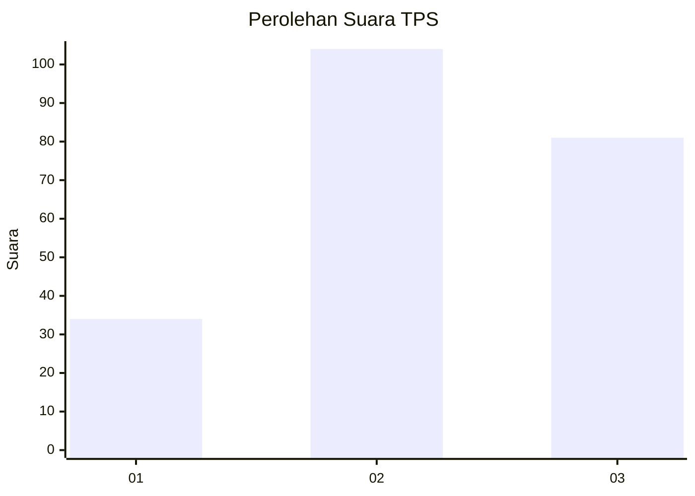
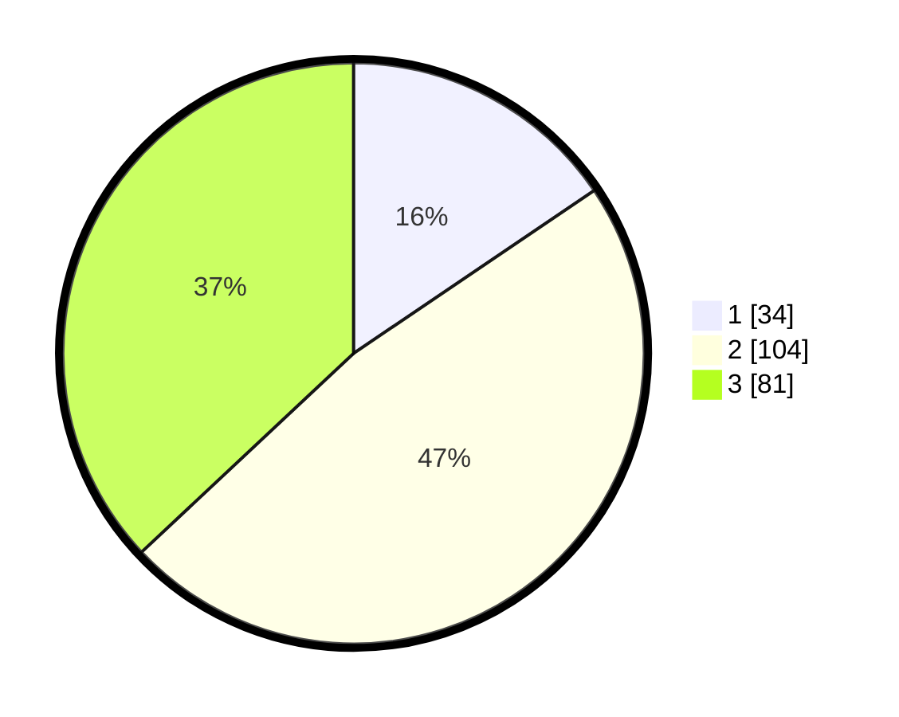

# Hasil

## Grafik

## Tabel

| No. | Nama Paslon    | Suara | Suara (raw) | Persentase |
|:--- |:-------------- | -----:| -----------:| ----------:|
| 1   | ANIES MUHAIMIN | 34    | [34][p-1]   | 15,53      |
| 2   | PRABOWO GIBRAN | 104   | [104][p-2]  | 47,49      |
| 3   | GANJAR MAHFUD  | 81    | [81][p-3]   | 36,99      |

[p-1]: https://github.com/gigit-pemilu/pemilu-2024-35-jawa-timur/blob/main/pilpres/hitung-suara/sub/35-jawa-timur/sub/04-tulungagung/sub/10-sumbergempol/sub/2009-junjung/sub/015-tps/sub/paslon-1.txt
[p-2]: https://github.com/gigit-pemilu/pemilu-2024-35-jawa-timur/blob/main/pilpres/hitung-suara/sub/35-jawa-timur/sub/04-tulungagung/sub/10-sumbergempol/sub/2009-junjung/sub/015-tps/sub/paslon-2.txt
[p-3]: https://github.com/gigit-pemilu/pemilu-2024-35-jawa-timur/blob/main/pilpres/hitung-suara/sub/35-jawa-timur/sub/04-tulungagung/sub/10-sumbergempol/sub/2009-junjung/sub/015-tps/sub/paslon-3.txt

## Foto C Plano

https://sirekap-obj-formc.kpu.go.id/c81c/pemilu/ppwp/35/04/10/20/09/3504102009015-20240217-015512--c5cc0a20-ae61-4507-beaf-a5f0c4b6a7de.jpg

https://sirekap-obj-formc.kpu.go.id/c81c/pemilu/ppwp/35/04/10/20/09/3504102009015-20240215-030140--710c09a1-d4d7-43f9-a109-30162278261b.jpg

https://sirekap-obj-formc.kpu.go.id/c81c/pemilu/ppwp/35/04/10/20/09/3504102009015-20240215-030337--2a0fd931-5589-4a5f-8a3d-d9032794f31e.jpg

## Metadata

| Key        | Value               |
| ---------- | ------------------- |
| Time Stamp | 2024-02-25 11:00:00 |

