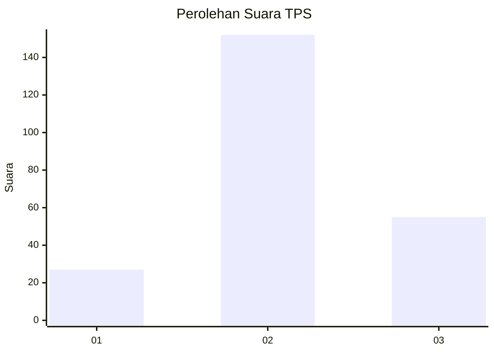
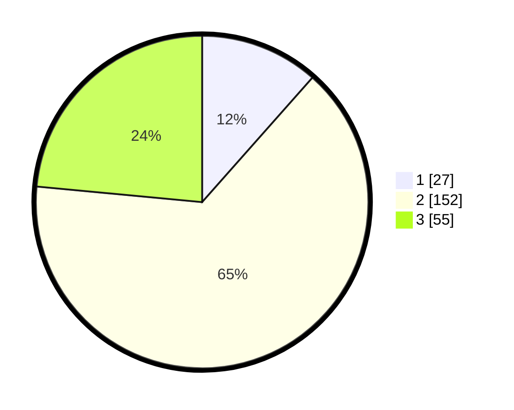

# Hasil

## Grafik

## Tabel

| No. | Nama Paslon    | Suara | Suara (raw) | Persentase |
|:--- |:-------------- | -----:| -----------:| ----------:|
| 1   | ANIES MUHAIMIN | 27    | [27][p-1]   | 11,54      |
| 2   | PRABOWO GIBRAN | 152   | [152][p-2]  | 64,96      |
| 3   | GANJAR MAHFUD  | 55    | [55][p-3]   | 23,50      |

[p-1]: https://github.com/gigit-pemilu/pemilu-2024/blob/main/pilpres/hitung-suara/sub/35-jawa-timur/sub/04-tulungagung/sub/10-sumbergempol/sub/2012-bendiljati-kulon/sub/002-tps/sub/paslon-1.txt
[p-2]: https://github.com/gigit-pemilu/pemilu-2024/blob/main/pilpres/hitung-suara/sub/35-jawa-timur/sub/04-tulungagung/sub/10-sumbergempol/sub/2012-bendiljati-kulon/sub/002-tps/sub/paslon-2.txt
[p-3]: https://github.com/gigit-pemilu/pemilu-2024/blob/main/pilpres/hitung-suara/sub/35-jawa-timur/sub/04-tulungagung/sub/10-sumbergempol/sub/2012-bendiljati-kulon/sub/002-tps/sub/paslon-3.txt

## Foto C Plano

https://sirekap-obj-formc.kpu.go.id/4792/pemilu/ppwp/35/04/10/20/12/3504102012002-20240214-230007--e5dec646-c873-492c-a782-dff32087ef3f.jpg

https://sirekap-obj-formc.kpu.go.id/4792/pemilu/ppwp/35/04/10/20/12/3504102012002-20240218-131616--3a29d77f-c7ce-42f7-a439-0bbdfce4301e.jpg

https://sirekap-obj-formc.kpu.go.id/4792/pemilu/ppwp/35/04/10/20/12/3504102012002-20240214-230246--cc954823-0081-4b46-89cc-f29b11e2dbcb.jpg

## Metadata

| Key        | Value               |
| ---------- | ------------------- |
| Time Stamp | 2024-02-19 06:16:00 |

