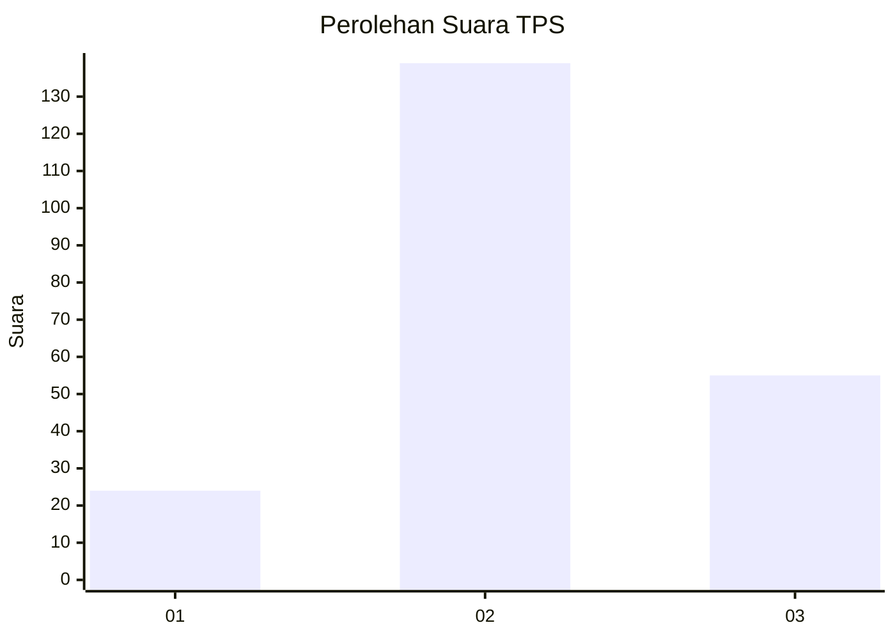
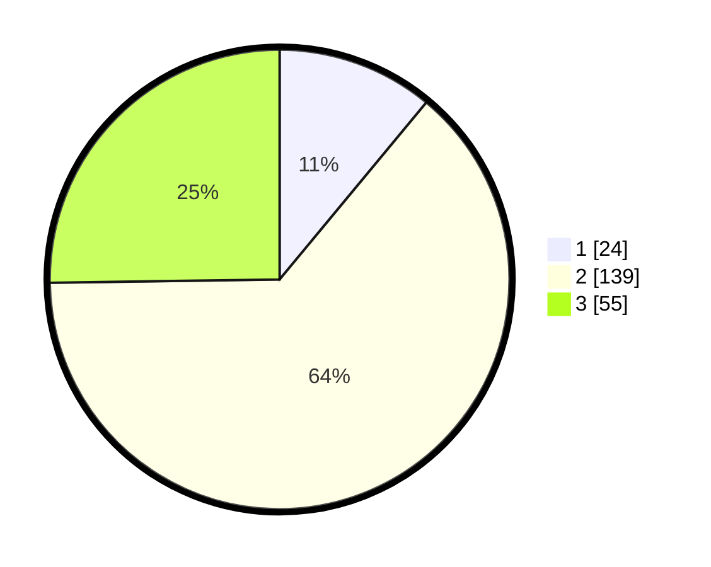

# Hasil

## Grafik

## Tabel

| No. | Nama Paslon    | Suara | Suara (raw) | Persentase |
|:--- |:-------------- | -----:| -----------:| ----------:|
| 1   | ANIES MUHAIMIN | 24    | [24][p-1]   | 11,01      |
| 2   | PRABOWO GIBRAN | 139   | [139][p-2]  | 63,76      |
| 3   | GANJAR MAHFUD  | 55    | [55][p-3]   | 25,23      |

[p-1]: https://github.com/gigit-pemilu/pemilu-2024/blob/main/pilpres/hitung-suara/sub/35-jawa-timur/sub/04-tulungagung/sub/10-sumbergempol/sub/2014-sumberdadi/sub/013-tps/sub/paslon-1.txt
[p-2]: https://github.com/gigit-pemilu/pemilu-2024/blob/main/pilpres/hitung-suara/sub/35-jawa-timur/sub/04-tulungagung/sub/10-sumbergempol/sub/2014-sumberdadi/sub/013-tps/sub/paslon-2.txt
[p-3]: https://github.com/gigit-pemilu/pemilu-2024/blob/main/pilpres/hitung-suara/sub/35-jawa-timur/sub/04-tulungagung/sub/10-sumbergempol/sub/2014-sumberdadi/sub/013-tps/sub/paslon-3.txt

## Foto C Plano

https://sirekap-obj-formc.kpu.go.id/df9e/pemilu/ppwp/35/04/10/20/14/3504102014013-20240214-223329--20f83d56-5e2c-4c8a-843d-35eb65e041c5.jpg

https://sirekap-obj-formc.kpu.go.id/df9e/pemilu/ppwp/35/04/10/20/14/3504102014013-20240214-223619--f69d351f-ff2c-4ca7-a6ef-be15b42a4a43.jpg

https://sirekap-obj-formc.kpu.go.id/df9e/pemilu/ppwp/35/04/10/20/14/3504102014013-20240214-234732--fa0f9e5c-77b7-4b9c-8818-3be7b26a66ef.jpg

## Metadata

| Key        | Value               |
| ---------- | ------------------- |
| Time Stamp | 2024-02-25 18:00:00 |

