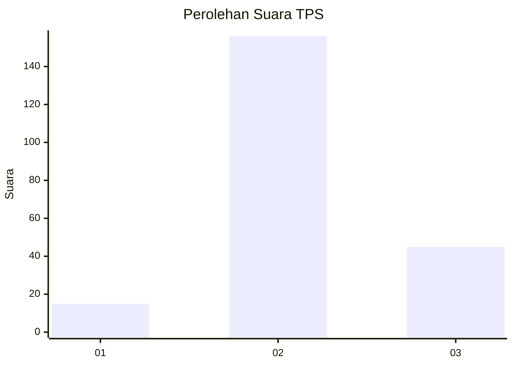

# Hasil

## Grafik

## Tabel

| No. | Nama Paslon    | Suara | Suara (raw) | Persentase |
|:--- |:-------------- | -----:| -----------:| ----------:|
| 1   | ANIES MUHAIMIN | 15    | [15][p-1]   | 6,94       |
| 2   | PRABOWO GIBRAN | 156   | [156][p-2]  | 72,22      |
| 3   | GANJAR MAHFUD  | 45    | [45][p-3]   | 20,83      |

[p-1]: https://github.com/gigit-pemilu/pemilu-2024-35-jawa-timur/blob/main/pilpres/hitung-suara/sub/35-jawa-timur/sub/04-tulungagung/sub/10-sumbergempol/sub/2016-sambirobyong/sub/008-tps/sub/paslon-1.txt
[p-2]: https://github.com/gigit-pemilu/pemilu-2024-35-jawa-timur/blob/main/pilpres/hitung-suara/sub/35-jawa-timur/sub/04-tulungagung/sub/10-sumbergempol/sub/2016-sambirobyong/sub/008-tps/sub/paslon-2.txt
[p-3]: https://github.com/gigit-pemilu/pemilu-2024-35-jawa-timur/blob/main/pilpres/hitung-suara/sub/35-jawa-timur/sub/04-tulungagung/sub/10-sumbergempol/sub/2016-sambirobyong/sub/008-tps/sub/paslon-3.txt

## Foto C Plano

https://sirekap-obj-formc.kpu.go.id/d597/pemilu/ppwp/35/04/10/20/16/3504102016008-20240214-212718--3d4af91a-4296-4c72-b0ed-e3f27b81d91a.jpg

https://sirekap-obj-formc.kpu.go.id/d597/pemilu/ppwp/35/04/10/20/16/3504102016008-20240214-212904--41adf801-528e-4a0c-8f41-577425e2c42c.jpg

https://sirekap-obj-formc.kpu.go.id/d597/pemilu/ppwp/35/04/10/20/16/3504102016008-20240215-021338--1be0b5d4-a4f1-4fac-980c-d8b05a42b744.jpg

## Metadata

| Key        | Value               |
| ---------- | ------------------- |
| Time Stamp | 2024-02-25 11:00:00 |

