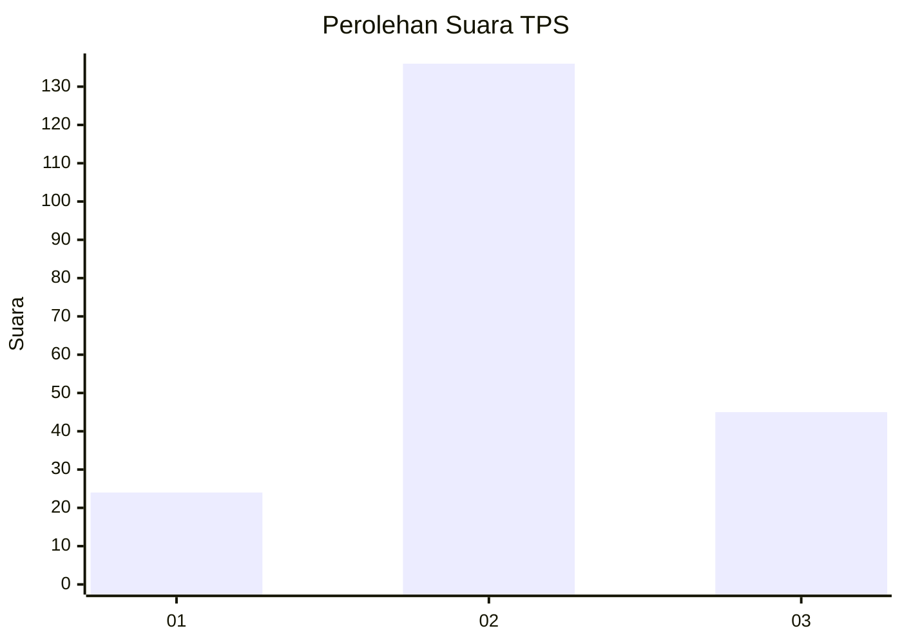
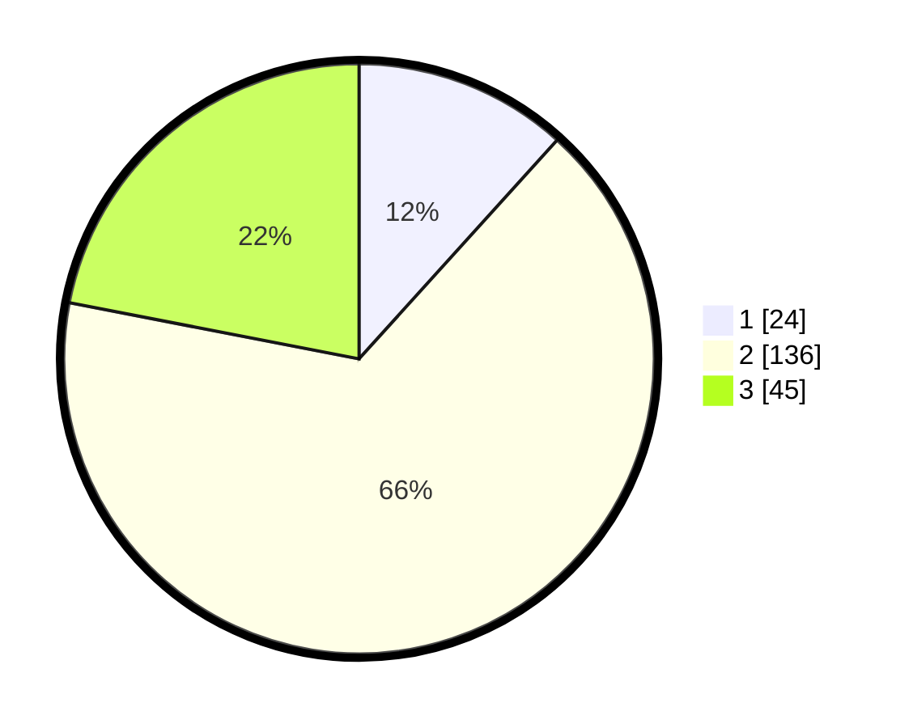

# Hasil

## Grafik

## Tabel

| No. | Nama Paslon    | Suara | Suara (raw) | Persentase |
|:--- |:-------------- | -----:| -----------:| ----------:|
| 1   | ANIES MUHAIMIN | 24    | [24][p-1]   | 11,71      |
| 2   | PRABOWO GIBRAN | 136   | [136][p-2]  | 66,34      |
| 3   | GANJAR MAHFUD  | 45    | [45][p-3]   | 21,95      |

[p-1]: https://github.com/gigit-pemilu/pemilu-2024/blob/main/pilpres/hitung-suara/sub/35-jawa-timur/sub/04-tulungagung/sub/11-ngunut/sub/2004-selorejo/sub/005-tps/sub/paslon-1.txt
[p-2]: https://github.com/gigit-pemilu/pemilu-2024/blob/main/pilpres/hitung-suara/sub/35-jawa-timur/sub/04-tulungagung/sub/11-ngunut/sub/2004-selorejo/sub/005-tps/sub/paslon-2.txt
[p-3]: https://github.com/gigit-pemilu/pemilu-2024/blob/main/pilpres/hitung-suara/sub/35-jawa-timur/sub/04-tulungagung/sub/11-ngunut/sub/2004-selorejo/sub/005-tps/sub/paslon-3.txt

## Foto C Plano

https://sirekap-obj-formc.kpu.go.id/b166/pemilu/ppwp/35/04/11/20/04/3504112004005-20240215-033515--94c1d2d5-cbb9-412d-ab5f-44d6a97bf2bb.jpg

https://sirekap-obj-formc.kpu.go.id/b166/pemilu/ppwp/35/04/11/20/04/3504112004005-20240215-034748--34e4d56c-f297-45d0-9311-1cc146d63869.jpg

https://sirekap-obj-formc.kpu.go.id/b166/pemilu/ppwp/35/04/11/20/04/3504112004005-20240217-113710--3be5a6b2-6831-4ae9-b4c4-1a47b5bbbc91.jpg

## Metadata

| Key        | Value               |
| ---------- | ------------------- |
| Time Stamp | 2024-02-17 12:00:00 |

