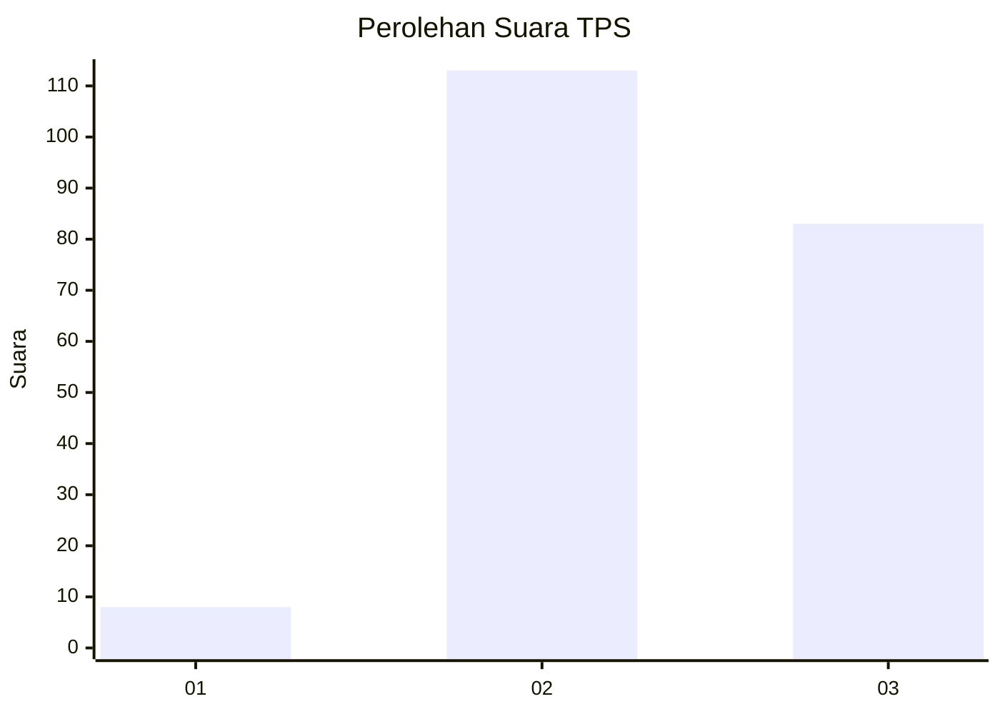
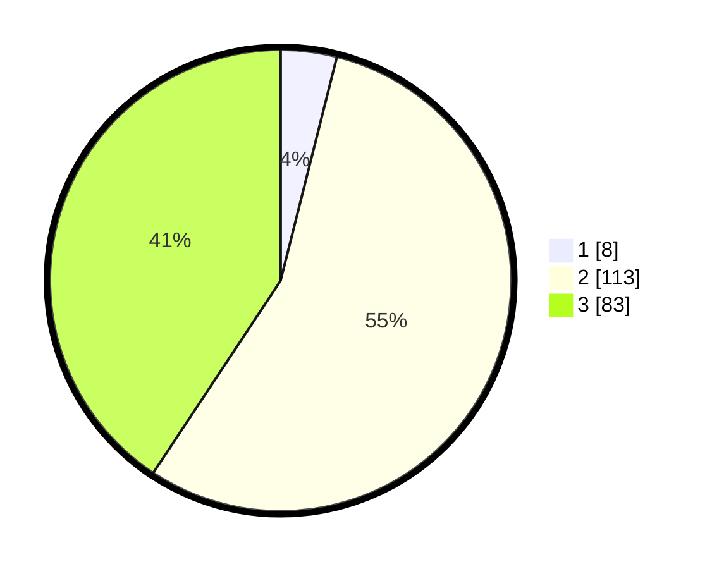

# Hasil

## Grafik

## Tabel

| No. | Nama Paslon    | Suara | Suara (raw) | Persentase |
|:--- |:-------------- | -----:| -----------:| ----------:|
| 1   | ANIES MUHAIMIN | 8     | [8][p-1]    | 3,92       |
| 2   | PRABOWO GIBRAN | 113   | [113][p-2]  | 55,39      |
| 3   | GANJAR MAHFUD  | 83    | [83][p-3]   | 40,69      |

[p-1]: https://github.com/gigit-pemilu/pemilu-2024-35-jawa-timur/blob/main/pilpres/hitung-suara/sub/35-jawa-timur/sub/04-tulungagung/sub/11-ngunut/sub/2009-kaliwungu/sub/004-tps/sub/paslon-1.txt
[p-2]: https://github.com/gigit-pemilu/pemilu-2024-35-jawa-timur/blob/main/pilpres/hitung-suara/sub/35-jawa-timur/sub/04-tulungagung/sub/11-ngunut/sub/2009-kaliwungu/sub/004-tps/sub/paslon-2.txt
[p-3]: https://github.com/gigit-pemilu/pemilu-2024-35-jawa-timur/blob/main/pilpres/hitung-suara/sub/35-jawa-timur/sub/04-tulungagung/sub/11-ngunut/sub/2009-kaliwungu/sub/004-tps/sub/paslon-3.txt

## Foto C Plano

https://sirekap-obj-formc.kpu.go.id/0f4f/pemilu/ppwp/35/04/11/20/09/3504112009004-20240217-193014--9c9935da-cc17-4413-915e-033f680b55fd.jpg

https://sirekap-obj-formc.kpu.go.id/0f4f/pemilu/ppwp/35/04/11/20/09/3504112009004-20240218-133059--0f89b8ff-6455-46cc-bc7a-318dc82b269c.jpg

https://sirekap-obj-formc.kpu.go.id/0f4f/pemilu/ppwp/35/04/11/20/09/3504112009004-20240218-133109--a8174b88-705b-47a6-8a64-49ebbf683c3b.jpg

## Metadata

| Key        | Value               |
| ---------- | ------------------- |
| Time Stamp | 2024-02-19 06:16:00 |

