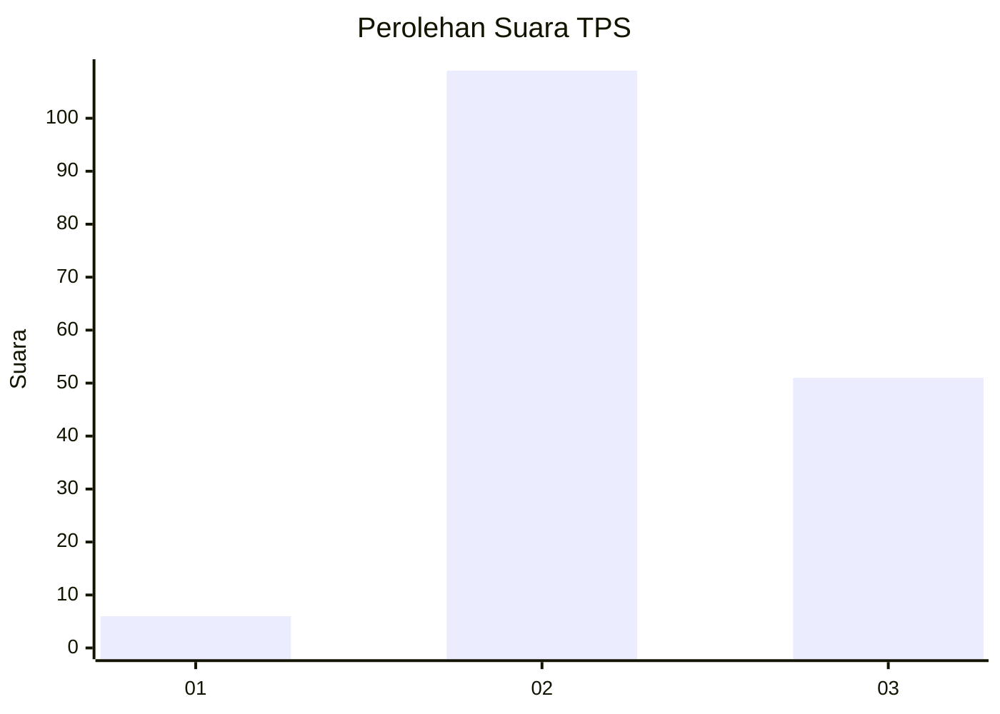

# Hasil

## Grafik

## Tabel

| No. | Nama Paslon    | Suara | Suara (raw) | Persentase |
|:--- |:-------------- | -----:| -----------:| ----------:|
| 1   | ANIES MUHAIMIN | 6     | [6][p-1]    | 3,61       |
| 2   | PRABOWO GIBRAN | 109   | [109][p-2]  | 65,66      |
| 3   | GANJAR MAHFUD  | 51    | [51][p-3]   | 30,72      |

[p-1]: https://github.com/gigit-pemilu/pemilu-2024-35-jawa-timur/blob/main/pilpres/hitung-suara/sub/35-jawa-timur/sub/04-tulungagung/sub/11-ngunut/sub/2009-kaliwungu/sub/006-tps/sub/paslon-1.txt
[p-2]: https://github.com/gigit-pemilu/pemilu-2024-35-jawa-timur/blob/main/pilpres/hitung-suara/sub/35-jawa-timur/sub/04-tulungagung/sub/11-ngunut/sub/2009-kaliwungu/sub/006-tps/sub/paslon-2.txt
[p-3]: https://github.com/gigit-pemilu/pemilu-2024-35-jawa-timur/blob/main/pilpres/hitung-suara/sub/35-jawa-timur/sub/04-tulungagung/sub/11-ngunut/sub/2009-kaliwungu/sub/006-tps/sub/paslon-3.txt

## Foto C Plano

https://sirekap-obj-formc.kpu.go.id/2981/pemilu/ppwp/35/04/11/20/09/3504112009006-20240215-002247--7a9b69f9-7148-412c-b9a3-79e73e990616.jpg

https://sirekap-obj-formc.kpu.go.id/2981/pemilu/ppwp/35/04/11/20/09/3504112009006-20240215-002318--77636648-c531-4292-b015-def089415654.jpg

https://sirekap-obj-formc.kpu.go.id/2981/pemilu/ppwp/35/04/11/20/09/3504112009006-20240215-002459--358d673a-0814-42a9-b08e-ffa1338ec3f7.jpg

## Metadata

| Key        | Value               |
| ---------- | ------------------- |
| Time Stamp | 2024-02-24 22:31:28 |

