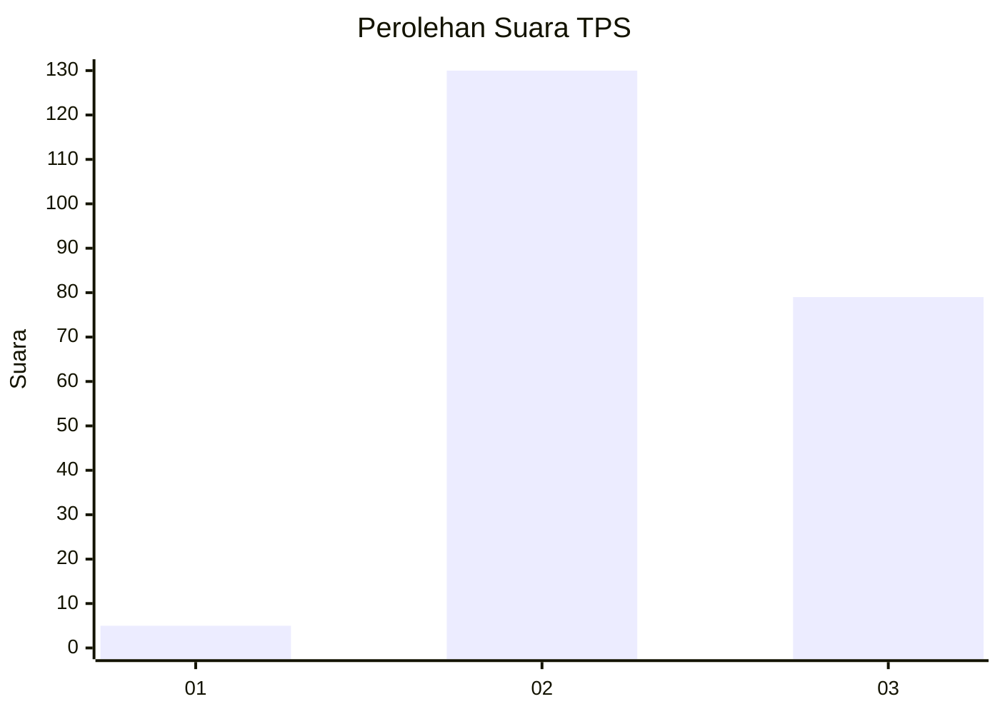
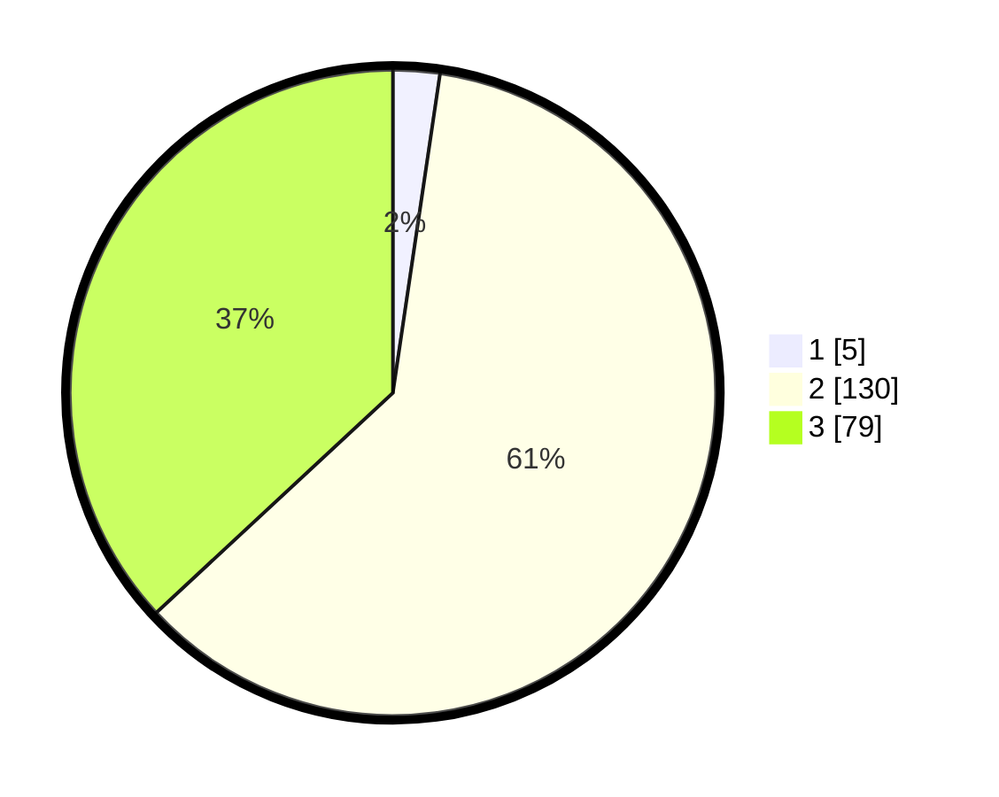

# Hasil

## Grafik

## Tabel

| No. | Nama Paslon    | Suara | Suara (raw) | Persentase |
|:--- |:-------------- | -----:| -----------:| ----------:|
| 1   | ANIES MUHAIMIN | 5     | [5][p-1]    | 2,34       |
| 2   | PRABOWO GIBRAN | 130   | [130][p-2]  | 60,75      |
| 3   | GANJAR MAHFUD  | 79    | [79][p-3]   | 36,92      |

[p-1]: https://github.com/gigit-pemilu/pemilu-2024/blob/main/pilpres/hitung-suara/sub/35-jawa-timur/sub/04-tulungagung/sub/11-ngunut/sub/2009-kaliwungu/sub/007-tps/sub/paslon-1.txt
[p-2]: https://github.com/gigit-pemilu/pemilu-2024/blob/main/pilpres/hitung-suara/sub/35-jawa-timur/sub/04-tulungagung/sub/11-ngunut/sub/2009-kaliwungu/sub/007-tps/sub/paslon-2.txt
[p-3]: https://github.com/gigit-pemilu/pemilu-2024/blob/main/pilpres/hitung-suara/sub/35-jawa-timur/sub/04-tulungagung/sub/11-ngunut/sub/2009-kaliwungu/sub/007-tps/sub/paslon-3.txt

## Foto C Plano

https://sirekap-obj-formc.kpu.go.id/9574/pemilu/ppwp/35/04/11/20/09/3504112009007-20240214-231531--8895571d-0914-4fea-8bf6-b7b2fef9894b.jpg

https://sirekap-obj-formc.kpu.go.id/9574/pemilu/ppwp/35/04/11/20/09/3504112009007-20240214-231836--2998b504-bac9-4562-9983-06fcc678f393.jpg

https://sirekap-obj-formc.kpu.go.id/9574/pemilu/ppwp/35/04/11/20/09/3504112009007-20240214-232228--742ebde9-c9af-4af5-a863-4d07e5b63824.jpg

## Metadata

| Key        | Value               |
| ---------- | ------------------- |
| Time Stamp | 2024-02-17 13:37:34 |

