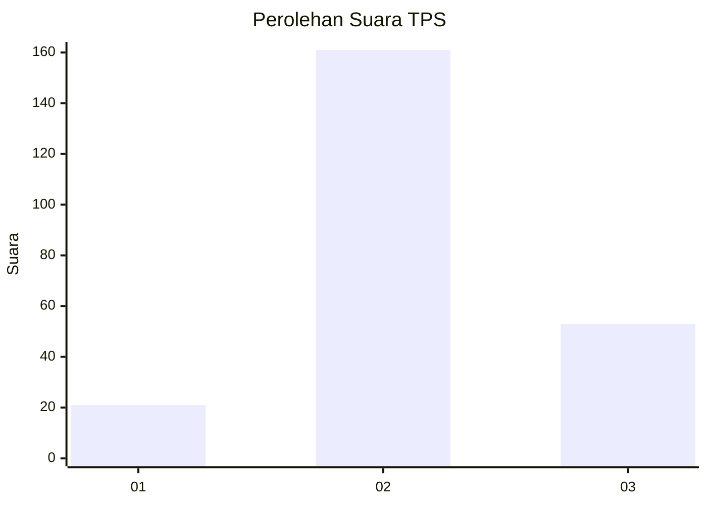
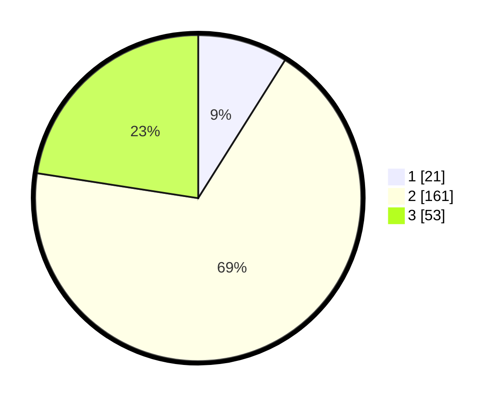

# Hasil

## Grafik

## Tabel

| No. | Nama Paslon    | Suara | Suara (raw) | Persentase |
|:--- |:-------------- | -----:| -----------:| ----------:|
| 1   | ANIES MUHAIMIN | 21    | [21][p-1]   | 8,94       |
| 2   | PRABOWO GIBRAN | 161   | [161][p-2]  | 68,51      |
| 3   | GANJAR MAHFUD  | 53    | [53][p-3]   | 22,55      |

[p-1]: https://github.com/gigit-pemilu/pemilu-2024/blob/main/pilpres/hitung-suara/sub/35-jawa-timur/sub/04-tulungagung/sub/11-ngunut/sub/2009-kaliwungu/sub/011-tps/sub/paslon-1.txt
[p-2]: https://github.com/gigit-pemilu/pemilu-2024/blob/main/pilpres/hitung-suara/sub/35-jawa-timur/sub/04-tulungagung/sub/11-ngunut/sub/2009-kaliwungu/sub/011-tps/sub/paslon-2.txt
[p-3]: https://github.com/gigit-pemilu/pemilu-2024/blob/main/pilpres/hitung-suara/sub/35-jawa-timur/sub/04-tulungagung/sub/11-ngunut/sub/2009-kaliwungu/sub/011-tps/sub/paslon-3.txt

## Foto C Plano

https://sirekap-obj-formc.kpu.go.id/ec63/pemilu/ppwp/35/04/11/20/09/3504112009011-20240214-225616--ca8e2d00-54bf-4c37-9229-9166af0aa033.jpg

https://sirekap-obj-formc.kpu.go.id/ec63/pemilu/ppwp/35/04/11/20/09/3504112009011-20240214-225717--fa115371-d178-4889-8155-1b993ac7e8ba.jpg

https://sirekap-obj-formc.kpu.go.id/ec63/pemilu/ppwp/35/04/11/20/09/3504112009011-20240214-225759--2d2409a2-f155-4f87-801f-d5b43c3a67a3.jpg

## Metadata

| Key        | Value               |
| ---------- | ------------------- |
| Time Stamp | 2024-02-25 16:00:00 |

